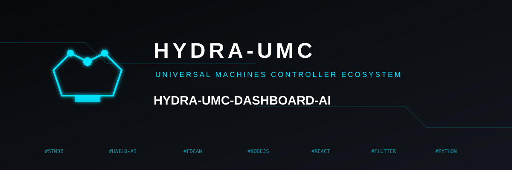
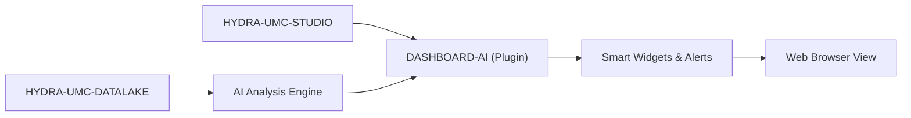

<p align="center">
  
</p>

# 🧠 HYDRA-UMC-DASHBOARD-AI

<p align="center">🇺🇸 <b>English</b> | <a href="README_spa.md">🇪🇸 Español</a> | <a href="README_fra.md">🇫🇷 Français</a> | <a href="README_ita.md">🇮🇹 Italiano</a> | <a href="README_deu.md">🇩🇪 Deutsch</a> | <a href="README_zho.md">🇨🇳 简体中文</a> | <a href="README_jpn.md">🇯🇵 日本語</a></p>

### 📈 AI-Powered Analytical Extension for the STUDIO Web Dashboard

<p align="left">
  
  
  
</p>

---

## 1. 🛠️ TECHNICAL OVERVIEW

**HYDRA-UMC-DASHBOARD-AI** is the analytical plugin for the STUDIO web interface. It enhances the standard dashboard with real-time AI insights, predictive trend analysis, and automated anomaly highlights.

It transforms raw telemetry data into actionable intelligence, providing plant operators with "Smart Summaries" of swarm performance, energy consumption patterns, and predictive maintenance alerts directly within the browser. It reuses HYDRA-UMC-STUDIO's own stack (React 19 + Vite + TypeScript) rather than introducing a new one, so it can eventually be embedded as a panel inside STUDIO itself.

### Key Features:
* 🧠 **Smart Summaries (v0)** — real min/max/average/latest/direction statistics computed from real HYDRA-UMC-DATALAKE history. *(implemented as real statistics, not yet an LLM-generated summary — see BUILD & RUN below)*
* 🔒 **AI-Provider Gate (v0)** — real input/output schema validation for the eventual LLM-backed narrative, plus a real, honestly-labeled statistical fallback used whenever no AI provider is configured or one fails/returns unstructured output. *(implemented and wired into the Trend Summary panel today; a real LLM-backed provider itself is planned)*
* 🛡️ **External Contract Guard (v0)** — validates every Datalake and anomaly-service response before a panel calculates with or renders it; malformed numbers, flags, oversized identifiers, and unsafe control characters are rejected. *(implemented; see [`docs/SECURITY.md`](docs/SECURITY.md))*
* 📈 **Trend Prediction** — a real forecast model, beyond v0's real-but-simple direction indicator. *(planned)*
* 🚨 **Anomaly Highlighting (v0)** — checks the most recent real samples against a real, already-fitted HYDRA-UMC-ANOMALY-DETECTOR baseline. *(implemented as a real text panel; overlaying it on STUDIO's own 3D view is planned)*
* 🛠️ **Optimization Tips** — suggests parameter changes to improve cycle time or motor lifespan. *(planned)*
* ✅ **Toolchain scaffold** — a real React/Vite/TypeScript app that builds clean with `tsc --noEmit` and serves with Vite. *(implemented — see BUILD & RUN below)*

---

## 2. 🔄 DASHBOARD AI FLOW



---

## 3. 🧱 ARCHITECTURE & DESIGN DECISIONS

* **Why this is a Node/TS project, not a Python one like the other AI-adjacent projects.** It's a direct extension of HYDRA-UMC-STUDIO's own React/Vite frontend, not a standalone AI service - matching STUDIO's own stack (rather than HYDRA-UMC-COGNITIVE-NODE's Python one) is what lets it actually mount as a real STUDIO panel later, not a separate app users have to switch to.
* **Why it's a sibling of STUDIO, not a folder inside it.** Keeping this as its own repo/build lets the AI-dashboard layer version and ship independently of STUDIO's own robot-control release cadence, the same reasoning that split HYDRA-UMC-SERVER out of STUDIO in the first place.
* **Why the entry point only prints identity/version/role today.** Andamiaje (scaffolding) stage: proving the package builds cleanly precedes the real dashboard panels.
* **How this fits the rest of the ecosystem.** Extends HYDRA-UMC-STUDIO with AI-driven insights, backed by HYDRA-UMC-COGNITIVE-NODE - the visual surface for what that cognitive layer actually decides.
* **Why the Anomaly Check panel checks `/stats` before offering to score anything.** HYDRA-UMC-ANOMALY-DETECTOR's own detector is one shared, in-memory-fitted baseline (see that project's own `api.py`) - this dashboard deliberately does not manage fitting it (mutating shared detector state from a read-oriented dashboard would be a real coupling smell). A real "not fitted yet" state is shown as exactly that, not folded into a generic error.
* **Why the Trend Summary reports "direction", not a forecast.** A real first-to-last delta sign (with a small relative-noise threshold so a flat signal doesn't flicker "up"/"down") is honest about what v0 actually computes - a real forecast model is separate, real future work, not something to fake with a linear extrapolation dressed up as "prediction".
* **Why `safeGenerateNarrative()` validates the request but never throws for a bad response.** A malformed request is a real wiring bug in this codebase - there's no summary to honestly fall back to, so it's allowed to throw. A malformed/unstructured *response* from a provider is a fact of life for any real external API - that path always degrades to the real statistical fallback instead of crashing the panel, because the caller already has everything it needs (the real summary) to say something true.
* **Why `NO_PROVIDER_CONFIGURED` reuses `summary.ts` instead of a separate fallback implementation.** A second, independent "fallback narrative" formula would drift from the real statistics the panel already trusts and displays numerically - reusing the same `TrendSummary` values keeps the fallback narrative provably consistent with the numbers right next to it.

---

## 📂 DIRECTORY STRUCTURE

Pure-software web app — no hardware, firmware or OS of its own; those folders are omitted by repository structure policy.

```text
HYDRA-UMC-DASHBOARD-AI/
├── src/
│   ├── api/                 # Real HTTP clients: datalakeClient.ts, anomalyClient.ts
│   ├── lib/
│   │   ├── summary.ts        # Real trend-summary statistics
│   │   └── aiProvider.ts     # Real AI-provider gate: schema validation + honest fallback
│   ├── components/
│   │   ├── TrendSummaryPanel.tsx
│   │   └── AnomalyCheckPanel.tsx
│   ├── main.tsx              # Application entry point
│   ├── App.tsx                # Root component - mounts both real panels
│   ├── index.css              # Base stylesheet
│   └── vite-env.d.ts          # VITE_DATALAKE_URL / VITE_ANOMALY_URL typing
├── tests/                   # Real tests: HTTP round-trips + component tests
├── scripts/
│   ├── bump-version.mjs    # Odometer-style version bump (run by build)
│   ├── serve_static.py     # Real static-file server for the built dist/ SPA (CM5 deploy gap found live)
│   └── test_serve_static.py # Real tests for serve_static.py
├── systemd/
│   └── hydra-umc-dashboard-ai.service # Local CM5 static-serve systemd unit
├── tools/
│   ├── build_test.py       # Non-versioning build/compile check
│   └── ci_validate.py      # Manifest/CHANGELOG/docs validation used by CI
├── docs/
│   └── SECURITY.md          # Public external-content and deployment safety contract
├── build/                  # Reserved for release artifacts (dist/ itself is gitignored)
├── images/                 # Media and diagrams
├── index.html              # Vite entry HTML
├── vite.config.ts          # Vite bundler + Vitest configuration
├── tsconfig.json / tsconfig.app.json / tsconfig.node.json
├── bump_manifest_version.py # Syncs hydra-umc.project.json's version to package.json's (--sync)
├── dev.sh / dev.bat        # Real dev server: install deps + vite
├── build.sh / build.bat    # Real build: install deps + real test suite + bump version + tsc + vite build
└── package.json
```

---

## 4. ⚙️ BUILD & RUN GUIDE

Requires Node.js >= 20.

```bash
# Linux/macOS
./dev.sh      # installs dependencies, starts the Vite dev server on :5174
./build.sh    # installs deps, runs the real test suite, bumps the version, type-checks, builds dist/

# Windows
dev.bat
build.bat
```

`npm run build` chains `node scripts/bump-version.mjs && tsc --noEmit && vite build` — the version bump only happens once the strict TypeScript check has already passed, so a broken build never ships a bumped version number. `npm run dev` starts Vite on port `5174` (separate from HYDRA-UMC-STUDIO's own `5173`, so both can run side by side). `npm test` runs the real Vitest suite directly.

By default the two real panels point at `http://localhost:8095` (HYDRA-UMC-DATALAKE) and `http://localhost:8097` (HYDRA-UMC-ANOMALY-DETECTOR) - override with `VITE_DATALAKE_URL`/`VITE_ANOMALY_URL` (set before `vite build`/`vite dev`, Vite inlines them at build time) to point at a different deployment.

Read [`docs/SECURITY.md`](docs/SECURITY.md) before configuring those browser-visible URLs or connecting a real AI provider; it defines the response validation, content safety, failure behaviour, and no-secrets deployment rule.

Every real Trend Summary fetch also runs the real AI-provider gate. With no real provider configured (v0's honest default), the panel shows the real statistical fallback, clearly labeled:

```ts
import { safeGenerateNarrative, NO_PROVIDER_CONFIGURED } from './lib/aiProvider'

const narrative = await safeGenerateNarrative(NO_PROVIDER_CONFIGURED, { sourceId, kind, field, summary })
// { narrative: "robot-1/motor_temp/value: 4 sample(s), ranging 10.00 to 50.00,
//    averaging 29.00, latest 36.00 (rising).", generatedBy: 'statistical-fallback' }
```

A provider that throws, or returns a response missing/malformed `narrative`, degrades to that exact same real fallback instead of crashing the panel or rendering nothing.

---

## 🔗 Related Projects

This project is part of the HYDRA-UMC robotics ecosystem by the same author (JuanenRac / Electro Hobby 3D). Worth knowing about, since a request might actually be about one of these rather than this repository.

**Directly Related**
- **[HYDRA-UMC-STUDIO](https://github.com/JuanenRac/HYDRA-UMC-STUDIO)** — web control dashboard with real-time multi-robot 3D visualization — the dashboard this project directly extends.
- **[HYDRA-UMC-COGNITIVE-NODE](https://github.com/JuanenRac/HYDRA-UMC-COGNITIVE-NODE)** — integration hub for the Hailo-10 cognitive pipeline (LLM/VLA/voice orchestration) — the AI backend feeding this dashboard.
- **[HYDRA-UMC-DATALAKE](https://github.com/JuanenRac/HYDRA-UMC-DATALAKE)** — real sqlite3-backed time-series store with a real ingest/query HTTP API — the real history the Smart Summaries panel computes its statistics from.
- **[HYDRA-UMC-ANOMALY-DETECTOR](https://github.com/JuanenRac/HYDRA-UMC-ANOMALY-DETECTOR)** — real FFT + statistical baseline anomaly detector with drift monitoring — the fitted baseline the Anomaly Highlighting panel scores recent samples against.

**Also Part of the Ecosystem**

*Core Hardware & Platform*
- **[HYDRA-UMC](https://github.com/JuanenRac/HYDRA-UMC)** — the physical robot-arm motherboard: CM5 host + dual-core STM32H745, orchestrating up to 8 tool arms over CAN-OTA/SPI-OTA.
- **[HYDRA-UMC-OS](https://github.com/JuanenRac/HYDRA-UMC-OS)** — reproducible Raspberry Pi OS product layer for the CM5: read-only agent, validated config/profiles, WiFi first-contact provisioning.
- **[HYDRA-UMC-SDK](https://github.com/JuanenRac/HYDRA-UMC-SDK)** — the shared JSON-Schema contract and safety-gate boundary every bridge validates its commands against.

*Core Backend & Clients*
- **[HYDRA-UMC-SERVER](https://github.com/JuanenRac/HYDRA-UMC-SERVER)** — the real headless backend (REST/WebSocket) every control client actually talks to.
- **[HYDRA-UMC-SUITE](https://github.com/JuanenRac/HYDRA-UMC-SUITE)** — desktop (PySide6) swarm command center for multiple servers at once, packaged as a standalone executable.
- **[HYDRA-UMC-ANDROID-CONTROL](https://github.com/JuanenRac/HYDRA-UMC-ANDROID-CONTROL)** — native Android control app with biometric login and a paired Wear OS companion.
- **[HYDRA-UMC-IOS-CONTROL](https://github.com/JuanenRac/HYDRA-UMC-IOS-CONTROL)** — iOS/iPadOS control app (Flutter) with real-time WebSocket sync.
- **[HYDRA-UMC-DSI](https://github.com/JuanenRac/HYDRA-UMC-DSI)** — native touch UI for the onboard 7" DSI touchscreen, embedded on the CM5 itself.
- **[HYDRA-UMC-EDITOR-URDF](https://github.com/JuanenRac/HYDRA-UMC-EDITOR-URDF)** — desktop graphical URDF creator/editor that pushes finished models into STUDIO's own catalog.
- **[HYDRA-UMC-BRIDGE-AMR](https://github.com/JuanenRac/HYDRA-UMC-BRIDGE-AMR)** — coordination boundary for AGV/AMR fleets via a real VDA 5050 MQTT publisher.
- **[HYDRA-UMC-BRIDGE-CNC](https://github.com/JuanenRac/HYDRA-UMC-BRIDGE-CNC)** — high-level CNC-cell coordinator with real GRBL status/control-byte access.
- **[HYDRA-UMC-BRIDGE-DROIDS](https://github.com/JuanenRac/HYDRA-UMC-BRIDGE-DROIDS)** — coordination boundary for legged/humanoid droids, with a real Boston Dynamics Spot command sender.
- **[HYDRA-UMC-BRIDGE-LASER](https://github.com/JuanenRac/HYDRA-UMC-BRIDGE-LASER)** — laser-cell safety coordinator reading 3 real key/enclosure/interlock GPIO safeguards.
- **[HYDRA-UMC-BRIDGE-OPENPNP](https://github.com/JuanenRac/HYDRA-UMC-BRIDGE-OPENPNP)** — safe high-level board-flow coordinator for OpenPnP pick-and-place.
- **[HYDRA-UMC-BRIDGE-PRINTER3D](https://github.com/JuanenRac/HYDRA-UMC-BRIDGE-PRINTER3D)** — safe coordination boundary for Moonraker/Klipper 3D printers, with real gated job commands.
- **[HYDRA-UMC-BRIDGE-ROS2](https://github.com/JuanenRac/HYDRA-UMC-BRIDGE-ROS2)** — safety coordinator with a real, lazily-imported rclpy ROS 2 transport.
- **[HYDRA-UMC-BRIDGE-UAV](https://github.com/JuanenRac/HYDRA-UMC-BRIDGE-UAV)** — coordination boundary for camera-equipped UAVs, with a real MAVLink command sender.

*URTC Tool Platform*
- **[URTC](https://github.com/JuanenRac/URTC)** — firmware for the physical Universal Robot Tool Controller PCB, 25+ tool profiles over CAN bus.
- **[URTC-FLASHER](https://github.com/JuanenRac/URTC-FLASHER)** — desktop GUI flashing tool for URTC boards, CAN-OTA plus full-chip SWD/JTAG.
- **[URTC-TESTER](https://github.com/JuanenRac/URTC-TESTER)** — desktop live CAN-bus diagnostic tool for URTC boards, one panel per tool profile.
- **[URTC-WEB-STUDIO](https://github.com/JuanenRac/URTC-WEB-STUDIO)** — browser-based alternative to URTC-TESTER via the Web Serial API, no local install needed.

*Vision AI Node (Hailo-8)*
- **[HYDRA-UMC-VISION-NODE](https://github.com/JuanenRac/HYDRA-UMC-VISION-NODE)** — integration hub for the Hailo-8 vision pipeline, with a real per-stage hardware-readiness check.
- **[HYDRA-UMC-DETECTION-HEF](https://github.com/JuanenRac/HYDRA-UMC-DETECTION-HEF)** — real compiled-model registry with Hailo-architecture/checksum safe-load verification.
- **[HYDRA-UMC-VISION-STREAMER](https://github.com/JuanenRac/HYDRA-UMC-VISION-STREAMER)** — real GStreamer pipeline + MediaMTX config generator with a real HailoRT integration boundary.
- **[HYDRA-UMC-VISUAL-SERVOING-API](https://github.com/JuanenRac/HYDRA-UMC-VISUAL-SERVOING-API)** — real Position-Based Visual Servoing correction law, safety-gated on upstream zone state.
- **[HYDRA-UMC-SAFETY-ZONES](https://github.com/JuanenRac/HYDRA-UMC-SAFETY-ZONES)** — real zone-breach checking and E-STOP requesting, with calibration-freshness enforcement.

*Cognitive AI Node (Hailo-10)*
- **[HYDRA-UMC-VLA-ENGINE](https://github.com/JuanenRac/HYDRA-UMC-VLA-ENGINE)** — real action-token encoding/decoding and trajectory generation for a Vision-Language-Action model.
- **[HYDRA-UMC-VOICE-UI](https://github.com/JuanenRac/HYDRA-UMC-VOICE-UI)** — real voice front-end (VAD + intent parser) with a bounded, confirmation-gated Watch relay.
- **[HYDRA-UMC-SEMANTIC-PLANNER](https://github.com/JuanenRac/HYDRA-UMC-SEMANTIC-PLANNER)** — real rule-based task decomposition and semantic error recovery over MCU error codes.
- **[HYDRA-UMC-DOCS-QA](https://github.com/JuanenRac/HYDRA-UMC-DOCS-QA)** — real stdlib-only TF-IDF document search over this ecosystem's own Markdown docs.

*Orchestration & Swarm*
- **[HYDRA-UMC-ORCHESTRATOR](https://github.com/JuanenRac/HYDRA-UMC-ORCHESTRATOR)** — integration hub with a real gRPC/Protobuf health-report contract and mission state machine.
- **[HYDRA-UMC-JOB-DISPATCHER](https://github.com/JuanenRac/HYDRA-UMC-JOB-DISPATCHER)** — real priority-based job queue with deduplication, over a real HTTP API.
- **[HYDRA-UMC-NODE-HEALING](https://github.com/JuanenRac/HYDRA-UMC-NODE-HEALING)** — real gRPC-based fleet health watchdog with retry/backoff and identity-mismatch detection.
- **[HYDRA-UMC-PATH-PLANNER-3D](https://github.com/JuanenRac/HYDRA-UMC-PATH-PLANNER-3D)** — real RRT-based 3D path planner with real obstacle/workspace collision validation.
- **[HYDRA-UMC-SWARM-SYNC](https://github.com/JuanenRac/HYDRA-UMC-SWARM-SYNC)** — real CRDT LWW-Element-Map state sync, property-tested for multi-cell convergence.

*Digital Twin & Simulation*
- **[HYDRA-UMC-TWIN](https://github.com/JuanenRac/HYDRA-UMC-TWIN)** — integration hub for the digital-twin engine, with a real version-compatibility sync contract.
- **[HYDRA-UMC-HIL-BRIDGE](https://github.com/JuanenRac/HYDRA-UMC-HIL-BRIDGE)** — real hardware-in-the-loop safety interlock routing commands between simulation and real hardware.
- **[HYDRA-UMC-PHYSICS-REPLICA](https://github.com/JuanenRac/HYDRA-UMC-PHYSICS-REPLICA)** — real forward kinematics and joint-limit validation over a real URDF subset.
- **[HYDRA-UMC-SYNTHETIC-DATA-GEN](https://github.com/JuanenRac/HYDRA-UMC-SYNTHETIC-DATA-GEN)** — real procedural 2D scene generator with YOLO/COCO annotation export.

*Data & Analytics*
- **[HYDRA-UMC-PRODUCTION-REPORTS](https://github.com/JuanenRac/HYDRA-UMC-PRODUCTION-REPORTS)** — real OEE/availability calculation over DATALAKE history, with reproducible CSV export.
- **[HYDRA-UMC-TELEMETRY-COLLECTOR](https://github.com/JuanenRac/HYDRA-UMC-TELEMETRY-COLLECTOR)** — real CAN/WebSocket ingestion pipeline into DATALAKE, with sequence deduplication.

*Industrial Gateway*
- **[HYDRA-UMC-GATEWAY-INDUSTRIAL](https://github.com/JuanenRac/HYDRA-UMC-GATEWAY-INDUSTRIAL)** — integration hub relaying to industrial protocols, with a real command allowlist/backpressure layer.
- **[HYDRA-UMC-OPCUA-SERVER](https://github.com/JuanenRac/HYDRA-UMC-OPCUA-SERVER)** — real OPC-UA address space, verified with a real binary-protocol client session.
- **[HYDRA-UMC-MQTT-BROKER](https://github.com/JuanenRac/HYDRA-UMC-MQTT-BROKER)** — real MQTT broker with optional per-client authentication and topic ACLs.
- **[HYDRA-UMC-MTCONNECT-ADAPTER](https://github.com/JuanenRac/HYDRA-UMC-MTCONNECT-ADAPTER)** — real MTConnect `/probe` and `/current` XML endpoints with degraded-mode output.

*Complementary Tools & Ecosystem Operations*
- **[HYDRA-UMC-TOOL-CLI](https://github.com/JuanenRac/HYDRA-UMC-TOOL-CLI)** — fleet CLI with a real, stable exit-code contract, a genuine live client of HYDRA-UMC-SERVER's own API.
- **[HYDRA-UMC-WATCH](https://github.com/JuanenRac/HYDRA-UMC-WATCH)** — WearOS companion app with real haptic alerts and a paired-phone voice relay.
- **[URTC-SMART-RACK](https://github.com/JuanenRac/URTC-SMART-RACK)** — firmware for a board-mounting rack with real tool-ID decoding and Smart Idle pre-heating logic.
- **[URTC-VISION-TOOL](https://github.com/JuanenRac/URTC-VISION-TOOL)** — firmware plus a real Python vision companion for a thermal/RGB inspection tool head.
- **[HYDRA-UMC-UPDATER](https://github.com/JuanenRac/HYDRA-UMC-UPDATER)** — administrative desktop tool that discovers, clones and updates every repo in this ecosystem.


---

## 📚 Documentation & Community

- **[CONTRIBUTING.md](CONTRIBUTING.md)** — tech stack and coding guidelines for a pull request.
- **[CODE_OF_CONDUCT.md](CODE_OF_CONDUCT.md)** — the standards of behavior expected in this community.
- **[SUPPORT.md](SUPPORT.md)** — where to ask questions and report bugs.
- **[LICENSE.md](LICENSE.md)** — this project's own license.

## 👤 AUTHOR
**JuanenRac** (Electro Hobby 3D)
📧 electrohobby3d@gmail.com
📺 [youtube.com/@electrohobby3d](https://youtube.com/@electrohobby3d)

## 📜 LICENSE
GPL-3.0 - See LICENSE for details.
