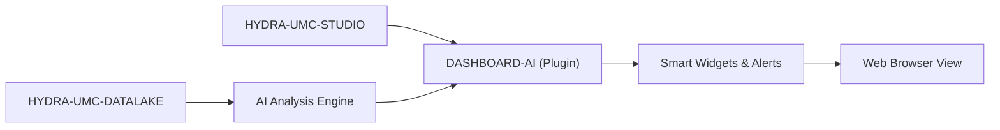

<p align="center">
  
</p>

# 🧠 HYDRA-UMC-DASHBOARD-AI

<p align="center">🇺🇸 <b>English</b> | <a href="README_spa.md">🇪🇸 Español</a> | <a href="README_fra.md">🇫🇷 Français</a> | <a href="README_ita.md">🇮🇹 Italiano</a> | <a href="README_deu.md">🇩🇪 Deutsch</a> | <a href="README_zho.md">🇨🇳 简体中文</a> | <a href="README_jpn.md">🇯🇵 日本語</a></p>

### 📈 AI-Powered Analytical Extension for the STUDIO Web Dashboard

<p align="left">
  
  
  
</p>

---

## 1. 🛠️ TECHNICAL OVERVIEW

**HYDRA-UMC-DASHBOARD-AI** is the analytical plugin for the STUDIO web interface. It enhances the standard dashboard with real-time AI insights, predictive trend analysis, and automated anomaly highlights.

It transforms raw telemetry data into actionable intelligence, providing plant operators with "Smart Summaries" of swarm performance, energy consumption patterns, and predictive maintenance alerts directly within the browser. It reuses HYDRA-UMC-STUDIO's own stack (React 19 + Vite + TypeScript) rather than introducing a new one, so it can eventually be embedded as a panel inside STUDIO itself.

### Key Features:
* 🧠 **Smart Summaries (v0)** — real min/max/average/latest/direction statistics computed from real HYDRA-UMC-DATALAKE history. *(implemented as real statistics, not yet an LLM-generated summary — see BUILD & RUN below)*
* 🔒 **AI-Provider Gate (v0)** — real input/output schema validation for the eventual LLM-backed narrative, plus a real, honestly-labeled statistical fallback used whenever no AI provider is configured or one fails/returns unstructured output. *(implemented and wired into the Trend Summary panel today; a real LLM-backed provider itself is planned)*
* 🛡️ **External Contract Guard (v0)** — validates every Datalake and anomaly-service response before a panel calculates with or renders it; malformed numbers, flags, oversized identifiers, and unsafe control characters are rejected. *(implemented; see [`docs/SECURITY.md`](docs/SECURITY.md))*
* 📈 **Trend Prediction** — a real forecast model, beyond v0's real-but-simple direction indicator. *(planned)*
* 🚨 **Anomaly Highlighting (v0)** — checks the most recent real samples against a real, already-fitted HYDRA-UMC-ANOMALY-DETECTOR baseline. *(implemented as a real text panel; overlaying it on STUDIO's own 3D view is planned)*
* 🛠️ **Optimization Tips** — suggests parameter changes to improve cycle time or motor lifespan. *(planned)*
* ✅ **Toolchain scaffold** — a real React/Vite/TypeScript app that builds clean with `tsc --noEmit` and serves with Vite. *(implemented — see BUILD & RUN below)*

---

## 2. 🔄 DASHBOARD AI FLOW



---

## 3. 🧱 ARCHITECTURE & DESIGN DECISIONS

* **Why this is a Node/TS project, not a Python one like the other AI-adjacent projects.** It's a direct extension of HYDRA-UMC-STUDIO's own React/Vite frontend, not a standalone AI service - matching STUDIO's own stack (rather than HYDRA-UMC-COGNITIVE-NODE's Python one) is what lets it actually mount as a real STUDIO panel later, not a separate app users have to switch to.
* **Why it's a sibling of STUDIO, not a folder inside it.** Keeping this as its own repo/build lets the AI-dashboard layer version and ship independently of STUDIO's own robot-control release cadence, the same reasoning that split HYDRA-UMC-SERVER out of STUDIO in the first place.
* **Why the entry point only prints identity/version/role today.** Andamiaje (scaffolding) stage: proving the package builds cleanly precedes the real dashboard panels.
* **How this fits the rest of the ecosystem.** Extends HYDRA-UMC-STUDIO with AI-driven insights, backed by HYDRA-UMC-COGNITIVE-NODE - the visual surface for what that cognitive layer actually decides.
* **Why the Anomaly Check panel checks `/stats` before offering to score anything.** HYDRA-UMC-ANOMALY-DETECTOR's own detector is one shared, in-memory-fitted baseline (see that project's own `api.py`) - this dashboard deliberately does not manage fitting it (mutating shared detector state from a read-oriented dashboard would be a real coupling smell). A real "not fitted yet" state is shown as exactly that, not folded into a generic error.
* **Why the Trend Summary reports "direction", not a forecast.** A real first-to-last delta sign (with a small relative-noise threshold so a flat signal doesn't flicker "up"/"down") is honest about what v0 actually computes - a real forecast model is separate, real future work, not something to fake with a linear extrapolation dressed up as "prediction".
* **Why `safeGenerateNarrative()` validates the request but never throws for a bad response.** A malformed request is a real wiring bug in this codebase - there's no summary to honestly fall back to, so it's allowed to throw. A malformed/unstructured *response* from a provider is a fact of life for any real external API - that path always degrades to the real statistical fallback instead of crashing the panel, because the caller already has everything it needs (the real summary) to say something true.
* **Why `NO_PROVIDER_CONFIGURED` reuses `summary.ts` instead of a separate fallback implementation.** A second, independent "fallback narrative" formula would drift from the real statistics the panel already trusts and displays numerically - reusing the same `TrendSummary` values keeps the fallback narrative provably consistent with the numbers right next to it.

---

## 📂 DIRECTORY STRUCTURE

Pure-software web app — no hardware, firmware or OS of its own; those folders are omitted by repository structure policy.

```text
HYDRA-UMC-DASHBOARD-AI/
├── src/
│   ├── api/                 # Real HTTP clients: datalakeClient.ts, anomalyClient.ts
│   ├── lib/
│   │   ├── summary.ts        # Real trend-summary statistics
│   │   └── aiProvider.ts     # Real AI-provider gate: schema validation + honest fallback
│   ├── components/
│   │   ├── TrendSummaryPanel.tsx
│   │   └── AnomalyCheckPanel.tsx
│   ├── main.tsx              # Application entry point
│   ├── App.tsx                # Root component - mounts both real panels
│   ├── index.css              # Base stylesheet
│   └── vite-env.d.ts          # VITE_DATALAKE_URL / VITE_ANOMALY_URL typing
├── tests/                   # Real tests: HTTP round-trips + component tests
├── scripts/
│   └── bump-version.mjs    # Odometer-style version bump (run by build)
├── docs/
│   └── SECURITY.md          # Public external-content and deployment safety contract
├── build/                  # Reserved for release artifacts (dist/ itself is gitignored)
├── images/                 # Media and diagrams
├── index.html              # Vite entry HTML
├── vite.config.ts          # Vite bundler + Vitest configuration
├── tsconfig.json / tsconfig.app.json / tsconfig.node.json
├── dev.sh / dev.bat        # Real dev server: install deps + vite
├── build.sh / build.bat    # Real build: install deps + real test suite + bump version + tsc + vite build
└── package.json
```

---

## 4. ⚙️ BUILD & RUN GUIDE

Requires Node.js >= 20.

```bash
# Linux/macOS
./dev.sh      # installs dependencies, starts the Vite dev server on :5174
./build.sh    # installs deps, runs the real test suite, bumps the version, type-checks, builds dist/

# Windows
dev.bat
build.bat
```

`npm run build` chains `node scripts/bump-version.mjs && tsc --noEmit && vite build` — the version bump only happens once the strict TypeScript check has already passed, so a broken build never ships a bumped version number. `npm run dev` starts Vite on port `5174` (separate from HYDRA-UMC-STUDIO's own `5173`, so both can run side by side). `npm test` runs the real Vitest suite directly.

By default the two real panels point at `http://localhost:8095` (HYDRA-UMC-DATALAKE) and `http://localhost:8097` (HYDRA-UMC-ANOMALY-DETECTOR) - override with `VITE_DATALAKE_URL`/`VITE_ANOMALY_URL` (set before `vite build`/`vite dev`, Vite inlines them at build time) to point at a different deployment.

Read [`docs/SECURITY.md`](docs/SECURITY.md) before configuring those browser-visible URLs or connecting a real AI provider; it defines the response validation, content safety, failure behaviour, and no-secrets deployment rule.

Every real Trend Summary fetch also runs the real AI-provider gate. With no real provider configured (v0's honest default), the panel shows the real statistical fallback, clearly labeled:

```ts
import { safeGenerateNarrative, NO_PROVIDER_CONFIGURED } from './lib/aiProvider'

const narrative = await safeGenerateNarrative(NO_PROVIDER_CONFIGURED, { sourceId, kind, field, summary })
// { narrative: "robot-1/motor_temp/value: 4 sample(s), ranging 10.00 to 50.00,
//    averaging 29.00, latest 36.00 (rising).", generatedBy: 'statistical-fallback' }
```

A provider that throws, or returns a response missing/malformed `narrative`, degrades to that exact same real fallback instead of crashing the panel or rendering nothing.

---

## 🔗 Related Projects

This project is part of a larger robotics ecosystem by the same author (JuanenRac / Electro Hobby 3D), spanning firmware, control software, AI nodes, and fleet tooling. Worth knowing about, since a request might actually be about one of these rather than this repository.

### Directly Related

- **[HYDRA-UMC-STUDIO](https://github.com/JuanenRac/HYDRA-UMC-STUDIO)** — the dashboard this project directly extends.
- **[HYDRA-UMC-COGNITIVE-NODE](https://github.com/JuanenRac/HYDRA-UMC-COGNITIVE-NODE)** — the AI backend feeding this dashboard.

### Rest of the Ecosystem

**HYDRA-UMC platform** — the multi-robot micro-factory cell
- **[HYDRA-UMC](https://github.com/JuanenRac/HYDRA-UMC)** — the CM5 + STM32H745 motherboard orchestrating up to 8 robot arms.
- **[HYDRA-UMC-SERVER](https://github.com/JuanenRac/HYDRA-UMC-SERVER)** — the Express/WebSocket backend every control client talks to.
- **[HYDRA-UMC-STUDIO](https://github.com/JuanenRac/HYDRA-UMC-STUDIO)** — web-based control dashboard, multi-robot 3D visualization.
- **[HYDRA-UMC-ANDROID-CONTROL](https://github.com/JuanenRac/HYDRA-UMC-ANDROID-CONTROL)** — Android control app over Wi-Fi/Bluetooth.
- **[HYDRA-UMC-IOS-CONTROL](https://github.com/JuanenRac/HYDRA-UMC-IOS-CONTROL)** — iOS/iPadOS control app built in Flutter.
- **[HYDRA-UMC-SUITE](https://github.com/JuanenRac/HYDRA-UMC-SUITE)** — desktop swarm command center (Python/PySide6).
- **[HYDRA-UMC-EDITOR-URDF](https://github.com/JuanenRac/HYDRA-UMC-EDITOR-URDF)** — desktop URDF model editor for the robot catalog.
- **[HYDRA-UMC-DSI](https://github.com/JuanenRac/HYDRA-UMC-DSI)** — native touch UI for the onboard DSI touchscreen.

**URTC platform** — the tool head controller every HYDRA-UMC robot arm carries
- **[URTC](https://github.com/JuanenRac/URTC)** — CAN bus tool head controller, 25 tool profiles.
- **[URTC-FLASHER](https://github.com/JuanenRac/URTC-FLASHER)** — desktop CAN-OTA + SWD/JTAG flashing tool.
- **[URTC-TESTER](https://github.com/JuanenRac/URTC-TESTER)** — desktop live CAN-bus diagnostic tool.
- **[URTC-WEB-STUDIO](https://github.com/JuanenRac/URTC-WEB-STUDIO)** — browser-based alternative via Web Serial API.

**🎥 Vision AI Node (Hailo-8)**
- [HYDRA-UMC-VISION-NODE](https://github.com/JuanenRac/HYDRA-UMC-VISION-NODE)
- [HYDRA-UMC-VISION-STREAMER](https://github.com/JuanenRac/HYDRA-UMC-VISION-STREAMER)
- [HYDRA-UMC-DETECTION-HEF](https://github.com/JuanenRac/HYDRA-UMC-DETECTION-HEF)
- [HYDRA-UMC-SAFETY-ZONES](https://github.com/JuanenRac/HYDRA-UMC-SAFETY-ZONES)
- [HYDRA-UMC-VISUAL-SERVOING-API](https://github.com/JuanenRac/HYDRA-UMC-VISUAL-SERVOING-API)

**🧠 Cognitive AI Node (Hailo-10)**
- [HYDRA-UMC-COGNITIVE-NODE](https://github.com/JuanenRac/HYDRA-UMC-COGNITIVE-NODE)
- [HYDRA-UMC-VLA-ENGINE](https://github.com/JuanenRac/HYDRA-UMC-VLA-ENGINE)
- [HYDRA-UMC-VOICE-UI](https://github.com/JuanenRac/HYDRA-UMC-VOICE-UI)
- [HYDRA-UMC-SEMANTIC-PLANNER](https://github.com/JuanenRac/HYDRA-UMC-SEMANTIC-PLANNER)
- [HYDRA-UMC-DOCS-QA](https://github.com/JuanenRac/HYDRA-UMC-DOCS-QA)

**🐝 Orchestration & Swarm**
- [HYDRA-UMC-ORCHESTRATOR](https://github.com/JuanenRac/HYDRA-UMC-ORCHESTRATOR)
- [HYDRA-UMC-SWARM-SYNC](https://github.com/JuanenRac/HYDRA-UMC-SWARM-SYNC)
- [HYDRA-UMC-PATH-PLANNER-3D](https://github.com/JuanenRac/HYDRA-UMC-PATH-PLANNER-3D)
- [HYDRA-UMC-JOB-DISPATCHER](https://github.com/JuanenRac/HYDRA-UMC-JOB-DISPATCHER)
- [HYDRA-UMC-NODE-HEALING](https://github.com/JuanenRac/HYDRA-UMC-NODE-HEALING)

**🎮 Digital Twin & Simulation**
- [HYDRA-UMC-TWIN](https://github.com/JuanenRac/HYDRA-UMC-TWIN)
- [HYDRA-UMC-PHYSICS-REPLICA](https://github.com/JuanenRac/HYDRA-UMC-PHYSICS-REPLICA)
- [HYDRA-UMC-HIL-BRIDGE](https://github.com/JuanenRac/HYDRA-UMC-HIL-BRIDGE)
- [HYDRA-UMC-SYNTHETIC-DATA-GEN](https://github.com/JuanenRac/HYDRA-UMC-SYNTHETIC-DATA-GEN)

**📊 Data & Analytics**
- [HYDRA-UMC-DATALAKE](https://github.com/JuanenRac/HYDRA-UMC-DATALAKE)
- [HYDRA-UMC-TELEMETRY-COLLECTOR](https://github.com/JuanenRac/HYDRA-UMC-TELEMETRY-COLLECTOR)
- [HYDRA-UMC-ANOMALY-DETECTOR](https://github.com/JuanenRac/HYDRA-UMC-ANOMALY-DETECTOR)
- [HYDRA-UMC-PRODUCTION-REPORTS](https://github.com/JuanenRac/HYDRA-UMC-PRODUCTION-REPORTS)

**🏭 Industrial Gateway**
- [HYDRA-UMC-GATEWAY-INDUSTRIAL](https://github.com/JuanenRac/HYDRA-UMC-GATEWAY-INDUSTRIAL)
- [HYDRA-UMC-OPCUA-SERVER](https://github.com/JuanenRac/HYDRA-UMC-OPCUA-SERVER)
- [HYDRA-UMC-MQTT-BROKER](https://github.com/JuanenRac/HYDRA-UMC-MQTT-BROKER)
- [HYDRA-UMC-MTCONNECT-ADAPTER](https://github.com/JuanenRac/HYDRA-UMC-MTCONNECT-ADAPTER)

**🛠️ Complementary Tools**
- [URTC-SMART-RACK](https://github.com/JuanenRac/URTC-SMART-RACK)
- [URTC-VISION-TOOL](https://github.com/JuanenRac/URTC-VISION-TOOL)
- [HYDRA-UMC-WATCH](https://github.com/JuanenRac/HYDRA-UMC-WATCH)
- [HYDRA-UMC-TOOL-CLI](https://github.com/JuanenRac/HYDRA-UMC-TOOL-CLI)


## 👤 AUTHOR
**JuanenRac** (Electro Hobby 3D)
📧 electrohobby3d@gmail.com

## 📜 LICENSE
GPL-3.0 - See LICENSE for details.

## 🛠️ BUILD & RUN

Use the non-versioning build check before a release build:

| Action | Windows | Linux / macOS |
|---|---|---|
| Build check (no version or CHANGELOG change) | `build-test.bat` | `./build-test.sh` |
| Run / development (when provided) | `run*.bat` or `dev*.bat` | `./run*.sh` or `./dev*.sh` |

`build-test.bat` and `build-test.sh` compile or validate the project stack without incrementing `hydra-umc.project.json` or modifying `CHANGELOG.md`. They may create normal compiler output only. Existing `build*.bat`, `build*.sh`, `run*` and `dev*` scripts retain their project-specific, versioned or runtime behavior; use them when that behavior is required.
