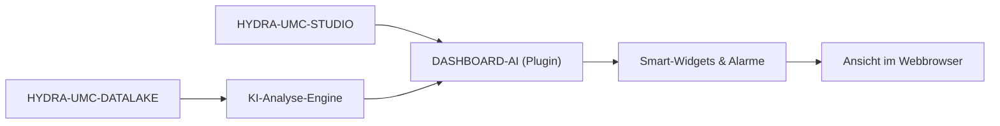

<p align="center">
  
</p>

# 🧠 HYDRA-UMC-DASHBOARD-AI

<p align="center"><a href="README.md">🇺🇸 English</a> | <a href="README_spa.md">🇪🇸 Español</a> | <a href="README_fra.md">🇫🇷 Français</a> | <a href="README_ita.md">🇮🇹 Italiano</a> | 🇩🇪 <b>Deutsch</b> | <a href="README_zho.md">🇨🇳 简体中文</a> | <a href="README_jpn.md">🇯🇵 日本語</a></p>

### 📈 KI-gestützte Analyse-Erweiterung für das STUDIO-Web-Dashboard

<p align="left">
  
  
  
</p>

---

## 1. 🛠️ TECHNISCHER ÜBERBLICK

**HYDRA-UMC-DASHBOARD-AI** ist das Analyse-Plugin für die STUDIO-Weboberfläche. Es erweitert das Standard-Dashboard um KI-Insights in Echtzeit, prädiktive Trendanalysen und automatische Anomalie-Hervorhebungen.

Es verwandelt rohe Telemetriedaten in verwertbare Erkenntnisse und liefert Anlagenbedienern "Smart Summaries" der Flottenleistung, Energieverbrauchsmuster und Warnungen zur vorausschauenden Wartung direkt im Browser. Es nutzt denselben Stack wie HYDRA-UMC-STUDIO (React 19 + Vite + TypeScript) statt einen neuen einzuführen, damit es später als Panel in STUDIO selbst eingebettet werden kann.

### Hauptmerkmale:
* 🧠 **Smart Summaries (v0)** — echte Min/Max/Durchschnitt/Letzter-Wert/Trend-Statistiken, berechnet aus dem echten Verlauf von HYDRA-UMC-DATALAKE. *(implementiert als echte Statistiken, noch keine KI-generierte Zusammenfassung — siehe BUILD & AUSFÜHRUNG unten)*
* 🔒 **KI-Anbieter-Gate (v0)** — echte Ein-/Ausgabe-Schema-Validierung für die zukünftige LLM-gestützte Erzählung, plus ein echter, ehrlich beschrifteter statistischer Fallback, der verwendet wird, wann immer kein KI-Anbieter konfiguriert ist oder einer fehlschlägt/unstrukturierte Ausgabe zurückgibt. *(heute implementiert und in das Trend-Summary-Panel eingebunden; ein echter LLM-gestützter Anbieter selbst ist geplant)*
* 🛡️ **Externes Vertrags-Gate (v0)** — validiert jede Datalake- und Anomaliedienst-Antwort, bevor ein Panel damit rechnet oder sie darstellt; fehlerhafte Zahlen, Flags, überlange Kennungen und unsichere Steuerzeichen werden abgewiesen. *(implementiert; siehe [`docs/SECURITY.md`](docs/SECURITY.md))*
* 📈 **Trendvorhersage** — ein echtes Vorhersagemodell, über den echten, aber einfachen Richtungsindikator von v0 hinaus. *(geplant)*
* 🚨 **Anomalie-Hervorhebung (v0)** — prüft die neuesten echten Messwerte gegen eine echte, bereits kalibrierte Baseline von HYDRA-UMC-ANOMALY-DETECTOR. *(implementiert als echtes Textpanel; die Überlagerung in STUDIOs eigener 3D-Ansicht ist geplant)*
* 🛠️ **Optimierungstipps** — schlägt Parameteränderungen zur Verbesserung von Zykluszeit oder Motorlebensdauer vor. *(geplant)*
* ✅ **Toolchain-Grundgerüst** — eine echte React/Vite/TypeScript-App, die sauber mit `tsc --noEmit` baut und mit Vite ausgeliefert wird. *(implementiert — siehe BUILD & AUSFÜHRUNG unten)*

---

## 2. 🔄 DASHBOARD-AI-ABLAUF



---

## 3. 🧱 ARCHITEKTUR & DESIGNENTSCHEIDUNGEN

* **Warum es ein Node/TS-Projekt ist, kein Python-Projekt wie die anderen KI-nahen Projekte.** Es ist eine direkte Erweiterung des eigenen React/Vite-Frontends von HYDRA-UMC-STUDIO, kein eigenständiger KI-Dienst - sich am eigenen Stack von STUDIO auszurichten (statt am Python-Stack von HYDRA-UMC-COGNITIVE-NODE) ist das, was es später erlaubt, wirklich als echtes STUDIO-Panel eingebunden zu werden, keine separate App, zu der Nutzer wechseln müssten.
* **Warum es Geschwister von STUDIO ist, kein Ordner darin.** Dies als eigenes Repo/Build zu behalten erlaubt es der KI-Dashboard-Schicht, unabhängig vom eigenen Release-Rhythmus der Robotersteuerung von STUDIO zu versionieren und auszuliefern - derselbe Grund, der seinerzeit HYDRA-UMC-SERVER von STUDIO abgespalten hat.
* **Warum der Einstiegspunkt heute nur Identität/Version/Rolle ausgibt.** Andamiaje-Stadium: der Nachweis, dass das Paket sauber kompiliert, geht den echten Dashboard-Panels voraus.
* **Wie sich das ins restliche Ökosystem einfügt.** Erweitert HYDRA-UMC-STUDIO um KI-gestützte Einblicke, unterstützt von HYDRA-UMC-COGNITIVE-NODE - die visuelle Oberfläche für das, was diese kognitive Schicht tatsächlich entscheidet.
* **Warum das Anomalie-Check-Panel `/stats` prüft, bevor es überhaupt anbietet, etwas zu bewerten.** Der eigene Detektor von HYDRA-UMC-ANOMALY-DETECTOR ist eine einzige, gemeinsam genutzte, im Speicher kalibrierte Baseline (siehe das eigene `api.py` dieses Projekts) - dieses Dashboard verwaltet ihre Kalibrierung bewusst nicht (den gemeinsamen Detektor-Zustand von einem lesend orientierten Dashboard aus zu verändern wäre eine echte, unerwünschte Kopplung). Ein echter "noch nicht kalibriert"-Zustand wird genau als solcher angezeigt, nie in einen generischen Fehler verschmolzen.
* **Warum die Trendzusammenfassung eine "Richtung" meldet, keine Vorhersage.** Ein echtes Vorzeichen des Erst-zu-Letzt-Deltas (mit einer kleinen relativen Rausch-Schwelle, damit ein flaches Signal nicht zwischen "steigend"/"fallend" flackert) ist ehrlich darüber, was v0 tatsächlich berechnet - ein echtes Vorhersagemodell ist eigenständige, echte zukünftige Arbeit, nicht etwas, das mit einer linearen Extrapolation vorgetäuscht wird, die als "Vorhersage" verkleidet ist.
* **Warum `safeGenerateNarrative()` die Anfrage validiert, aber bei einer schlechten Antwort nie einen Fehler wirft.** Eine fehlerhafte Anfrage ist ein echter Verdrahtungsfehler in diesem Code - es gibt keine Zusammenfassung, auf die ehrlich zurückgegriffen werden könnte, daher darf sie einen Fehler werfen. Eine *fehlerhafte/unstrukturierte* Antwort eines Anbieters ist eine reale Tatsache bei jeder echten externen API - dieser Pfad degradiert immer zum echten statistischen Fallback, statt das Panel abstürzen zu lassen, weil der Aufrufer bereits alles hat, was er braucht (die echte Zusammenfassung), um etwas Wahres zu sagen.
* **Warum `NO_PROVIDER_CONFIGURED` `summary.ts` wiederverwendet statt einer separaten Fallback-Implementierung.** Eine zweite, unabhängige "Fallback-Erzählung"-Formel würde von den echten Statistiken abweichen, denen das Panel bereits vertraut und die es bereits numerisch anzeigt - die Wiederverwendung derselben `TrendSummary`-Werte hält die Fallback-Erzählung nachweislich konsistent mit den Zahlen direkt daneben.

---

## 📂 VERZEICHNISSTRUKTUR

Reine Software-Anwendung — ohne eigene Hardware, Firmware oder Betriebssystem; diese Ordner werden gemäß der Repository-Strukturpolitik ausgelassen.

```text
HYDRA-UMC-DASHBOARD-AI/
├── src/
│   ├── api/                 # Echte HTTP-Clients: datalakeClient.ts, anomalyClient.ts
│   ├── lib/
│   │   ├── summary.ts        # Echte Trendzusammenfassungs-Statistiken
│   │   └── aiProvider.ts     # Echtes KI-Anbieter-Gate: Schema-Validierung + ehrlicher Fallback
│   ├── components/
│   │   ├── TrendSummaryPanel.tsx
│   │   └── AnomalyCheckPanel.tsx
│   ├── main.tsx              # Einstiegspunkt der Anwendung
│   ├── App.tsx                # Wurzelkomponente - bindet beide echten Panels ein
│   ├── index.css              # Basis-Stylesheet
│   └── vite-env.d.ts          # Typisierung von VITE_DATALAKE_URL / VITE_ANOMALY_URL
├── tests/                   # Echte Tests: HTTP-Round-Trips + Komponententests
├── scripts/
│   ├── bump-version.mjs    # Versionserhöhung nach Kilometerzähler-Prinzip (vom Build ausgeführt)
│   ├── serve_static.py     # Echter statischer Dateiserver für das gebaute dist/-SPA (live gefundene CM5-Deployment-Lücke)
│   └── test_serve_static.py # Echte Tests für serve_static.py
├── systemd/
│   └── hydra-umc-dashboard-ai.service # systemd-Unit des lokalen CM5-Static-Serve-Dienstes
├── tools/
│   ├── build_test.py       # Nicht-versionierender Build-Check
│   └── ci_validate.py      # Manifest/CHANGELOG/Docs-Validierung, von CI genutzt
├── docs/
│   └── SECURITY.md          # Öffentlicher Sicherheitsvertrag für externe Inhalte und Deployment
├── build/                  # Reserviert für Release-Artefakte (dist/ selbst ist von git ignoriert)
├── images/                 # Medien und Diagramme
├── index.html              # Vite-Einstiegs-HTML
├── vite.config.ts          # Vite-Bundler- + Vitest-Konfiguration
├── tsconfig.json / tsconfig.app.json / tsconfig.node.json
├── bump_manifest_version.py # Synchronisiert die Version von hydra-umc.project.json mit der von package.json (--sync)
├── dev.sh / dev.bat        # Echter Dev-Server: installiert Abhängigkeiten + vite
├── build.sh / build.bat    # Echter Build: installiert Abhängigkeiten + echte Testsuite + erhöht Version + tsc + vite build
└── package.json
```

---

## 4. ⚙️ BUILD & AUSFÜHRUNG

Erfordert Node.js >= 20.

```bash
# Linux/macOS
./dev.sh      # installiert Abhängigkeiten, startet den Vite-Dev-Server auf :5174
./build.sh    # installiert Abhängigkeiten, führt die echte Testsuite aus, erhöht die Version, prüft Typen, baut dist/

# Windows
dev.bat
build.bat
```

`npm run build` verkettet `node scripts/bump-version.mjs && tsc --noEmit && vite build` — die Versionserhöhung erfolgt erst, nachdem die strikte TypeScript-Prüfung bereits bestanden wurde, sodass ein defekter Build niemals eine erhöhte Versionsnummer ausliefert. `npm run dev` startet Vite auf Port `5174` (getrennt vom eigenen `5173` von HYDRA-UMC-STUDIO, damit beide gleichzeitig laufen können). `npm test` führt die echte Vitest-Suite direkt aus.

Standardmäßig zeigen die beiden echten Panels auf `http://localhost:8095` (HYDRA-UMC-DATALAKE) und `http://localhost:8097` (HYDRA-UMC-ANOMALY-DETECTOR) - überschreibbar mit `VITE_DATALAKE_URL`/`VITE_ANOMALY_URL` (vor `vite build`/`vite dev` gesetzt, Vite bindet sie zur Build-Zeit ein), um auf ein anderes Deployment zu zeigen.

Lies [`docs/SECURITY.md`](docs/SECURITY.md), bevor du diese im Browser sichtbaren URLs konfigurierst oder einen echten KI-Anbieter verbindest; es definiert Antwortvalidierung, Inhaltssicherheit, Fehlerverhalten und die Regel, keine Geheimnisse einzubinden.

Jeder echte Trend-Summary-Abruf durchläuft auch das echte KI-Anbieter-Gate. Ohne konfigurierten echten Anbieter (v0s ehrlicher Standard) zeigt das Panel den echten statistischen Fallback, klar beschriftet:

```ts
import { safeGenerateNarrative, NO_PROVIDER_CONFIGURED } from './lib/aiProvider'

const narrative = await safeGenerateNarrative(NO_PROVIDER_CONFIGURED, { sourceId, kind, field, summary })
// { narrative: "robot-1/motor_temp/value: 4 sample(s), ranging 10.00 to 50.00,
//    averaging 29.00, latest 36.00 (rising).", generatedBy: 'statistical-fallback' }
```

Ein Anbieter, der einen Fehler wirft oder eine Antwort mit fehlendem oder fehlerhaftem `narrative` zurückgibt, degradiert zu genau diesem echten Fallback, statt das Panel abstürzen zu lassen oder nichts anzuzeigen.

---

## 🔗 Verwandte Projekte

Dieses Projekt ist Teil des HYDRA-UMC-Robotik-Ökosystems desselben Autors (JuanenRac / Electro Hobby 3D). Gut zu wissen, da eine Anfrage eigentlich eines dieser Projekte betreffen könnte statt dieses Repositorys.

**Direkt verwandt**
- **[HYDRA-UMC-STUDIO](https://github.com/JuanenRac/HYDRA-UMC-STUDIO)** — Web-Steuerungs-Dashboard mit Echtzeit-3D-Visualisierung mehrerer Roboter — das Dashboard, das dieses Projekt direkt erweitert.
- **[HYDRA-UMC-COGNITIVE-NODE](https://github.com/JuanenRac/HYDRA-UMC-COGNITIVE-NODE)** — Integrationsknoten für die Hailo-10-Cognitive-Pipeline (LLM-/VLA-/Sprach-Orchestrierung) — das KI-Backend, das dieses Dashboard speist.
- **[HYDRA-UMC-DATALAKE](https://github.com/JuanenRac/HYDRA-UMC-DATALAKE)** — echter sqlite3-gestützter Zeitreihenspeicher mit einer echten Ingest-/Abfrage-HTTP-API — der reale Verlauf, aus dem das Smart-Summaries-Panel seine Statistiken berechnet.
- **[HYDRA-UMC-ANOMALY-DETECTOR](https://github.com/JuanenRac/HYDRA-UMC-ANOMALY-DETECTOR)** — echter FFT- + statistischer Basislinien-Anomaliedetektor mit Drift-Überwachung — die angepasste Baseline, gegen die das Anomaly-Highlighting-Panel aktuelle Samples bewertet.

**Ebenfalls Teil des Ökosystems**

*Kern-Hardware & Plattform*
- **[HYDRA-UMC](https://github.com/JuanenRac/HYDRA-UMC)** — das physische Motherboard des Roboterarms: CM5-Host + Dual-Core-STM32H745, koordiniert bis zu 8 Werkzeugarme über CAN-OTA/SPI-OTA.
- **[HYDRA-UMC-OS](https://github.com/JuanenRac/HYDRA-UMC-OS)** — reproduzierbare Raspberry-Pi-OS-Produktschicht für den CM5: schreibgeschützter Agent, validierte Konfiguration/Profile, WiFi-Ersteinrichtung.
- **[HYDRA-UMC-SDK](https://github.com/JuanenRac/HYDRA-UMC-SDK)** — der gemeinsame JSON-Schema-Vertrag und die Sicherheitsschranke, gegen die jede Bridge ihre Befehle validiert.

*Kern-Backend & Clients*
- **[HYDRA-UMC-SERVER](https://github.com/JuanenRac/HYDRA-UMC-SERVER)** — das reale Headless-Backend (REST/WebSocket), mit dem jeder Steuerungsclient tatsächlich spricht.
- **[HYDRA-UMC-SUITE](https://github.com/JuanenRac/HYDRA-UMC-SUITE)** — Desktop-Schwarmleitstand (PySide6) für mehrere Server gleichzeitig, verpackt als eigenständige ausführbare Datei.
- **[HYDRA-UMC-ANDROID-CONTROL](https://github.com/JuanenRac/HYDRA-UMC-ANDROID-CONTROL)** — native Android-Steuerungs-App mit biometrischem Login und einer gekoppelten Wear-OS-Begleit-App.
- **[HYDRA-UMC-IOS-CONTROL](https://github.com/JuanenRac/HYDRA-UMC-IOS-CONTROL)** — iOS/iPadOS-Steuerungs-App (Flutter) mit Echtzeit-WebSocket-Synchronisierung.
- **[HYDRA-UMC-DSI](https://github.com/JuanenRac/HYDRA-UMC-DSI)** — native Touch-UI für das eingebaute 7"-DSI-Touchscreen, direkt auf dem CM5 eingebettet.
- **[HYDRA-UMC-EDITOR-URDF](https://github.com/JuanenRac/HYDRA-UMC-EDITOR-URDF)** — grafischer Desktop-URDF-Ersteller/-Editor, der fertige Modelle in STUDIOs eigenen Katalog überträgt.
- **[HYDRA-UMC-BRIDGE-AMR](https://github.com/JuanenRac/HYDRA-UMC-BRIDGE-AMR)** — Koordinationsschranke für AGV-/AMR-Flotten über einen echten VDA-5050-MQTT-Publisher.
- **[HYDRA-UMC-BRIDGE-CNC](https://github.com/JuanenRac/HYDRA-UMC-BRIDGE-CNC)** — High-Level-Koordinator für CNC-Zellen mit echtem GRBL-Status-/Steuerbyte-Zugriff.
- **[HYDRA-UMC-BRIDGE-DROIDS](https://github.com/JuanenRac/HYDRA-UMC-BRIDGE-DROIDS)** — Koordinationsschranke für laufende/humanoide Droiden, mit einem echten Boston-Dynamics-Spot-Befehlssender.
- **[HYDRA-UMC-BRIDGE-LASER](https://github.com/JuanenRac/HYDRA-UMC-BRIDGE-LASER)** — Sicherheitskoordinator für Laserzellen, liest 3 echte Schlüssel-/Gehäuse-/Verriegelungs-GPIO-Sicherungen.
- **[HYDRA-UMC-BRIDGE-OPENPNP](https://github.com/JuanenRac/HYDRA-UMC-BRIDGE-OPENPNP)** — sicherer High-Level-Koordinator für den Leiterplattenfluss von OpenPnP Pick-and-Place.
- **[HYDRA-UMC-BRIDGE-PRINTER3D](https://github.com/JuanenRac/HYDRA-UMC-BRIDGE-PRINTER3D)** — sichere Koordinationsschranke für Moonraker/Klipper-3D-Drucker, mit echten gesicherten Job-Befehlen.
- **[HYDRA-UMC-BRIDGE-ROS2](https://github.com/JuanenRac/HYDRA-UMC-BRIDGE-ROS2)** — Sicherheitskoordinator mit einem echten, träge importierten rclpy-ROS-2-Transport.
- **[HYDRA-UMC-BRIDGE-UAV](https://github.com/JuanenRac/HYDRA-UMC-BRIDGE-UAV)** — Koordinationsschranke für kameraausgestattete UAVs, mit einem echten MAVLink-Befehlssender.

*URTC-Werkzeugplattform*
- **[URTC](https://github.com/JuanenRac/URTC)** — Firmware für die physische Universal-Robot-Tool-Controller-Platine, 25+ Werkzeugprofile über CAN-Bus.
- **[URTC-FLASHER](https://github.com/JuanenRac/URTC-FLASHER)** — Desktop-GUI-Flash-Tool für URTC-Platinen, CAN-OTA plus Full-Chip-SWD/JTAG.
- **[URTC-TESTER](https://github.com/JuanenRac/URTC-TESTER)** — Desktop-Live-CAN-Bus-Diagnosetool für URTC-Platinen, ein Panel pro Werkzeugprofil.
- **[URTC-WEB-STUDIO](https://github.com/JuanenRac/URTC-WEB-STUDIO)** — browserbasierte Alternative zu URTC-TESTER über die Web-Serial-API, ohne lokale Installation.

*Vision-KI-Knoten (Hailo-8)*
- **[HYDRA-UMC-VISION-NODE](https://github.com/JuanenRac/HYDRA-UMC-VISION-NODE)** — Integrationsknoten für die Hailo-8-Vision-Pipeline, mit einer echten stufenweisen Hardware-Bereitschaftsprüfung.
- **[HYDRA-UMC-DETECTION-HEF](https://github.com/JuanenRac/HYDRA-UMC-DETECTION-HEF)** — echte Registry für kompilierte Modelle mit Hailo-Architektur-/Prüfsummen-Safe-Load-Verifizierung.
- **[HYDRA-UMC-VISION-STREAMER](https://github.com/JuanenRac/HYDRA-UMC-VISION-STREAMER)** — echter GStreamer-Pipeline- + MediaMTX-Konfigurationsgenerator mit einer echten HailoRT-Integrationsschranke.
- **[HYDRA-UMC-VISUAL-SERVOING-API](https://github.com/JuanenRac/HYDRA-UMC-VISUAL-SERVOING-API)** — echtes Position-Based-Visual-Servoing-Korrekturgesetz, sicherheitsgesteuert nach vorgelagertem Zonenstatus.
- **[HYDRA-UMC-SAFETY-ZONES](https://github.com/JuanenRac/HYDRA-UMC-SAFETY-ZONES)** — echte Zonenverletzungsprüfung und E-STOP-Anforderung, mit erzwungener Kalibrierungsaktualität.

*Kognitiver KI-Knoten (Hailo-10)*
- **[HYDRA-UMC-VLA-ENGINE](https://github.com/JuanenRac/HYDRA-UMC-VLA-ENGINE)** — echte Aktions-Token-Kodierung/-Dekodierung und Trajektoriengenerierung für ein Vision-Language-Action-Modell.
- **[HYDRA-UMC-VOICE-UI](https://github.com/JuanenRac/HYDRA-UMC-VOICE-UI)** — echtes Sprach-Frontend (VAD + Intent-Parser) mit einem begrenzten, bestätigungsgesicherten Watch-Relay.
- **[HYDRA-UMC-SEMANTIC-PLANNER](https://github.com/JuanenRac/HYDRA-UMC-SEMANTIC-PLANNER)** — echte regelbasierte Aufgabenzerlegung und semantische Fehlerbehebung über MCU-Fehlercodes.
- **[HYDRA-UMC-DOCS-QA](https://github.com/JuanenRac/HYDRA-UMC-DOCS-QA)** — echte, nur auf der Standardbibliothek basierende TF-IDF-Dokumentensuche über die eigenen Markdown-Dokumente dieses Ökosystems.

*Orchestrierung & Schwarm*
- **[HYDRA-UMC-ORCHESTRATOR](https://github.com/JuanenRac/HYDRA-UMC-ORCHESTRATOR)** — Integrationsknoten mit einem echten gRPC/Protobuf-Health-Report-Vertrag und einer Missions-Zustandsmaschine.
- **[HYDRA-UMC-JOB-DISPATCHER](https://github.com/JuanenRac/HYDRA-UMC-JOB-DISPATCHER)** — echte prioritätsbasierte Job-Queue mit Deduplizierung, über eine echte HTTP-API.
- **[HYDRA-UMC-NODE-HEALING](https://github.com/JuanenRac/HYDRA-UMC-NODE-HEALING)** — echter gRPC-basierter Flotten-Health-Watchdog mit Retry/Backoff und Identitäts-Mismatch-Erkennung.
- **[HYDRA-UMC-PATH-PLANNER-3D](https://github.com/JuanenRac/HYDRA-UMC-PATH-PLANNER-3D)** — echter RRT-basierter 3D-Pfadplaner mit echter Hindernis-/Arbeitsraum-Kollisionsvalidierung.
- **[HYDRA-UMC-SWARM-SYNC](https://github.com/JuanenRac/HYDRA-UMC-SWARM-SYNC)** — echte CRDT-LWW-Element-Map-Zustandssynchronisation, eigenschaftsgetestet auf Multi-Zellen-Konvergenz.

*Digitaler Zwilling & Simulation*
- **[HYDRA-UMC-TWIN](https://github.com/JuanenRac/HYDRA-UMC-TWIN)** — Integrationsknoten für die Digital-Twin-Engine, mit einem echten Versionskompatibilitäts-Sync-Vertrag.
- **[HYDRA-UMC-HIL-BRIDGE](https://github.com/JuanenRac/HYDRA-UMC-HIL-BRIDGE)** — echte Hardware-in-the-Loop-Sicherheitsverriegelung, die Befehle zwischen Simulation und echter Hardware routet.
- **[HYDRA-UMC-PHYSICS-REPLICA](https://github.com/JuanenRac/HYDRA-UMC-PHYSICS-REPLICA)** — echte Vorwärtskinematik und Gelenkgrenzenvalidierung über eine echte URDF-Teilmenge.
- **[HYDRA-UMC-SYNTHETIC-DATA-GEN](https://github.com/JuanenRac/HYDRA-UMC-SYNTHETIC-DATA-GEN)** — echter prozeduraler 2D-Szenengenerator mit YOLO/COCO-Annotationsexport.

*Daten & Analytik*
- **[HYDRA-UMC-PRODUCTION-REPORTS](https://github.com/JuanenRac/HYDRA-UMC-PRODUCTION-REPORTS)** — echte OEE-/Verfügbarkeitsberechnung über den DATALAKE-Verlauf, mit reproduzierbarem CSV-Export.
- **[HYDRA-UMC-TELEMETRY-COLLECTOR](https://github.com/JuanenRac/HYDRA-UMC-TELEMETRY-COLLECTOR)** — echte CAN/WebSocket-Ingestion-Pipeline in DATALAKE, mit Sequenz-Deduplizierung.

*Industrie-Gateway*
- **[HYDRA-UMC-GATEWAY-INDUSTRIAL](https://github.com/JuanenRac/HYDRA-UMC-GATEWAY-INDUSTRIAL)** — Integrationsknoten, der zu Industrieprotokollen weiterleitet, mit einer echten Befehls-Allowlist-/Backpressure-Schicht.
- **[HYDRA-UMC-OPCUA-SERVER](https://github.com/JuanenRac/HYDRA-UMC-OPCUA-SERVER)** — echter OPC-UA-Adressraum, verifiziert mit einer echten Binärprotokoll-Client-Session.
- **[HYDRA-UMC-MQTT-BROKER](https://github.com/JuanenRac/HYDRA-UMC-MQTT-BROKER)** — echter MQTT-Broker mit optionaler Pro-Client-Authentifizierung und Topic-ACLs.
- **[HYDRA-UMC-MTCONNECT-ADAPTER](https://github.com/JuanenRac/HYDRA-UMC-MTCONNECT-ADAPTER)** — echte MTConnect-`/probe`- und `/current`-XML-Endpunkte mit Degraded-Mode-Ausgabe.

*Ergänzende Tools & Ökosystembetrieb*
- **[HYDRA-UMC-TOOL-CLI](https://github.com/JuanenRac/HYDRA-UMC-TOOL-CLI)** — Flotten-CLI mit einem echten, stabilen Exit-Code-Vertrag, ein echter Live-Client der eigenen API von HYDRA-UMC-SERVER.
- **[HYDRA-UMC-WATCH](https://github.com/JuanenRac/HYDRA-UMC-WATCH)** — WearOS-Begleit-App mit echten haptischen Alarmen und einem Sprach-Relay zum gekoppelten Telefon.
- **[URTC-SMART-RACK](https://github.com/JuanenRac/URTC-SMART-RACK)** — Firmware für ein Platinenmontagegestell mit echter Werkzeug-ID-Dekodierung und Smart-Idle-Vorheizlogik.
- **[URTC-VISION-TOOL](https://github.com/JuanenRac/URTC-VISION-TOOL)** — Firmware plus ein echter Python-Vision-Begleiter für einen Thermal-/RGB-Inspektionswerkzeugkopf.
- **[HYDRA-UMC-UPDATER](https://github.com/JuanenRac/HYDRA-UMC-UPDATER)** — administratives Desktop-Tool, das jedes Repository in diesem Ökosystem entdeckt, klont und aktualisiert.


---

## 📚 Dokumentation & Community

- **[CONTRIBUTING.md](CONTRIBUTING.md)** — Technologie-Stack und Coding-Richtlinien für einen Pull Request.
- **[CODE_OF_CONDUCT.md](CODE_OF_CONDUCT.md)** — die in dieser Community erwarteten Verhaltensstandards.
- **[SECURITY.md](SECURITY.md)** — wie man eine Schwachstelle meldet; siehe stattdessen [`docs/SECURITY.md`](docs/SECURITY.md) für den eigenen External-Content- und Deployment-Sicherheitsvertrag dieses Projekts.
- **[SUPPORT.md](SUPPORT.md)** — wo man Fragen stellt und Fehler meldet.
- **[LICENSE.md](LICENSE.md)** — die eigene Lizenz dieses Projekts.

## 👤 AUTOR
**JuanenRac** (Electro Hobby 3D)
📧 electrohobby3d@gmail.com
📺 [youtube.com/@electrohobby3d](https://youtube.com/@electrohobby3d)

## 📜 LIZENZ
GPL-3.0 - Siehe LICENSE für Details.
