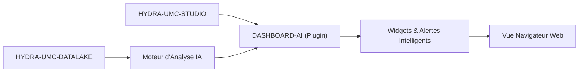

<p align="center">
  
</p>

# 🧠 HYDRA-UMC-DASHBOARD-AI

<p align="center"><a href="README.md">🇺🇸 English</a> | <a href="README_spa.md">🇪🇸 Español</a> | 🇫🇷 <b>Français</b> | <a href="README_ita.md">🇮🇹 Italiano</a> | <a href="README_deu.md">🇩🇪 Deutsch</a> | <a href="README_zho.md">🇨🇳 简体中文</a> | <a href="README_jpn.md">🇯🇵 日本語</a></p>

### 📈 Extension Analytique Alimentée par l'IA pour le Dashboard Web STUDIO

<p align="left">
  
  
  
</p>

---

## 1. 🛠️ APERÇU TECHNIQUE

**HYDRA-UMC-DASHBOARD-AI** est le plugin analytique de l'interface web STUDIO. Il enrichit le tableau de bord standard avec des insights IA en temps réel, une analyse prédictive des tendances et une mise en évidence automatique des anomalies.

Il transforme les données brutes de télémétrie en intelligence exploitable, offrant aux opérateurs de production des « Résumés Intelligents » de la performance de la flotte, des schémas de consommation d'énergie et des alertes de maintenance prédictive directement dans le navigateur. Il réutilise la même stack que HYDRA-UMC-STUDIO (React 19 + Vite + TypeScript) plutôt que d'en introduire une nouvelle, afin de pouvoir un jour être intégré comme panneau dans STUDIO lui-même.

### Fonctionnalités Clés :
* 🧠 **Résumés Intelligents (v0)** — statistiques réelles de min/max/moyenne/dernière valeur/tendance calculées à partir de l'historique réel de HYDRA-UMC-DATALAKE. *(implémenté comme statistiques réelles, pas encore un résumé généré par IA — voir COMPILATION ET EXÉCUTION ci-dessous)*
* 📈 **Prédiction de Tendances** — un véritable modèle de prédiction, au-delà de l'indicateur de direction réel-mais-simple de v0. *(prévu)*
* 🚨 **Mise en Évidence des Anomalies (v0)** — vérifie les échantillons réels les plus récents par rapport à une ligne de base réelle déjà ajustée de HYDRA-UMC-ANOMALY-DETECTOR. *(implémenté comme un vrai panneau textuel ; le superposer à la vue 3D de STUDIO est prévu)*
* 🛠️ **Conseils d'Optimisation** — suggère des changements de paramètres pour améliorer le temps de cycle ou la durée de vie des moteurs. *(prévu)*
* ✅ **Socle du toolchain** — une véritable application React/Vite/TypeScript qui compile proprement avec `tsc --noEmit` et se sert avec Vite. *(implémenté — voir COMPILATION ET EXÉCUTION ci-dessous)*

---

## 2. 🔄 FLUX DASHBOARD AI



---

## 3. 🧱 ARCHITECTURE & DÉCISIONS DE CONCEPTION

* **Pourquoi c'est un projet Node/TS, pas un projet Python comme les autres projets liés à l'IA.** C'est une extension directe du propre frontend React/Vite de HYDRA-UMC-STUDIO, pas un service IA autonome - correspondre à la propre stack de STUDIO (plutôt qu'à la stack Python de HYDRA-UMC-COGNITIVE-NODE) est ce qui lui permet de vraiment se monter comme un vrai panneau de STUDIO plus tard, pas une application séparée vers laquelle les utilisateurs devraient basculer.
* **Pourquoi c'est un frère de STUDIO, pas un dossier à l'intérieur.** Garder ceci comme son propre dépôt/build permet à la couche dashboard IA de se versionner et de se publier indépendamment du propre calendrier de sortie de contrôle robotique de STUDIO - la même raison qui a en son temps séparé HYDRA-UMC-SERVER de STUDIO.
* **Pourquoi le point d'entrée ne fait qu'imprimer identité/version/rôle aujourd'hui.** Étape d'andamiaje : prouver que le paquet compile proprement précède les vrais panneaux du tableau de bord.
* **Comment cela s'intègre dans le reste de l'écosystème.** Étend HYDRA-UMC-STUDIO avec des informations pilotées par l'IA, adossées à HYDRA-UMC-COGNITIVE-NODE - la surface visuelle de ce que cette couche cognitive décide réellement.
* **Pourquoi le panneau de Vérification des Anomalies vérifie `/stats` avant de proposer de noter quoi que ce soit.** Le propre détecteur de HYDRA-UMC-ANOMALY-DETECTOR est une unique ligne de base partagée, ajustée en mémoire (voir le propre `api.py` de ce projet) - ce dashboard ne gère délibérément pas son ajustement (muter l'état partagé du détecteur depuis un dashboard orienté lecture serait un vrai couplage indésirable). Un véritable état « pas encore ajusté » est affiché exactement comme tel, jamais fondu dans une erreur générique.
* **Pourquoi le Résumé de Tendances rapporte une « direction », pas une prédiction.** Un vrai signe de delta premier-à-dernier (avec un petit seuil de bruit relatif pour qu'un signal plat ne clignote pas entre « hausse »/« baisse ») est honnête sur ce que v0 calcule réellement - un véritable modèle de prédiction est un travail futur réel et distinct, pas quelque chose à simuler avec une extrapolation linéaire déguisée en « prédiction ».

---

## 📂 STRUCTURE DES DOSSIERS

Application purement logicielle — sans matériel, micrologiciel ou système d'exploitation propres ; ces dossiers sont omis conformément à la politique de structure du dépôt.

```text
HYDRA-UMC-DASHBOARD-AI/
├── src/
│   ├── api/                 # Vrais clients HTTP : datalakeClient.ts, anomalyClient.ts
│   ├── lib/
│   │   └── summary.ts        # Vraies statistiques de résumé de tendances
│   ├── components/
│   │   ├── TrendSummaryPanel.tsx
│   │   └── AnomalyCheckPanel.tsx
│   ├── main.tsx              # Point d'entrée de l'application
│   ├── App.tsx                # Composant racine - monte les deux vrais panneaux
│   ├── index.css              # Feuille de style de base
│   └── vite-env.d.ts          # Typage de VITE_DATALAKE_URL / VITE_ANOMALY_URL
├── tests/                   # Vrais tests : allers-retours HTTP + tests de composants
├── scripts/
│   └── bump-version.mjs    # Incrémentation de version façon compteur kilométrique (exécuté par build)
├── docs/                   # Documentation et guide d'intégration
├── build/                  # Réservé aux artefacts de release (dist/ est ignoré par git)
├── images/                 # Médias et diagrammes
├── index.html              # HTML d'entrée de Vite
├── vite.config.ts          # Configuration du bundler Vite + Vitest
├── tsconfig.json / tsconfig.app.json / tsconfig.node.json
├── dev.sh / dev.bat        # Serveur de dev réel : installe les dépendances + vite
├── build.sh / build.bat    # Build réel : installe les dépendances + vraie suite de tests + incrémente la version + tsc + vite build
└── package.json
```

---

## 4. ⚙️ COMPILATION ET EXÉCUTION

Nécessite Node.js >= 20.

```bash
# Linux/macOS
./dev.sh      # installe les dépendances, démarre le serveur Vite sur le port :5174
./build.sh    # installe les dépendances, exécute la vraie suite de tests, incrémente la version, vérifie les types, compile dist/

# Windows
dev.bat
build.bat
```

`npm run build` enchaîne `node scripts/bump-version.mjs && tsc --noEmit && vite build` — l'incrémentation de version n'a lieu qu'une fois la vérification stricte de TypeScript déjà passée, afin qu'un build cassé ne publie jamais un numéro de version incrémenté. `npm run dev` démarre Vite sur le port `5174` (distinct du `5173` propre à HYDRA-UMC-STUDIO, pour que les deux puissent tourner en même temps). `npm test` exécute directement la vraie suite Vitest.

Par défaut, les deux vrais panneaux pointent vers `http://localhost:8095` (HYDRA-UMC-DATALAKE) et `http://localhost:8097` (HYDRA-UMC-ANOMALY-DETECTOR) - à surcharger avec `VITE_DATALAKE_URL`/`VITE_ANOMALY_URL` (définies avant `vite build`/`vite dev`, Vite les intègre au moment du build) pour pointer vers un déploiement différent.

---

## 🔗 Projets Liés

Ce projet fait partie d'un écosystème robotique plus large du même auteur (JuanenRac / Electro Hobby 3D), couvrant firmware, logiciel de contrôle, nœuds IA et outillage de flotte. Bon à savoir, car une demande pourrait en réalité concerner l'un de ces projets plutôt que ce dépôt.

### Relation Directe

- **[HYDRA-UMC-STUDIO](https://github.com/JuanenRac/HYDRA-UMC-STUDIO)** — le tableau de bord que ce projet étend directement.
- **[HYDRA-UMC-COGNITIVE-NODE](https://github.com/JuanenRac/HYDRA-UMC-COGNITIVE-NODE)** — le backend IA qui alimente ce tableau de bord.

### Reste de l'Écosystème

**Plateforme HYDRA-UMC** — la cellule de micro-usine multi-robot
- **[HYDRA-UMC](https://github.com/JuanenRac/HYDRA-UMC)** — la carte mère CM5 + STM32H745 orchestrant jusqu'à 8 bras robotiques.
- **[HYDRA-UMC-SERVER](https://github.com/JuanenRac/HYDRA-UMC-SERVER)** — le backend Express/WebSocket auquel parle chaque client de contrôle.
- **[HYDRA-UMC-STUDIO](https://github.com/JuanenRac/HYDRA-UMC-STUDIO)** — tableau de bord de contrôle web, visualisation 3D multi-robot.
- **[HYDRA-UMC-ANDROID-CONTROL](https://github.com/JuanenRac/HYDRA-UMC-ANDROID-CONTROL)** — application de contrôle Android via Wi-Fi/Bluetooth.
- **[HYDRA-UMC-IOS-CONTROL](https://github.com/JuanenRac/HYDRA-UMC-IOS-CONTROL)** — application de contrôle iOS/iPadOS construite en Flutter.
- **[HYDRA-UMC-SUITE](https://github.com/JuanenRac/HYDRA-UMC-SUITE)** — centre de commande d'essaim de bureau (Python/PySide6).
- **[HYDRA-UMC-EDITOR-URDF](https://github.com/JuanenRac/HYDRA-UMC-EDITOR-URDF)** — éditeur de modèles URDF de bureau pour le catalogue de robots.
- **[HYDRA-UMC-DSI](https://github.com/JuanenRac/HYDRA-UMC-DSI)** — interface tactile native pour l'écran DSI embarqué.

**Plateforme URTC** — le contrôleur de tête d'outil que porte chaque bras HYDRA-UMC
- **[URTC](https://github.com/JuanenRac/URTC)** — contrôleur de tête d'outil sur bus CAN, 25 profils d'outil.
- **[URTC-FLASHER](https://github.com/JuanenRac/URTC-FLASHER)** — outil de bureau de flashage CAN-OTA + SWD/JTAG.
- **[URTC-TESTER](https://github.com/JuanenRac/URTC-TESTER)** — outil de bureau de diagnostic CAN en direct.
- **[URTC-WEB-STUDIO](https://github.com/JuanenRac/URTC-WEB-STUDIO)** — alternative basée navigateur via l'API Web Serial.

**🎥 Vision AI Node (Hailo-8)**
- [HYDRA-UMC-VISION-NODE](https://github.com/JuanenRac/HYDRA-UMC-VISION-NODE)
- [HYDRA-UMC-VISION-STREAMER](https://github.com/JuanenRac/HYDRA-UMC-VISION-STREAMER)
- [HYDRA-UMC-DETECTION-HEF](https://github.com/JuanenRac/HYDRA-UMC-DETECTION-HEF)
- [HYDRA-UMC-SAFETY-ZONES](https://github.com/JuanenRac/HYDRA-UMC-SAFETY-ZONES)
- [HYDRA-UMC-VISUAL-SERVOING-API](https://github.com/JuanenRac/HYDRA-UMC-VISUAL-SERVOING-API)

**🧠 Cognitive AI Node (Hailo-10)**
- [HYDRA-UMC-COGNITIVE-NODE](https://github.com/JuanenRac/HYDRA-UMC-COGNITIVE-NODE)
- [HYDRA-UMC-VLA-ENGINE](https://github.com/JuanenRac/HYDRA-UMC-VLA-ENGINE)
- [HYDRA-UMC-VOICE-UI](https://github.com/JuanenRac/HYDRA-UMC-VOICE-UI)
- [HYDRA-UMC-SEMANTIC-PLANNER](https://github.com/JuanenRac/HYDRA-UMC-SEMANTIC-PLANNER)
- [HYDRA-UMC-DOCS-QA](https://github.com/JuanenRac/HYDRA-UMC-DOCS-QA)

**🐝 Orchestration & Swarm**
- [HYDRA-UMC-ORCHESTRATOR](https://github.com/JuanenRac/HYDRA-UMC-ORCHESTRATOR)
- [HYDRA-UMC-SWARM-SYNC](https://github.com/JuanenRac/HYDRA-UMC-SWARM-SYNC)
- [HYDRA-UMC-PATH-PLANNER-3D](https://github.com/JuanenRac/HYDRA-UMC-PATH-PLANNER-3D)
- [HYDRA-UMC-JOB-DISPATCHER](https://github.com/JuanenRac/HYDRA-UMC-JOB-DISPATCHER)
- [HYDRA-UMC-NODE-HEALING](https://github.com/JuanenRac/HYDRA-UMC-NODE-HEALING)

**🎮 Digital Twin & Simulation**
- [HYDRA-UMC-TWIN](https://github.com/JuanenRac/HYDRA-UMC-TWIN)
- [HYDRA-UMC-PHYSICS-REPLICA](https://github.com/JuanenRac/HYDRA-UMC-PHYSICS-REPLICA)
- [HYDRA-UMC-HIL-BRIDGE](https://github.com/JuanenRac/HYDRA-UMC-HIL-BRIDGE)
- [HYDRA-UMC-SYNTHETIC-DATA-GEN](https://github.com/JuanenRac/HYDRA-UMC-SYNTHETIC-DATA-GEN)

**📊 Data & Analytics**
- [HYDRA-UMC-DATALAKE](https://github.com/JuanenRac/HYDRA-UMC-DATALAKE)
- [HYDRA-UMC-TELEMETRY-COLLECTOR](https://github.com/JuanenRac/HYDRA-UMC-TELEMETRY-COLLECTOR)
- [HYDRA-UMC-ANOMALY-DETECTOR](https://github.com/JuanenRac/HYDRA-UMC-ANOMALY-DETECTOR)
- [HYDRA-UMC-PRODUCTION-REPORTS](https://github.com/JuanenRac/HYDRA-UMC-PRODUCTION-REPORTS)

**🏭 Industrial Gateway**
- [HYDRA-UMC-GATEWAY-INDUSTRIAL](https://github.com/JuanenRac/HYDRA-UMC-GATEWAY-INDUSTRIAL)
- [HYDRA-UMC-OPCUA-SERVER](https://github.com/JuanenRac/HYDRA-UMC-OPCUA-SERVER)
- [HYDRA-UMC-MQTT-BROKER](https://github.com/JuanenRac/HYDRA-UMC-MQTT-BROKER)
- [HYDRA-UMC-MTCONNECT-ADAPTER](https://github.com/JuanenRac/HYDRA-UMC-MTCONNECT-ADAPTER)

**🛠️ Complementary Tools**
- [URTC-SMART-RACK](https://github.com/JuanenRac/URTC-SMART-RACK)
- [URTC-VISION-TOOL](https://github.com/JuanenRac/URTC-VISION-TOOL)
- [HYDRA-UMC-WATCH](https://github.com/JuanenRac/HYDRA-UMC-WATCH)
- [HYDRA-UMC-TOOL-CLI](https://github.com/JuanenRac/HYDRA-UMC-TOOL-CLI)


## 👤 AUTEUR
**JuanenRac** (Electro Hobby 3D)
📧 electrohobby3d@gmail.com

## 📜 LICENCE
GPL-3.0 - Voir LICENSE pour plus de détails.

## 🛠️ BUILD & RUN

Utilisez la vérification de compilation sans versionnement avant une compilation de publication :

| Action | Windows | Linux / macOS |
|---|---|---|
| Vérification de compilation (sans modifier la version ni le CHANGELOG) | `build-test.bat` | `./build-test.sh` |
| Exécution / développement (si disponible) | `run*.bat` ou `dev*.bat` | `./run*.sh` ou `./dev*.sh` |

`build-test.bat` et `build-test.sh` compilent ou valident la pile du projet sans incrémenter `hydra-umc.project.json` ni modifier `CHANGELOG.md`. Ils peuvent uniquement créer les sorties normales du compilateur. Les scripts existants `build*.bat`, `build*.sh`, `run*` et `dev*` conservent leur comportement spécifique de versionnement ou d'exécution ; utilisez-les lorsque ce comportement est requis.