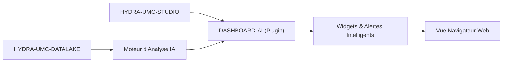

<p align="center">
  
</p>

# 🧠 HYDRA-UMC-DASHBOARD-AI

<p align="center"><a href="README.md">🇺🇸 English</a> | <a href="README_spa.md">🇪🇸 Español</a> | 🇫🇷 <b>Français</b> | <a href="README_ita.md">🇮🇹 Italiano</a> | <a href="README_deu.md">🇩🇪 Deutsch</a> | <a href="README_zho.md">🇨🇳 简体中文</a> | <a href="README_jpn.md">🇯🇵 日本語</a></p>

### 📈 Extension Analytique Alimentée par l'IA pour le Dashboard Web STUDIO

<p align="left">
  
  
  
</p>

---

## 1. 🛠️ APERÇU TECHNIQUE

**HYDRA-UMC-DASHBOARD-AI** est le plugin analytique de l'interface web STUDIO. Il enrichit le tableau de bord standard avec des insights IA en temps réel, une analyse prédictive des tendances et une mise en évidence automatique des anomalies.

Il transforme les données brutes de télémétrie en intelligence exploitable, offrant aux opérateurs de production des « Résumés Intelligents » de la performance de la flotte, des schémas de consommation d'énergie et des alertes de maintenance prédictive directement dans le navigateur. Il réutilise la même stack que HYDRA-UMC-STUDIO (React 19 + Vite + TypeScript) plutôt que d'en introduire une nouvelle, afin de pouvoir un jour être intégré comme panneau dans STUDIO lui-même.

### Fonctionnalités Clés :
* 🧠 **Résumés Intelligents (v0)** — statistiques réelles de min/max/moyenne/dernière valeur/tendance calculées à partir de l'historique réel de HYDRA-UMC-DATALAKE. *(implémenté comme statistiques réelles, pas encore un résumé généré par IA — voir COMPILATION ET EXÉCUTION ci-dessous)*
* 🔒 **Verrou de Fournisseur IA (v0)** — validation réelle du schéma d'entrée/sortie pour la future narration basée sur un LLM, plus un repli statistique réel et honnêtement étiqueté utilisé chaque fois qu'aucun fournisseur IA n'est configuré ou qu'un fournisseur échoue/renvoie une sortie non structurée. *(implémenté et câblé dans le panneau Résumé de Tendance aujourd'hui ; un vrai fournisseur basé sur un LLM est prévu)*
* 🛡️ **Garde de Contrat Externe (v0)** — valide chaque réponse du Datalake et du service d'anomalies avant qu'un panneau ne calcule ou l'affiche ; les nombres, indicateurs, identifiants surdimensionnés et caractères de contrôle non sûrs malformés sont rejetés. *(implémenté ; voir [`docs/SECURITY.md`](docs/SECURITY.md))*
* 📈 **Prédiction de Tendances** — un véritable modèle de prédiction, au-delà de l'indicateur de direction réel-mais-simple de v0. *(prévu)*
* 🚨 **Mise en Évidence des Anomalies (v0)** — vérifie les échantillons réels les plus récents par rapport à une ligne de base réelle déjà ajustée de HYDRA-UMC-ANOMALY-DETECTOR. *(implémenté comme un vrai panneau textuel ; le superposer à la vue 3D de STUDIO est prévu)*
* 🛠️ **Conseils d'Optimisation** — suggère des changements de paramètres pour améliorer le temps de cycle ou la durée de vie des moteurs. *(prévu)*
* ✅ **Socle du toolchain** — une véritable application React/Vite/TypeScript qui compile proprement avec `tsc --noEmit` et se sert avec Vite. *(implémenté — voir COMPILATION ET EXÉCUTION ci-dessous)*

---

## 2. 🔄 FLUX DASHBOARD AI



---

## 3. 🧱 ARCHITECTURE & DÉCISIONS DE CONCEPTION

* **Pourquoi c'est un projet Node/TS, pas un projet Python comme les autres projets liés à l'IA.** C'est une extension directe du propre frontend React/Vite de HYDRA-UMC-STUDIO, pas un service IA autonome - correspondre à la propre stack de STUDIO (plutôt qu'à la stack Python de HYDRA-UMC-COGNITIVE-NODE) est ce qui lui permet de vraiment se monter comme un vrai panneau de STUDIO plus tard, pas une application séparée vers laquelle les utilisateurs devraient basculer.
* **Pourquoi c'est un frère de STUDIO, pas un dossier à l'intérieur.** Garder ceci comme son propre dépôt/build permet à la couche dashboard IA de se versionner et de se publier indépendamment du propre calendrier de sortie de contrôle robotique de STUDIO - la même raison qui a en son temps séparé HYDRA-UMC-SERVER de STUDIO.
* **Pourquoi le point d'entrée ne fait qu'imprimer identité/version/rôle aujourd'hui.** Étape d'andamiaje : prouver que le paquet compile proprement précède les vrais panneaux du tableau de bord.
* **Comment cela s'intègre dans le reste de l'écosystème.** Étend HYDRA-UMC-STUDIO avec des informations pilotées par l'IA, adossées à HYDRA-UMC-COGNITIVE-NODE - la surface visuelle de ce que cette couche cognitive décide réellement.
* **Pourquoi le panneau de Vérification des Anomalies vérifie `/stats` avant de proposer de noter quoi que ce soit.** Le propre détecteur de HYDRA-UMC-ANOMALY-DETECTOR est une unique ligne de base partagée, ajustée en mémoire (voir le propre `api.py` de ce projet) - ce dashboard ne gère délibérément pas son ajustement (muter l'état partagé du détecteur depuis un dashboard orienté lecture serait un vrai couplage indésirable). Un véritable état « pas encore ajusté » est affiché exactement comme tel, jamais fondu dans une erreur générique.
* **Pourquoi le Résumé de Tendances rapporte une « direction », pas une prédiction.** Un vrai signe de delta premier-à-dernier (avec un petit seuil de bruit relatif pour qu'un signal plat ne clignote pas entre « hausse »/« baisse ») est honnête sur ce que v0 calcule réellement - un véritable modèle de prédiction est un travail futur réel et distinct, pas quelque chose à simuler avec une extrapolation linéaire déguisée en « prédiction ».
* **Pourquoi `safeGenerateNarrative()` valide la requête mais ne lève jamais d'exception pour une mauvaise réponse.** Une requête malformée est un vrai bug de câblage dans ce code - il n'y a pas de résumé vers lequel se replier honnêtement, donc elle est autorisée à lever une exception. Une réponse *malformée/non structurée* d'un fournisseur est un fait de la vie pour toute API externe réelle - ce chemin dégrade toujours vers le vrai repli statistique au lieu de faire planter le panneau, car l'appelant dispose déjà de tout ce dont il a besoin (le vrai résumé) pour dire quelque chose de vrai.
* **Pourquoi `NO_PROVIDER_CONFIGURED` réutilise `summary.ts` plutôt qu'une implémentation de repli séparée.** Une seconde formule de « narration de repli » indépendante dériverait des vraies statistiques auxquelles le panneau fait déjà confiance et qu'il affiche déjà numériquement - réutiliser les mêmes valeurs `TrendSummary` maintient la narration de repli prouvablement cohérente avec les nombres juste à côté.

---

## 📂 STRUCTURE DES DOSSIERS

Application purement logicielle — sans matériel, micrologiciel ou système d'exploitation propres ; ces dossiers sont omis conformément à la politique de structure du dépôt.

```text
HYDRA-UMC-DASHBOARD-AI/
├── src/
│   ├── api/                 # Vrais clients HTTP : datalakeClient.ts, anomalyClient.ts
│   ├── lib/
│   │   ├── summary.ts        # Vraies statistiques de résumé de tendances
│   │   └── aiProvider.ts     # Vrai verrou de fournisseur IA : validation de schéma + repli honnête
│   ├── components/
│   │   ├── TrendSummaryPanel.tsx
│   │   └── AnomalyCheckPanel.tsx
│   ├── main.tsx              # Point d'entrée de l'application
│   ├── App.tsx                # Composant racine - monte les deux vrais panneaux
│   ├── index.css              # Feuille de style de base
│   └── vite-env.d.ts          # Typage de VITE_DATALAKE_URL / VITE_ANOMALY_URL
├── tests/                   # Vrais tests : allers-retours HTTP + tests de composants
├── scripts/
│   ├── bump-version.mjs    # Incrémentation de version façon compteur kilométrique (exécuté par build)
│   ├── serve_static.py     # Vrai serveur de fichiers statiques pour le SPA compilé dans dist/ (lacune de déploiement CM5 trouvée en direct)
│   └── test_serve_static.py # Vrais tests pour serve_static.py
├── systemd/
│   └── hydra-umc-dashboard-ai.service # Unité systemd du service statique local sur la CM5
├── tools/
│   ├── build_test.py       # Vérification de build sans versionnage
│   └── ci_validate.py      # Validation manifeste/CHANGELOG/docs utilisée par CI
├── docs/
│   └── SECURITY.md          # Contrat public de sécurité du contenu externe et du déploiement
├── build/                  # Réservé aux artefacts de release (dist/ est ignoré par git)
├── images/                 # Médias et diagrammes
├── index.html              # HTML d'entrée de Vite
├── vite.config.ts          # Configuration du bundler Vite + Vitest
├── tsconfig.json / tsconfig.app.json / tsconfig.node.json
├── bump_manifest_version.py # Synchronise la version de hydra-umc.project.json avec celle de package.json (--sync)
├── dev.sh / dev.bat        # Serveur de dev réel : installe les dépendances + vite
├── build.sh / build.bat    # Build réel : installe les dépendances + vraie suite de tests + incrémente la version + tsc + vite build
└── package.json
```

---

## 4. ⚙️ COMPILATION ET EXÉCUTION

Nécessite Node.js >= 20.

```bash
# Linux/macOS
./dev.sh      # installe les dépendances, démarre le serveur Vite sur le port :5174
./build.sh    # installe les dépendances, exécute la vraie suite de tests, incrémente la version, vérifie les types, compile dist/

# Windows
dev.bat
build.bat
```

`npm run build` enchaîne `node scripts/bump-version.mjs && tsc --noEmit && vite build` — l'incrémentation de version n'a lieu qu'une fois la vérification stricte de TypeScript déjà passée, afin qu'un build cassé ne publie jamais un numéro de version incrémenté. `npm run dev` démarre Vite sur le port `5174` (distinct du `5173` propre à HYDRA-UMC-STUDIO, pour que les deux puissent tourner en même temps). `npm test` exécute directement la vraie suite Vitest.

Par défaut, les deux vrais panneaux pointent vers `http://localhost:8095` (HYDRA-UMC-DATALAKE) et `http://localhost:8097` (HYDRA-UMC-ANOMALY-DETECTOR) - à surcharger avec `VITE_DATALAKE_URL`/`VITE_ANOMALY_URL` (définies avant `vite build`/`vite dev`, Vite les intègre au moment du build) pour pointer vers un déploiement différent.

Lisez [`docs/SECURITY.md`](docs/SECURITY.md) avant de configurer ces URL visibles par le navigateur ou de connecter un véritable fournisseur IA ; il définit la validation des réponses, la sécurité du contenu, le comportement en cas d'échec et la règle d'absence de secrets.

Chaque vraie récupération du Résumé de Tendance exécute aussi le vrai verrou de fournisseur IA. Sans vrai fournisseur configuré (le défaut honnête de v0), le panneau affiche le vrai repli statistique, clairement étiqueté :

```ts
import { safeGenerateNarrative, NO_PROVIDER_CONFIGURED } from './lib/aiProvider'

const narrative = await safeGenerateNarrative(NO_PROVIDER_CONFIGURED, { sourceId, kind, field, summary })
// { narrative: "robot-1/motor_temp/value: 4 sample(s), ranging 10.00 to 50.00,
//    averaging 29.00, latest 36.00 (rising).", generatedBy: 'statistical-fallback' }
```

Un fournisseur qui lève une exception, ou renvoie une réponse avec un `narrative` manquant ou malformé, dégrade vers ce même vrai repli au lieu de faire planter le panneau ou de n'afficher rien.

---

## 🔗 Projets Liés

Ce projet fait partie de l'écosystème robotique HYDRA-UMC du même auteur (JuanenRac / Electro Hobby 3D). Bon à savoir, car une demande pourrait en réalité concerner l'un de ceux-ci plutôt que ce dépôt.

**Directement Liés**
- **[HYDRA-UMC-STUDIO](https://github.com/JuanenRac/HYDRA-UMC-STUDIO)** — tableau de bord de contrôle web avec visualisation 3D multi-robot en temps réel — le tableau de bord que ce projet étend directement.
- **[HYDRA-UMC-COGNITIVE-NODE](https://github.com/JuanenRac/HYDRA-UMC-COGNITIVE-NODE)** — hub d'intégration pour le pipeline cognitif Hailo-10 (orchestration LLM/VLA/voix) — le backend IA qui alimente ce tableau de bord.
- **[HYDRA-UMC-DATALAKE](https://github.com/JuanenRac/HYDRA-UMC-DATALAKE)** — vrai magasin de séries temporelles basé sur sqlite3, avec une vraie API HTTP d'ingestion/requête — l'historique réel à partir duquel le panneau Smart Summaries calcule ses statistiques.
- **[HYDRA-UMC-ANOMALY-DETECTOR](https://github.com/JuanenRac/HYDRA-UMC-ANOMALY-DETECTOR)** — vrai détecteur d'anomalies FFT + ligne de base statistique, avec surveillance de dérive — la ligne de base ajustée par rapport à laquelle le panneau Anomaly Highlighting note les échantillons récents.

**Fait Également Partie de l'Écosystème**

*Matériel & Plateforme de Base*
- **[HYDRA-UMC](https://github.com/JuanenRac/HYDRA-UMC)** — la carte mère physique du bras robotique : hôte CM5 + coprocesseur STM32H745 double cœur, coordonnant jusqu'à 8 bras-outils via CAN-OTA/SPI-OTA.
- **[HYDRA-UMC-OS](https://github.com/JuanenRac/HYDRA-UMC-OS)** — couche produit reproductible sur Raspberry Pi OS pour le CM5 : agent en lecture seule, config/profils validés, provisionnement WiFi de premier contact.
- **[HYDRA-UMC-SDK](https://github.com/JuanenRac/HYDRA-UMC-SDK)** — le contrat JSON-Schema partagé et la barrière de sécurité contre laquelle chaque bridge valide ses commandes.

*Backend Central & Clients*
- **[HYDRA-UMC-SERVER](https://github.com/JuanenRac/HYDRA-UMC-SERVER)** — le vrai backend headless (REST/WebSocket) auquel parle réellement chaque client de contrôle.
- **[HYDRA-UMC-SUITE](https://github.com/JuanenRac/HYDRA-UMC-SUITE)** — centre de commande d'essaim de bureau (PySide6) pour plusieurs serveurs à la fois, empaqueté en exécutable autonome.
- **[HYDRA-UMC-ANDROID-CONTROL](https://github.com/JuanenRac/HYDRA-UMC-ANDROID-CONTROL)** — application de contrôle Android native avec connexion biométrique et un compagnon Wear OS jumelé.
- **[HYDRA-UMC-IOS-CONTROL](https://github.com/JuanenRac/HYDRA-UMC-IOS-CONTROL)** — application de contrôle iOS/iPadOS (Flutter) avec synchronisation WebSocket en temps réel.
- **[HYDRA-UMC-DSI](https://github.com/JuanenRac/HYDRA-UMC-DSI)** — interface tactile native pour l'écran tactile DSI 7" embarqué, intégrée directement sur le CM5.
- **[HYDRA-UMC-EDITOR-URDF](https://github.com/JuanenRac/HYDRA-UMC-EDITOR-URDF)** — créateur/éditeur graphique de bureau pour URDF qui envoie les modèles terminés vers le propre catalogue de STUDIO.
- **[HYDRA-UMC-BRIDGE-AMR](https://github.com/JuanenRac/HYDRA-UMC-BRIDGE-AMR)** — frontière de coordination pour les flottes AGV/AMR via un éditeur MQTT VDA 5050 réel.
- **[HYDRA-UMC-BRIDGE-CNC](https://github.com/JuanenRac/HYDRA-UMC-BRIDGE-CNC)** — coordinateur haut niveau pour cellules CNC avec accès réel au statut/octets de contrôle GRBL.
- **[HYDRA-UMC-BRIDGE-DROIDS](https://github.com/JuanenRac/HYDRA-UMC-BRIDGE-DROIDS)** — frontière de coordination pour droïdes à pattes/humanoïdes, avec un véritable émetteur de commandes Boston Dynamics Spot.
- **[HYDRA-UMC-BRIDGE-LASER](https://github.com/JuanenRac/HYDRA-UMC-BRIDGE-LASER)** — coordinateur de sécurité pour cellules laser lisant 3 vraies sécurités GPIO de clé/enceinte/verrouillage.
- **[HYDRA-UMC-BRIDGE-OPENPNP](https://github.com/JuanenRac/HYDRA-UMC-BRIDGE-OPENPNP)** — coordinateur haut niveau sûr pour le flux de cartes du pick-and-place OpenPnP.
- **[HYDRA-UMC-BRIDGE-PRINTER3D](https://github.com/JuanenRac/HYDRA-UMC-BRIDGE-PRINTER3D)** — frontière de coordination sûre pour imprimantes 3D Moonraker/Klipper, avec de vraies commandes de tâche contrôlées.
- **[HYDRA-UMC-BRIDGE-ROS2](https://github.com/JuanenRac/HYDRA-UMC-BRIDGE-ROS2)** — coordinateur de sécurité avec un vrai transport ROS 2 rclpy à importation paresseuse.
- **[HYDRA-UMC-BRIDGE-UAV](https://github.com/JuanenRac/HYDRA-UMC-BRIDGE-UAV)** — frontière de coordination pour UAV équipés de caméra, avec un véritable émetteur de commandes MAVLink.

*Plateforme d'Outils URTC*
- **[URTC](https://github.com/JuanenRac/URTC)** — firmware pour la carte physique Universal Robot Tool Controller, plus de 25 profils d'outil sur bus CAN.
- **[URTC-FLASHER](https://github.com/JuanenRac/URTC-FLASHER)** — outil de bureau à interface graphique pour flasher les cartes URTC, CAN-OTA plus SWD/JTAG puce complète.
- **[URTC-TESTER](https://github.com/JuanenRac/URTC-TESTER)** — outil de bureau de diagnostic CAN-bus en direct pour cartes URTC, un panneau par profil d'outil.
- **[URTC-WEB-STUDIO](https://github.com/JuanenRac/URTC-WEB-STUDIO)** — alternative basée navigateur à URTC-TESTER via la Web Serial API, sans installation locale.

*Nœud IA de Vision (Hailo-8)*
- **[HYDRA-UMC-VISION-NODE](https://github.com/JuanenRac/HYDRA-UMC-VISION-NODE)** — hub d'intégration pour le pipeline de vision Hailo-8, avec une vraie vérification de disponibilité matérielle par étape.
- **[HYDRA-UMC-DETECTION-HEF](https://github.com/JuanenRac/HYDRA-UMC-DETECTION-HEF)** — registre réel de modèles compilés avec vérification de chargement sécurisé par architecture Hailo/checksum.
- **[HYDRA-UMC-VISION-STREAMER](https://github.com/JuanenRac/HYDRA-UMC-VISION-STREAMER)** — générateur réel de pipeline GStreamer + config MediaMTX, avec une vraie frontière d'intégration HailoRT.
- **[HYDRA-UMC-VISUAL-SERVOING-API](https://github.com/JuanenRac/HYDRA-UMC-VISUAL-SERVOING-API)** — vraie loi de correction Position-Based Visual Servoing, verrouillée sur l'état de zone en amont.
- **[HYDRA-UMC-SAFETY-ZONES](https://github.com/JuanenRac/HYDRA-UMC-SAFETY-ZONES)** — vraie vérification de violation de zone et demande d'E-STOP, avec application de la fraîcheur de calibration.

*Nœud IA Cognitif (Hailo-10)*
- **[HYDRA-UMC-VLA-ENGINE](https://github.com/JuanenRac/HYDRA-UMC-VLA-ENGINE)** — vrai encodage/décodage de jetons d'action et génération de trajectoire pour un modèle Vision-Language-Action.
- **[HYDRA-UMC-VOICE-UI](https://github.com/JuanenRac/HYDRA-UMC-VOICE-UI)** — vrai front-end vocal (VAD + analyseur d'intention) avec un relais Watch borné et soumis à confirmation.
- **[HYDRA-UMC-SEMANTIC-PLANNER](https://github.com/JuanenRac/HYDRA-UMC-SEMANTIC-PLANNER)** — vraie décomposition de tâches basée sur des règles et récupération sémantique d'erreurs sur les codes d'erreur MCU.
- **[HYDRA-UMC-DOCS-QA](https://github.com/JuanenRac/HYDRA-UMC-DOCS-QA)** — vraie recherche documentaire TF-IDF (bibliothèque standard uniquement) sur les propres documents Markdown de cet écosystème.

*Orchestration & Essaim*
- **[HYDRA-UMC-ORCHESTRATOR](https://github.com/JuanenRac/HYDRA-UMC-ORCHESTRATOR)** — hub d'intégration avec un vrai contrat de rapport de santé gRPC/Protobuf et une machine à états de mission.
- **[HYDRA-UMC-JOB-DISPATCHER](https://github.com/JuanenRac/HYDRA-UMC-JOB-DISPATCHER)** — vraie file de tâches basée sur la priorité avec déduplication, via une vraie API HTTP.
- **[HYDRA-UMC-NODE-HEALING](https://github.com/JuanenRac/HYDRA-UMC-NODE-HEALING)** — vrai chien de garde de santé de flotte basé sur gRPC, avec retry/backoff et détection d'incohérence d'identité.
- **[HYDRA-UMC-PATH-PLANNER-3D](https://github.com/JuanenRac/HYDRA-UMC-PATH-PLANNER-3D)** — vrai planificateur de trajectoire 3D basé sur RRT, avec vraie validation des collisions obstacle/espace de travail.
- **[HYDRA-UMC-SWARM-SYNC](https://github.com/JuanenRac/HYDRA-UMC-SWARM-SYNC)** — vraie synchronisation d'état CRDT LWW-Element-Map, testée par propriétés pour la convergence multi-cellule.

*Jumeau Numérique & Simulation*
- **[HYDRA-UMC-TWIN](https://github.com/JuanenRac/HYDRA-UMC-TWIN)** — hub d'intégration pour le moteur de jumeau numérique, avec un vrai contrat de synchronisation par compatibilité de version.
- **[HYDRA-UMC-HIL-BRIDGE](https://github.com/JuanenRac/HYDRA-UMC-HIL-BRIDGE)** — vrai verrouillage de sécurité hardware-in-the-loop routant les commandes entre simulation et matériel réel.
- **[HYDRA-UMC-PHYSICS-REPLICA](https://github.com/JuanenRac/HYDRA-UMC-PHYSICS-REPLICA)** — vraie cinématique directe et validation des limites articulaires sur un vrai sous-ensemble URDF.
- **[HYDRA-UMC-SYNTHETIC-DATA-GEN](https://github.com/JuanenRac/HYDRA-UMC-SYNTHETIC-DATA-GEN)** — vrai générateur procédural de scènes 2D avec export d'annotations YOLO/COCO.

*Données & Analytique*
- **[HYDRA-UMC-PRODUCTION-REPORTS](https://github.com/JuanenRac/HYDRA-UMC-PRODUCTION-REPORTS)** — vrai calcul OEE/disponibilité sur l'historique de DATALAKE, avec export CSV reproductible.
- **[HYDRA-UMC-TELEMETRY-COLLECTOR](https://github.com/JuanenRac/HYDRA-UMC-TELEMETRY-COLLECTOR)** — vrai pipeline d'ingestion CAN/WebSocket vers DATALAKE, avec déduplication par séquence.

*Passerelle Industrielle*
- **[HYDRA-UMC-GATEWAY-INDUSTRIAL](https://github.com/JuanenRac/HYDRA-UMC-GATEWAY-INDUSTRIAL)** — hub d'intégration relayant vers les protocoles industriels, avec une vraie couche de liste blanche de commandes/contre-pression.
- **[HYDRA-UMC-OPCUA-SERVER](https://github.com/JuanenRac/HYDRA-UMC-OPCUA-SERVER)** — vrai espace d'adressage OPC-UA, vérifié avec une vraie session client du protocole binaire.
- **[HYDRA-UMC-MQTT-BROKER](https://github.com/JuanenRac/HYDRA-UMC-MQTT-BROKER)** — vrai broker MQTT avec authentification par client optionnelle et ACL de sujets.
- **[HYDRA-UMC-MTCONNECT-ADAPTER](https://github.com/JuanenRac/HYDRA-UMC-MTCONNECT-ADAPTER)** — vrais points de terminaison XML MTConnect `/probe` et `/current`, avec sortie en mode dégradé.

*Outils Complémentaires & Opérations de l'Écosystème*
- **[HYDRA-UMC-TOOL-CLI](https://github.com/JuanenRac/HYDRA-UMC-TOOL-CLI)** — CLI de flotte avec un vrai contrat de codes de sortie stable, un vrai client en direct de la propre API de HYDRA-UMC-SERVER.
- **[HYDRA-UMC-WATCH](https://github.com/JuanenRac/HYDRA-UMC-WATCH)** — application compagnon WearOS avec de vraies alertes haptiques et un relais vocal vers le téléphone jumelé.
- **[URTC-SMART-RACK](https://github.com/JuanenRac/URTC-SMART-RACK)** — firmware pour un rack de montage de cartes avec décodage réel d'ID d'outil et logique de préchauffage Smart Idle.
- **[URTC-VISION-TOOL](https://github.com/JuanenRac/URTC-VISION-TOOL)** — firmware plus un vrai compagnon de vision Python pour une tête d'outil d'inspection thermique/RGB.
- **[HYDRA-UMC-UPDATER](https://github.com/JuanenRac/HYDRA-UMC-UPDATER)** — outil administratif de bureau qui découvre, clone et met à jour chaque dépôt de cet écosystème.
- **[HYDRA-UMC-OS-REBUILDER](https://github.com/JuanenRac/HYDRA-UMC-OS-REBUILDER)** — outil de bureau Windows/Linux qui construit une image de la CM5 prête à graver, préchargée avec les versions les plus actuelles de l'écosystème, avec une configuration de premier démarrage Wi-Fi/utilisateur/SSH façon Raspberry Pi Imager.


---

## 📚 Documentation & Communauté

- **[CONTRIBUTING.md](CONTRIBUTING.md)** — pile technologique et lignes directrices de codage pour une pull request.
- **[CODE_OF_CONDUCT.md](CODE_OF_CONDUCT.md)** — les normes de comportement attendues dans cette communauté.
- **[SECURITY.md](SECURITY.md)** — comment signaler une vulnérabilité ; voir plutôt [`docs/SECURITY.md`](docs/SECURITY.md) pour le contrat propre de ce projet sur la sécurité du contenu externe et du déploiement.
- **[SUPPORT.md](SUPPORT.md)** — où poser des questions et signaler des bugs.
- **[LICENSE.md](LICENSE.md)** — la licence propre de ce projet.

## 👤 AUTEUR
**JuanenRac** (Electro Hobby 3D)
📧 electrohobby3d@gmail.com
📺 [youtube.com/@electrohobby3d](https://youtube.com/@electrohobby3d)

## 📜 LICENCE
GPL-3.0 - Voir LICENSE pour plus de détails.
