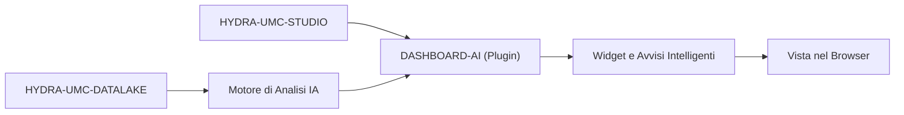

<p align="center">
  
</p>

# 🧠 HYDRA-UMC-DASHBOARD-AI

<p align="center"><a href="README.md">🇺🇸 English</a> | <a href="README_spa.md">🇪🇸 Español</a> | <a href="README_fra.md">🇫🇷 Français</a> | 🇮🇹 <b>Italiano</b> | <a href="README_deu.md">🇩🇪 Deutsch</a> | <a href="README_zho.md">🇨🇳 简体中文</a> | <a href="README_jpn.md">🇯🇵 日本語</a></p>

### 📈 Estensione Analitica basata su IA per la Dashboard Web di STUDIO

<p align="left">
  
  
  
</p>

---

## 1. 🛠️ PANORAMICA TECNICA

**HYDRA-UMC-DASHBOARD-AI** è il plugin analitico per l'interfaccia web di STUDIO. Arricchisce la dashboard standard con insight IA in tempo reale, analisi predittiva delle tendenze e evidenziazione automatica delle anomalie.

Trasforma i dati grezzi di telemetria in informazioni utilizzabili, offrendo agli operatori di impianto "Riepiloghi Intelligenti" delle prestazioni della flotta, degli schemi di consumo energetico e avvisi di manutenzione predittiva direttamente nel browser. Riutilizza lo stesso stack di HYDRA-UMC-STUDIO (React 19 + Vite + TypeScript) invece di introdurne uno nuovo, in modo da poter essere in futuro incorporato come pannello all'interno di STUDIO stesso.

### Caratteristiche Principali:
* 🧠 **Riepiloghi Intelligenti (v0)** — statistiche reali di minimo/massimo/media/ultimo valore/tendenza calcolate dallo storico reale di HYDRA-UMC-DATALAKE. *(implementato come statistiche reali, non ancora un riepilogo generato dall'IA — vedi COMPILAZIONE ED ESECUZIONE sotto)*
* 🔒 **Verifica del Fornitore IA (v0)** — validazione reale dello schema di input/output per la futura narrazione basata su LLM, più un fallback statistico reale ed etichettato onestamente usato ogni volta che nessun fornitore IA è configurato o uno fallisce/restituisce output non strutturato. *(implementato e collegato al pannello Riepilogo Tendenza oggi; un vero fornitore basato su LLM è pianificato)*
* 🛡️ **Protezione del Contratto Esterno (v0)** — convalida ogni risposta di Datalake e del servizio anomalie prima che un pannello la elabori o la mostri; numeri, flag, identificatori sovradimensionati e caratteri di controllo non sicuri malformati vengono rifiutati. *(implementato; vedi [`docs/SECURITY.md`](docs/SECURITY.md))*
* 📈 **Previsione delle Tendenze** — un vero modello di previsione, oltre l'indicatore di direzione reale-ma-semplice di v0. *(pianificato)*
* 🚨 **Evidenziazione delle Anomalie (v0)** — verifica i campioni reali più recenti rispetto a una baseline reale già calibrata di HYDRA-UMC-ANOMALY-DETECTOR. *(implementato come un vero pannello testuale; sovrapporlo alla vista 3D di STUDIO è pianificato)*
* 🛠️ **Suggerimenti di Ottimizzazione** — suggerisce modifiche ai parametri per migliorare il tempo di ciclo o la durata dei motori. *(pianificato)*
* ✅ **Base del toolchain** — una vera applicazione React/Vite/TypeScript che compila pulita con `tsc --noEmit` e viene servita con Vite. *(implementato — vedi COMPILAZIONE ED ESECUZIONE sotto)*

---

## 2. 🔄 FLUSSO DASHBOARD AI



---

## 3. 🧱 ARCHITETTURA E DECISIONI DI PROGETTAZIONE

* **Perché è un progetto Node/TS, non uno Python come gli altri progetti affini all'IA.** È un'estensione diretta del frontend React/Vite proprio di HYDRA-UMC-STUDIO, non un servizio IA autonomo - allinearsi allo stack proprio di STUDIO (invece dello stack Python di HYDRA-UMC-COGNITIVE-NODE) è ciò che gli permette di montarsi davvero come un vero pannello di STUDIO più avanti, non un'app separata a cui gli utenti devono passare.
* **Perché è fratello di STUDIO, non una cartella al suo interno.** Mantenere questo come proprio repo/build permette al livello dashboard IA di versionarsi e pubblicarsi indipendentemente dal calendario di rilascio del controllo robot proprio di STUDIO - lo stesso motivo che a suo tempo ha separato HYDRA-UMC-SERVER da STUDIO.
* **Perché il punto di ingresso oggi stampa solo identità/versione/ruolo.** Fase di andamiaje: dimostrare che il pacchetto compila in modo pulito precede i veri pannelli della dashboard.
* **Come si inserisce nel resto dell'ecosistema.** Estende HYDRA-UMC-STUDIO con informazioni guidate dall'IA, supportate da HYDRA-UMC-COGNITIVE-NODE - la superficie visiva di ciò che quello strato cognitivo decide realmente.
* **Perché il pannello di Verifica Anomalie controlla `/stats` prima di offrire di valutare qualsiasi cosa.** Il rilevatore proprio di HYDRA-UMC-ANOMALY-DETECTOR è un'unica baseline condivisa, calibrata in memoria (vedi l'`api.py` proprio di quel progetto) - questa dashboard deliberatamente non gestisce la sua calibrazione (mutare lo stato condiviso del rilevatore da una dashboard orientata alla lettura sarebbe un vero accoppiamento indebito). Uno stato reale di "non ancora calibrato" viene mostrato esattamente come tale, mai confuso con un errore generico.
* **Perché il Riepilogo delle Tendenze riporta una "direzione", non una previsione.** Un vero segno di delta primo-a-ultimo (con una piccola soglia di rumore relativo affinché un segnale piatto non lampeggi tra "su"/"giù") è onesto su ciò che v0 calcola davvero - un vero modello di previsione è lavoro futuro reale e separato, non qualcosa da simulare con un'estrapolazione lineare travestita da "previsione".
* **Perché `safeGenerateNarrative()` valida la richiesta ma non lancia mai eccezioni per una risposta sbagliata.** Una richiesta malformata è un vero bug di cablaggio in questo codice - non c'è un riepilogo a cui ricorrere onestamente, quindi le è permesso lanciare un'eccezione. Una risposta *malformata/non strutturata* da un fornitore è un dato di fatto per qualsiasi API esterna reale - quel percorso degrada sempre al vero fallback statistico invece di far crashare il pannello, perché chi chiama ha già tutto ciò che serve (il vero riepilogo) per dire qualcosa di vero.
* **Perché `NO_PROVIDER_CONFIGURED` riusa `summary.ts` invece di un'implementazione di fallback separata.** Una seconda formula di "narrazione di fallback" indipendente divergerebbe dalle vere statistiche di cui il pannello già si fida e che già mostra numericamente - riusare gli stessi valori `TrendSummary` mantiene la narrazione di fallback dimostrabilmente coerente con i numeri proprio accanto.

---

## 📂 STRUTTURA DELLE DIRECTORY

Applicazione puramente software — senza hardware, firmware o sistema operativo propri; tali cartelle sono omesse secondo la politica della struttura del repository.

```text
HYDRA-UMC-DASHBOARD-AI/
├── src/
│   ├── api/                 # Veri client HTTP: datalakeClient.ts, anomalyClient.ts
│   ├── lib/
│   │   ├── summary.ts        # Vere statistiche di riepilogo delle tendenze
│   │   └── aiProvider.ts     # Vera verifica del fornitore IA: validazione schema + fallback onesto
│   ├── components/
│   │   ├── TrendSummaryPanel.tsx
│   │   └── AnomalyCheckPanel.tsx
│   ├── main.tsx              # Punto di ingresso dell'applicazione
│   ├── App.tsx                # Componente radice - monta entrambi i veri pannelli
│   ├── index.css              # Foglio di stile di base
│   └── vite-env.d.ts          # Tipizzazione di VITE_DATALAKE_URL / VITE_ANOMALY_URL
├── tests/                   # Veri test: round-trip HTTP + test dei componenti
├── scripts/
│   ├── bump-version.mjs    # Incremento versione stile contachilometri (eseguito dal build)
│   ├── serve_static.py     # Vero server di file statici per la SPA compilata in dist/ (gap di deployment sulla CM5 trovato dal vivo)
│   └── test_serve_static.py # Test reali per serve_static.py
├── systemd/
│   └── hydra-umc-dashboard-ai.service # Unità systemd del servizio statico locale sulla CM5
├── tools/
│   ├── build_test.py       # Controllo build senza versionamento
│   └── ci_validate.py      # Validazione manifest/CHANGELOG/docs usata dalla CI
├── docs/
│   └── SECURITY.md          # Contratto pubblico di sicurezza per contenuto esterno e deployment
├── build/                  # Riservato agli artefatti di release (dist/ è ignorato da git)
├── images/                 # Media e diagrammi
├── index.html              # HTML di ingresso di Vite
├── vite.config.ts          # Configurazione del bundler Vite + Vitest
├── tsconfig.json / tsconfig.app.json / tsconfig.node.json
├── bump_manifest_version.py # Sincronizza la versione di hydra-umc.project.json con quella di package.json (--sync)
├── dev.sh / dev.bat        # Server di sviluppo reale: installa le dipendenze + vite
├── build.sh / build.bat    # Build reale: installa le dipendenze + vera suite di test + incrementa la versione + tsc + vite build
└── package.json
```

---

## 4. ⚙️ COMPILAZIONE ED ESECUZIONE

Richiede Node.js >= 20.

```bash
# Linux/macOS
./dev.sh      # installa le dipendenze, avvia il server Vite sulla porta :5174
./build.sh    # installa le dipendenze, esegue la vera suite di test, incrementa la versione, verifica i tipi, compila dist/

# Windows
dev.bat
build.bat
```

`npm run build` concatena `node scripts/bump-version.mjs && tsc --noEmit && vite build` — l'incremento di versione avviene solo dopo che il controllo rigoroso di TypeScript è già passato, cosicché un build rotto non pubblica mai un numero di versione incrementato. `npm run dev` avvia Vite sulla porta `5174` (separata dalla `5173` propria di HYDRA-UMC-STUDIO, così entrambi possono girare insieme). `npm test` esegue direttamente la vera suite Vitest.

Per impostazione predefinita i due veri pannelli puntano a `http://localhost:8095` (HYDRA-UMC-DATALAKE) e `http://localhost:8097` (HYDRA-UMC-ANOMALY-DETECTOR) - sovrascrivibile con `VITE_DATALAKE_URL`/`VITE_ANOMALY_URL` (definite prima di `vite build`/`vite dev`, Vite le incorpora in fase di build) per puntare a un deployment diverso.

Leggi [`docs/SECURITY.md`](docs/SECURITY.md) prima di configurare questi URL visibili nel browser o collegare un vero fornitore IA; definisce la convalida delle risposte, la sicurezza del contenuto, il comportamento in caso di errore e la regola di non includere segreti.

Ogni vero fetch del Riepilogo Tendenza esegue anche la vera verifica del fornitore IA. Senza un vero fornitore configurato (il default onesto di v0), il pannello mostra il vero fallback statistico, chiaramente etichettato:

```ts
import { safeGenerateNarrative, NO_PROVIDER_CONFIGURED } from './lib/aiProvider'

const narrative = await safeGenerateNarrative(NO_PROVIDER_CONFIGURED, { sourceId, kind, field, summary })
// { narrative: "robot-1/motor_temp/value: 4 sample(s), ranging 10.00 to 50.00,
//    averaging 29.00, latest 36.00 (rising).", generatedBy: 'statistical-fallback' }
```

Un fornitore che lancia un'eccezione, o restituisce una risposta con `narrative` mancante o malformato, degrada a questo stesso vero fallback invece di far crashare il pannello o non mostrare nulla.

---

## 🔗 Progetti Correlati

Questo progetto fa parte dell'ecosistema robotico HYDRA-UMC dello stesso autore (JuanenRac / Electro Hobby 3D). Vale la pena conoscerlo, poiché una richiesta potrebbe in realtà riguardare uno di questi invece di questo repository.

**Direttamente Correlati**
- **[HYDRA-UMC-STUDIO](https://github.com/JuanenRac/HYDRA-UMC-STUDIO)** — dashboard di controllo web con visualizzazione 3D multi-robot in tempo reale — la dashboard che questo progetto estende direttamente.
- **[HYDRA-UMC-COGNITIVE-NODE](https://github.com/JuanenRac/HYDRA-UMC-COGNITIVE-NODE)** — hub di integrazione per la pipeline cognitiva Hailo-10 (orchestrazione LLM/VLA/voce) — il backend IA che alimenta questa dashboard.
- **[HYDRA-UMC-DATALAKE](https://github.com/JuanenRac/HYDRA-UMC-DATALAKE)** — vero archivio di serie temporali basato su sqlite3, con una vera API HTTP di ingestione/query — lo storico reale da cui il pannello Smart Summaries calcola le proprie statistiche.
- **[HYDRA-UMC-ANOMALY-DETECTOR](https://github.com/JuanenRac/HYDRA-UMC-ANOMALY-DETECTOR)** — vero rilevatore di anomalie FFT + baseline statistica, con monitoraggio della deriva — la baseline adattata contro cui il pannello Anomaly Highlighting valuta i campioni recenti.

**Fa Anche Parte dell'Ecosistema**

*Hardware e Piattaforma di Base*
- **[HYDRA-UMC](https://github.com/JuanenRac/HYDRA-UMC)** — la scheda madre fisica del braccio robotico: host CM5 + coprocessore STM32H745 dual-core, che coordina fino a 8 bracci utensile via CAN-OTA/SPI-OTA.
- **[HYDRA-UMC-OS](https://github.com/JuanenRac/HYDRA-UMC-OS)** — livello prodotto riproducibile su Raspberry Pi OS per il CM5: agente in sola lettura, config/profili validati, provisioning WiFi al primo contatto.
- **[HYDRA-UMC-SDK](https://github.com/JuanenRac/HYDRA-UMC-SDK)** — il contratto JSON-Schema condiviso e la barriera di sicurezza contro cui ogni bridge valida i propri comandi.

*Backend Centrale e Client*
- **[HYDRA-UMC-SERVER](https://github.com/JuanenRac/HYDRA-UMC-SERVER)** — il vero backend headless (REST/WebSocket) con cui parla davvero ogni client di controllo.
- **[HYDRA-UMC-SUITE](https://github.com/JuanenRac/HYDRA-UMC-SUITE)** — centro di comando sciame desktop (PySide6) per più server contemporaneamente, pacchettizzato come eseguibile standalone.
- **[HYDRA-UMC-ANDROID-CONTROL](https://github.com/JuanenRac/HYDRA-UMC-ANDROID-CONTROL)** — app di controllo nativa per Android con login biometrico e un companion Wear OS abbinato.
- **[HYDRA-UMC-IOS-CONTROL](https://github.com/JuanenRac/HYDRA-UMC-IOS-CONTROL)** — app di controllo per iOS/iPadOS (Flutter) con sincronizzazione WebSocket in tempo reale.
- **[HYDRA-UMC-DSI](https://github.com/JuanenRac/HYDRA-UMC-DSI)** — interfaccia touch nativa per il touchscreen DSI da 7" a bordo, incorporata direttamente nel CM5.
- **[HYDRA-UMC-EDITOR-URDF](https://github.com/JuanenRac/HYDRA-UMC-EDITOR-URDF)** — creatore/editor grafico desktop di URDF che invia i modelli finiti al catalogo di STUDIO.
- **[HYDRA-UMC-BRIDGE-AMR](https://github.com/JuanenRac/HYDRA-UMC-BRIDGE-AMR)** — barriera di coordinamento per flotte AGV/AMR tramite un publisher MQTT VDA 5050 reale.
- **[HYDRA-UMC-BRIDGE-CNC](https://github.com/JuanenRac/HYDRA-UMC-BRIDGE-CNC)** — coordinatore ad alto livello per celle CNC con accesso reale a stato/byte di controllo GRBL.
- **[HYDRA-UMC-BRIDGE-DROIDS](https://github.com/JuanenRac/HYDRA-UMC-BRIDGE-DROIDS)** — barriera di coordinamento per droidi con zampe/umanoidi, con un vero mittente di comandi per Boston Dynamics Spot.
- **[HYDRA-UMC-BRIDGE-LASER](https://github.com/JuanenRac/HYDRA-UMC-BRIDGE-LASER)** — coordinatore di sicurezza per celle laser che legge 3 salvaguardie GPIO reali di chiave/involucro/interblocco.
- **[HYDRA-UMC-BRIDGE-OPENPNP](https://github.com/JuanenRac/HYDRA-UMC-BRIDGE-OPENPNP)** — coordinatore ad alto livello sicuro per il flusso schede del pick-and-place OpenPnP.
- **[HYDRA-UMC-BRIDGE-PRINTER3D](https://github.com/JuanenRac/HYDRA-UMC-BRIDGE-PRINTER3D)** — barriera di coordinamento sicura per stampanti 3D Moonraker/Klipper, con comandi di lavoro reali e controllati.
- **[HYDRA-UMC-BRIDGE-ROS2](https://github.com/JuanenRac/HYDRA-UMC-BRIDGE-ROS2)** — coordinatore di sicurezza con un vero trasporto ROS 2 rclpy, importato in modo lazy.
- **[HYDRA-UMC-BRIDGE-UAV](https://github.com/JuanenRac/HYDRA-UMC-BRIDGE-UAV)** — barriera di coordinamento per UAV dotati di fotocamera, con un vero mittente di comandi MAVLink.

*Piattaforma Strumenti URTC*
- **[URTC](https://github.com/JuanenRac/URTC)** — firmware per la scheda fisica dell'Universal Robot Tool Controller, oltre 25 profili utensile su bus CAN.
- **[URTC-FLASHER](https://github.com/JuanenRac/URTC-FLASHER)** — strumento desktop con GUI per il flashing delle schede URTC, CAN-OTA più SWD/JTAG a chip intero.
- **[URTC-TESTER](https://github.com/JuanenRac/URTC-TESTER)** — strumento desktop di diagnostica CAN-bus dal vivo per schede URTC, un pannello per profilo utensile.
- **[URTC-WEB-STUDIO](https://github.com/JuanenRac/URTC-WEB-STUDIO)** — alternativa basata su browser a URTC-TESTER tramite la Web Serial API, senza installazione locale.

*Nodo IA Visione (Hailo-8)*
- **[HYDRA-UMC-VISION-NODE](https://github.com/JuanenRac/HYDRA-UMC-VISION-NODE)** — hub di integrazione per la pipeline di visione Hailo-8, con un vero controllo di prontezza hardware per fase.
- **[HYDRA-UMC-DETECTION-HEF](https://github.com/JuanenRac/HYDRA-UMC-DETECTION-HEF)** — registro reale di modelli compilati con verifica di caricamento sicuro per architettura Hailo/checksum.
- **[HYDRA-UMC-VISION-STREAMER](https://github.com/JuanenRac/HYDRA-UMC-VISION-STREAMER)** — generatore reale di pipeline GStreamer + config MediaMTX, con una vera barriera di integrazione HailoRT.
- **[HYDRA-UMC-VISUAL-SERVOING-API](https://github.com/JuanenRac/HYDRA-UMC-VISUAL-SERVOING-API)** — vera legge di correzione Position-Based Visual Servoing, con cancello di sicurezza sullo stato di zona a monte.
- **[HYDRA-UMC-SAFETY-ZONES](https://github.com/JuanenRac/HYDRA-UMC-SAFETY-ZONES)** — vero controllo di violazione zona e richiesta E-STOP, con imposizione della freschezza di calibrazione.

*Nodo IA Cognitivo (Hailo-10)*
- **[HYDRA-UMC-VLA-ENGINE](https://github.com/JuanenRac/HYDRA-UMC-VLA-ENGINE)** — vera codifica/decodifica di token d'azione e generazione di traiettoria per un modello Vision-Language-Action.
- **[HYDRA-UMC-VOICE-UI](https://github.com/JuanenRac/HYDRA-UMC-VOICE-UI)** — vero front-end vocale (VAD + parser di intenti) con un relay verso Watch limitato e soggetto a conferma.
- **[HYDRA-UMC-SEMANTIC-PLANNER](https://github.com/JuanenRac/HYDRA-UMC-SEMANTIC-PLANNER)** — vera scomposizione dei task basata su regole e recupero semantico degli errori sui codici errore MCU.
- **[HYDRA-UMC-DOCS-QA](https://github.com/JuanenRac/HYDRA-UMC-DOCS-QA)** — vera ricerca documentale TF-IDF (solo libreria standard) sui documenti Markdown di questo ecosistema.

*Orchestrazione e Sciame*
- **[HYDRA-UMC-ORCHESTRATOR](https://github.com/JuanenRac/HYDRA-UMC-ORCHESTRATOR)** — hub di integrazione con un vero contratto di health-report gRPC/Protobuf e una macchina a stati di missione.
- **[HYDRA-UMC-JOB-DISPATCHER](https://github.com/JuanenRac/HYDRA-UMC-JOB-DISPATCHER)** — vera coda di lavori basata su priorità con deduplicazione, su una vera API HTTP.
- **[HYDRA-UMC-NODE-HEALING](https://github.com/JuanenRac/HYDRA-UMC-NODE-HEALING)** — vero watchdog di salute della flotta basato su gRPC, con retry/backoff e rilevamento di discrepanza d'identità.
- **[HYDRA-UMC-PATH-PLANNER-3D](https://github.com/JuanenRac/HYDRA-UMC-PATH-PLANNER-3D)** — vero pianificatore di percorsi 3D basato su RRT, con vera validazione delle collisioni ostacolo/spazio di lavoro.
- **[HYDRA-UMC-SWARM-SYNC](https://github.com/JuanenRac/HYDRA-UMC-SWARM-SYNC)** — vera sincronizzazione di stato CRDT LWW-Element-Map, con property test per la convergenza multi-cella.

*Gemello Digitale e Simulazione*
- **[HYDRA-UMC-TWIN](https://github.com/JuanenRac/HYDRA-UMC-TWIN)** — hub di integrazione per il motore di gemello digitale, con un vero contratto di sincronizzazione per compatibilità di versione.
- **[HYDRA-UMC-HIL-BRIDGE](https://github.com/JuanenRac/HYDRA-UMC-HIL-BRIDGE)** — vero interblocco di sicurezza hardware-in-the-loop che instrada i comandi tra simulazione e hardware reale.
- **[HYDRA-UMC-PHYSICS-REPLICA](https://github.com/JuanenRac/HYDRA-UMC-PHYSICS-REPLICA)** — vera cinematica diretta e validazione dei limiti articolari su un vero sottoinsieme URDF.
- **[HYDRA-UMC-SYNTHETIC-DATA-GEN](https://github.com/JuanenRac/HYDRA-UMC-SYNTHETIC-DATA-GEN)** — vero generatore procedurale di scene 2D con esportazione di annotazioni YOLO/COCO.

*Dati e Analisi*
- **[HYDRA-UMC-PRODUCTION-REPORTS](https://github.com/JuanenRac/HYDRA-UMC-PRODUCTION-REPORTS)** — vero calcolo OEE/disponibilità sullo storico di DATALAKE, con esportazione CSV riproducibile.
- **[HYDRA-UMC-TELEMETRY-COLLECTOR](https://github.com/JuanenRac/HYDRA-UMC-TELEMETRY-COLLECTOR)** — vera pipeline di ingestione CAN/WebSocket verso DATALAKE, con deduplicazione per sequenza.

*Gateway Industriale*
- **[HYDRA-UMC-GATEWAY-INDUSTRIAL](https://github.com/JuanenRac/HYDRA-UMC-GATEWAY-INDUSTRIAL)** — hub di integrazione che inoltra ai protocolli industriali, con un vero livello di allowlist dei comandi/backpressure.
- **[HYDRA-UMC-OPCUA-SERVER](https://github.com/JuanenRac/HYDRA-UMC-OPCUA-SERVER)** — vero spazio di indirizzi OPC-UA, verificato con una vera sessione client del protocollo binario.
- **[HYDRA-UMC-MQTT-BROKER](https://github.com/JuanenRac/HYDRA-UMC-MQTT-BROKER)** — vero broker MQTT con autenticazione opzionale per client e ACL sui topic.
- **[HYDRA-UMC-MTCONNECT-ADAPTER](https://github.com/JuanenRac/HYDRA-UMC-MTCONNECT-ADAPTER)** — veri endpoint XML `/probe` e `/current` di MTConnect, con output in modalità degradata.

*Strumenti Complementari e Operazioni dell'Ecosistema*
- **[HYDRA-UMC-TOOL-CLI](https://github.com/JuanenRac/HYDRA-UMC-TOOL-CLI)** — CLI di flotta con un vero e stabile contratto di exit-code, un client live reale della stessa API di HYDRA-UMC-SERVER.
- **[HYDRA-UMC-WATCH](https://github.com/JuanenRac/HYDRA-UMC-WATCH)** — app companion WearOS con avvisi aptici reali e un relay vocale verso il telefono abbinato.
- **[URTC-SMART-RACK](https://github.com/JuanenRac/URTC-SMART-RACK)** — firmware per un rack di montaggio schede con decodifica reale dell'ID utensile e logica di preriscaldamento Smart Idle.
- **[URTC-VISION-TOOL](https://github.com/JuanenRac/URTC-VISION-TOOL)** — firmware più un vero companion di visione Python per una testa utensile di ispezione termica/RGB.
- **[HYDRA-UMC-UPDATER](https://github.com/JuanenRac/HYDRA-UMC-UPDATER)** — strumento amministrativo desktop che scopre, clona e aggiorna ogni repository di questo ecosistema.
- **[HYDRA-UMC-OS-REBUILDER](https://github.com/JuanenRac/HYDRA-UMC-OS-REBUILDER)** — strumento desktop Windows/Linux che costruisce un'immagine della CM5 pronta da scrivere, precaricata con le versioni più aggiornate dell'ecosistema, con configurazione di primo avvio Wi-Fi/utente/SSH in stile Raspberry Pi Imager.


---

## 📚 Documentazione e Comunità

- **[CONTRIBUTING.md](CONTRIBUTING.md)** — stack tecnologico e linee guida di codifica per una pull request.
- **[CODE_OF_CONDUCT.md](CODE_OF_CONDUCT.md)** — gli standard di comportamento attesi in questa comunità.
- **[SECURITY.md](SECURITY.md)** — come segnalare una vulnerabilità; vedi invece [`docs/SECURITY.md`](docs/SECURITY.md) per il contratto di sicurezza sui contenuti esterni e sul deployment proprio di questo progetto.
- **[SUPPORT.md](SUPPORT.md)** — dove porre domande e segnalare bug.
- **[LICENSE.md](LICENSE.md)** — la licenza propria di questo progetto.

## 👤 AUTORE
**JuanenRac** (Electro Hobby 3D)
📧 electrohobby3d@gmail.com
📺 [youtube.com/@electrohobby3d](https://youtube.com/@electrohobby3d)

## 📜 LICENZA
GPL-3.0 - Vedi LICENSE per i dettagli.
