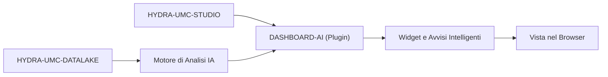

<p align="center">
  
</p>

# 🧠 HYDRA-UMC-DASHBOARD-AI

<p align="center"><a href="README.md">🇺🇸 English</a> | <a href="README_spa.md">🇪🇸 Español</a> | <a href="README_fra.md">🇫🇷 Français</a> | 🇮🇹 <b>Italiano</b> | <a href="README_deu.md">🇩🇪 Deutsch</a> | <a href="README_zho.md">🇨🇳 简体中文</a> | <a href="README_jpn.md">🇯🇵 日本語</a></p>

### 📈 Estensione Analitica basata su IA per la Dashboard Web di STUDIO

<p align="left">
  
  
  
</p>

---

## 1. 🛠️ PANORAMICA TECNICA

**HYDRA-UMC-DASHBOARD-AI** è il plugin analitico per l'interfaccia web di STUDIO. Arricchisce la dashboard standard con insight IA in tempo reale, analisi predittiva delle tendenze e evidenziazione automatica delle anomalie.

Trasforma i dati grezzi di telemetria in informazioni utilizzabili, offrendo agli operatori di impianto "Riepiloghi Intelligenti" delle prestazioni della flotta, degli schemi di consumo energetico e avvisi di manutenzione predittiva direttamente nel browser. Riutilizza lo stesso stack di HYDRA-UMC-STUDIO (React 19 + Vite + TypeScript) invece di introdurne uno nuovo, in modo da poter essere in futuro incorporato come pannello all'interno di STUDIO stesso.

### Caratteristiche Principali:
* 🧠 **Riepiloghi Intelligenti (v0)** — statistiche reali di minimo/massimo/media/ultimo valore/tendenza calcolate dallo storico reale di HYDRA-UMC-DATALAKE. *(implementato come statistiche reali, non ancora un riepilogo generato dall'IA — vedi COMPILAZIONE ED ESECUZIONE sotto)*
* 📈 **Previsione delle Tendenze** — un vero modello di previsione, oltre l'indicatore di direzione reale-ma-semplice di v0. *(pianificato)*
* 🚨 **Evidenziazione delle Anomalie (v0)** — verifica i campioni reali più recenti rispetto a una baseline reale già calibrata di HYDRA-UMC-ANOMALY-DETECTOR. *(implementato come un vero pannello testuale; sovrapporlo alla vista 3D di STUDIO è pianificato)*
* 🛠️ **Suggerimenti di Ottimizzazione** — suggerisce modifiche ai parametri per migliorare il tempo di ciclo o la durata dei motori. *(pianificato)*
* ✅ **Base del toolchain** — una vera applicazione React/Vite/TypeScript che compila pulita con `tsc --noEmit` e viene servita con Vite. *(implementato — vedi COMPILAZIONE ED ESECUZIONE sotto)*

---

## 2. 🔄 FLUSSO DASHBOARD AI



---

## 3. 🧱 ARCHITETTURA E DECISIONI DI PROGETTAZIONE

* **Perché è un progetto Node/TS, non uno Python come gli altri progetti affini all'IA.** È un'estensione diretta del frontend React/Vite proprio di HYDRA-UMC-STUDIO, non un servizio IA autonomo - allinearsi allo stack proprio di STUDIO (invece dello stack Python di HYDRA-UMC-COGNITIVE-NODE) è ciò che gli permette di montarsi davvero come un vero pannello di STUDIO più avanti, non un'app separata a cui gli utenti devono passare.
* **Perché è fratello di STUDIO, non una cartella al suo interno.** Mantenere questo come proprio repo/build permette al livello dashboard IA di versionarsi e pubblicarsi indipendentemente dal calendario di rilascio del controllo robot proprio di STUDIO - lo stesso motivo che a suo tempo ha separato HYDRA-UMC-SERVER da STUDIO.
* **Perché il punto di ingresso oggi stampa solo identità/versione/ruolo.** Fase di andamiaje: dimostrare che il pacchetto compila in modo pulito precede i veri pannelli della dashboard.
* **Come si inserisce nel resto dell'ecosistema.** Estende HYDRA-UMC-STUDIO con informazioni guidate dall'IA, supportate da HYDRA-UMC-COGNITIVE-NODE - la superficie visiva di ciò che quello strato cognitivo decide realmente.
* **Perché il pannello di Verifica Anomalie controlla `/stats` prima di offrire di valutare qualsiasi cosa.** Il rilevatore proprio di HYDRA-UMC-ANOMALY-DETECTOR è un'unica baseline condivisa, calibrata in memoria (vedi l'`api.py` proprio di quel progetto) - questa dashboard deliberatamente non gestisce la sua calibrazione (mutare lo stato condiviso del rilevatore da una dashboard orientata alla lettura sarebbe un vero accoppiamento indebito). Uno stato reale di "non ancora calibrato" viene mostrato esattamente come tale, mai confuso con un errore generico.
* **Perché il Riepilogo delle Tendenze riporta una "direzione", non una previsione.** Un vero segno di delta primo-a-ultimo (con una piccola soglia di rumore relativo affinché un segnale piatto non lampeggi tra "su"/"giù") è onesto su ciò che v0 calcola davvero - un vero modello di previsione è lavoro futuro reale e separato, non qualcosa da simulare con un'estrapolazione lineare travestita da "previsione".

---

## 📂 STRUTTURA DELLE DIRECTORY

Applicazione puramente software — senza hardware/firmware/os propri, mai presenti nel template di questo progetto (vedi `SONNET/5.PLAN_EJECUCION_32_PROYECTOS_NUEVOS.txt` per la regola di potatura di tutto l'ecosistema).

```text
HYDRA-UMC-DASHBOARD-AI/
├── src/
│   ├── api/                 # Veri client HTTP: datalakeClient.ts, anomalyClient.ts
│   ├── lib/
│   │   └── summary.ts        # Vere statistiche di riepilogo delle tendenze
│   ├── components/
│   │   ├── TrendSummaryPanel.tsx
│   │   └── AnomalyCheckPanel.tsx
│   ├── main.tsx              # Punto di ingresso dell'applicazione
│   ├── App.tsx                # Componente radice - monta entrambi i veri pannelli
│   ├── index.css              # Foglio di stile di base
│   └── vite-env.d.ts          # Tipizzazione di VITE_DATALAKE_URL / VITE_ANOMALY_URL
├── tests/                   # Veri test: round-trip HTTP + test dei componenti
├── scripts/
│   └── bump-version.mjs    # Incremento versione stile contachilometri (eseguito dal build)
├── docs/                   # Documentazione e guida all'integrazione
├── build/                  # Riservato agli artefatti di release (dist/ è ignorato da git)
├── images/                 # Media e diagrammi
├── index.html              # HTML di ingresso di Vite
├── vite.config.ts          # Configurazione del bundler Vite + Vitest
├── tsconfig.json / tsconfig.app.json / tsconfig.node.json
├── dev.sh / dev.bat        # Server di sviluppo reale: installa le dipendenze + vite
├── build.sh / build.bat    # Build reale: installa le dipendenze + vera suite di test + incrementa la versione + tsc + vite build
└── package.json
```

---

## 4. ⚙️ COMPILAZIONE ED ESECUZIONE

Richiede Node.js >= 20.

```bash
# Linux/macOS
./dev.sh      # installa le dipendenze, avvia il server Vite sulla porta :5174
./build.sh    # installa le dipendenze, esegue la vera suite di test, incrementa la versione, verifica i tipi, compila dist/

# Windows
dev.bat
build.bat
```

`npm run build` concatena `node scripts/bump-version.mjs && tsc --noEmit && vite build` — l'incremento di versione avviene solo dopo che il controllo rigoroso di TypeScript è già passato, cosicché un build rotto non pubblica mai un numero di versione incrementato. `npm run dev` avvia Vite sulla porta `5174` (separata dalla `5173` propria di HYDRA-UMC-STUDIO, cosi entrambi possono girare insieme). `npm test` esegue direttamente la vera suite Vitest.

Per impostazione predefinita i due veri pannelli puntano a `http://localhost:8095` (HYDRA-UMC-DATALAKE) e `http://localhost:8097` (HYDRA-UMC-ANOMALY-DETECTOR) - sovrascrivibile con `VITE_DATALAKE_URL`/`VITE_ANOMALY_URL` (definite prima di `vite build`/`vite dev`, Vite le incorpora in fase di build) per puntare a un deployment diverso.

---

## 🔗 Progetti Correlati

Questo progetto fa parte di un ecosistema robotico più ampio dello stesso autore (JuanenRac / Electro Hobby 3D), che copre firmware, software di controllo, nodi IA e strumenti di flotta. Utile saperlo, perché una richiesta potrebbe in realtà riguardare uno di questi progetti anziché questo repository.

### Relazione Diretta

- **[HYDRA-UMC-STUDIO](https://github.com/JuanenRac/HYDRA-UMC-STUDIO)** — la dashboard che questo progetto estende direttamente.
- **[HYDRA-UMC-COGNITIVE-NODE](https://github.com/JuanenRac/HYDRA-UMC-COGNITIVE-NODE)** — il backend IA che alimenta questa dashboard.

### Resto dell'Ecosistema

**Piattaforma HYDRA-UMC** — la cella di micro-fabbrica multi-robot
- **[HYDRA-UMC](https://github.com/JuanenRac/HYDRA-UMC)** — la scheda madre CM5 + STM32H745 che orchestra fino a 8 bracci robotici.
- **[HYDRA-UMC-SERVER](https://github.com/JuanenRac/HYDRA-UMC-SERVER)** — il backend Express/WebSocket con cui parla ogni client di controllo.
- **[HYDRA-UMC-STUDIO](https://github.com/JuanenRac/HYDRA-UMC-STUDIO)** — dashboard di controllo web, visualizzazione 3D multi-robot.
- **[HYDRA-UMC-ANDROID-CONTROL](https://github.com/JuanenRac/HYDRA-UMC-ANDROID-CONTROL)** — app di controllo Android via Wi-Fi/Bluetooth.
- **[HYDRA-UMC-IOS-CONTROL](https://github.com/JuanenRac/HYDRA-UMC-IOS-CONTROL)** — app di controllo iOS/iPadOS costruita in Flutter.
- **[HYDRA-UMC-SUITE](https://github.com/JuanenRac/HYDRA-UMC-SUITE)** — centro di comando sciame desktop (Python/PySide6).
- **[HYDRA-UMC-EDITOR-URDF](https://github.com/JuanenRac/HYDRA-UMC-EDITOR-URDF)** — editor desktop di modelli URDF per il catalogo robot.
- **[HYDRA-UMC-DSI](https://github.com/JuanenRac/HYDRA-UMC-DSI)** — interfaccia touch nativa per lo schermo DSI a bordo.

**Piattaforma URTC** — il controller della testa utensile che ogni braccio HYDRA-UMC porta con sé
- **[URTC](https://github.com/JuanenRac/URTC)** — controller testa utensile su bus CAN, 25 profili utensile.
- **[URTC-FLASHER](https://github.com/JuanenRac/URTC-FLASHER)** — strumento desktop di flashing CAN-OTA + SWD/JTAG.
- **[URTC-TESTER](https://github.com/JuanenRac/URTC-TESTER)** — strumento desktop di diagnostica CAN live.
- **[URTC-WEB-STUDIO](https://github.com/JuanenRac/URTC-WEB-STUDIO)** — alternativa basata su browser via Web Serial API.

**🎥 Vision AI Node (Hailo-8)**
- [HYDRA-UMC-VISION-NODE](https://github.com/JuanenRac/HYDRA-UMC-VISION-NODE)
- [HYDRA-UMC-VISION-STREAMER](https://github.com/JuanenRac/HYDRA-UMC-VISION-STREAMER)
- [HYDRA-UMC-DETECTION-HEF](https://github.com/JuanenRac/HYDRA-UMC-DETECTION-HEF)
- [HYDRA-UMC-SAFETY-ZONES](https://github.com/JuanenRac/HYDRA-UMC-SAFETY-ZONES)
- [HYDRA-UMC-VISUAL-SERVOING-API](https://github.com/JuanenRac/HYDRA-UMC-VISUAL-SERVOING-API)

**🧠 Cognitive AI Node (Hailo-10)**
- [HYDRA-UMC-COGNITIVE-NODE](https://github.com/JuanenRac/HYDRA-UMC-COGNITIVE-NODE)
- [HYDRA-UMC-VLA-ENGINE](https://github.com/JuanenRac/HYDRA-UMC-VLA-ENGINE)
- [HYDRA-UMC-VOICE-UI](https://github.com/JuanenRac/HYDRA-UMC-VOICE-UI)
- [HYDRA-UMC-SEMANTIC-PLANNER](https://github.com/JuanenRac/HYDRA-UMC-SEMANTIC-PLANNER)
- [HYDRA-UMC-DOCS-QA](https://github.com/JuanenRac/HYDRA-UMC-DOCS-QA)

**🐝 Orchestration & Swarm**
- [HYDRA-UMC-ORCHESTRATOR](https://github.com/JuanenRac/HYDRA-UMC-ORCHESTRATOR)
- [HYDRA-UMC-SWARM-SYNC](https://github.com/JuanenRac/HYDRA-UMC-SWARM-SYNC)
- [HYDRA-UMC-PATH-PLANNER-3D](https://github.com/JuanenRac/HYDRA-UMC-PATH-PLANNER-3D)
- [HYDRA-UMC-JOB-DISPATCHER](https://github.com/JuanenRac/HYDRA-UMC-JOB-DISPATCHER)
- [HYDRA-UMC-NODE-HEALING](https://github.com/JuanenRac/HYDRA-UMC-NODE-HEALING)

**🎮 Digital Twin & Simulation**
- [HYDRA-UMC-TWIN](https://github.com/JuanenRac/HYDRA-UMC-TWIN)
- [HYDRA-UMC-PHYSICS-REPLICA](https://github.com/JuanenRac/HYDRA-UMC-PHYSICS-REPLICA)
- [HYDRA-UMC-HIL-BRIDGE](https://github.com/JuanenRac/HYDRA-UMC-HIL-BRIDGE)
- [HYDRA-UMC-SYNTHETIC-DATA-GEN](https://github.com/JuanenRac/HYDRA-UMC-SYNTHETIC-DATA-GEN)

**📊 Data & Analytics**
- [HYDRA-UMC-DATALAKE](https://github.com/JuanenRac/HYDRA-UMC-DATALAKE)
- [HYDRA-UMC-TELEMETRY-COLLECTOR](https://github.com/JuanenRac/HYDRA-UMC-TELEMETRY-COLLECTOR)
- [HYDRA-UMC-ANOMALY-DETECTOR](https://github.com/JuanenRac/HYDRA-UMC-ANOMALY-DETECTOR)
- [HYDRA-UMC-PRODUCTION-REPORTS](https://github.com/JuanenRac/HYDRA-UMC-PRODUCTION-REPORTS)

**🏭 Industrial Gateway**
- [HYDRA-UMC-GATEWAY-INDUSTRIAL](https://github.com/JuanenRac/HYDRA-UMC-GATEWAY-INDUSTRIAL)
- [HYDRA-UMC-OPCUA-SERVER](https://github.com/JuanenRac/HYDRA-UMC-OPCUA-SERVER)
- [HYDRA-UMC-MQTT-BROKER](https://github.com/JuanenRac/HYDRA-UMC-MQTT-BROKER)
- [HYDRA-UMC-MTCONNECT-ADAPTER](https://github.com/JuanenRac/HYDRA-UMC-MTCONNECT-ADAPTER)

**🛠️ Complementary Tools**
- [URTC-SMART-RACK](https://github.com/JuanenRac/URTC-SMART-RACK)
- [URTC-VISION-TOOL](https://github.com/JuanenRac/URTC-VISION-TOOL)
- [HYDRA-UMC-WATCH](https://github.com/JuanenRac/HYDRA-UMC-WATCH)
- [HYDRA-UMC-TOOL-CLI](https://github.com/JuanenRac/HYDRA-UMC-TOOL-CLI)


## 👤 AUTORE
**JuanenRac** (Electro Hobby 3D)
📧 electrohobby3d@gmail.com

## 📜 LICENZA
GPL-3.0 - Vedi LICENSE per i dettagli.
