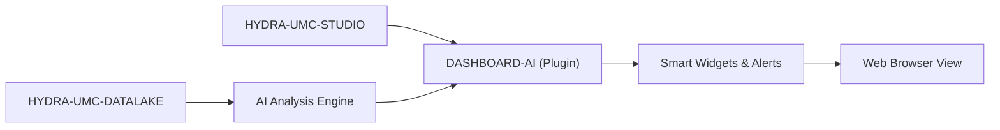

<p align="center">
  
</p>

# 🧠 HYDRA-UMC-DASHBOARD-AI

<p align="center"><a href="README.md">🇺🇸 English</a> | <a href="README_spa.md">🇪🇸 Español</a> | <a href="README_fra.md">🇫🇷 Français</a> | <a href="README_ita.md">🇮🇹 Italiano</a> | <a href="README_deu.md">🇩🇪 Deutsch</a> | <a href="README_zho.md">🇨🇳 简体中文</a> | 🇯🇵 <b>日本語</b></p>

### 📈 STUDIO Web ダッシュボード向けの AI 駆動分析拡張機能

<p align="left">
  
  
  
</p>

---

## 1. 🛠️ 技術概要

**HYDRA-UMC-DASHBOARD-AI** は、STUDIO Web インターフェースの分析用
プラグインです。リアルタイムの AI インサイト、予測的トレンド分析、
自動化された異常ハイライトにより、標準のダッシュボードを強化します。

生のテレメトリデータを実用的なインテリジェンスへと変換し、工場オペレー
ターにスウォームのパフォーマンス、エネルギー消費パターンの「スマート
サマリー」、そして予測保守アラートをブラウザ内で直接提供します。新しい
技術スタックを導入するのではなく、HYDRA-UMC-STUDIO 自身の技術スタック
（React 19 + Vite + TypeScript）を再利用しているため、将来的には
STUDIO 自体の内部にパネルとして組み込むことが可能です。

### 主な機能：
* 🧠 **スマートサマリー（v0）** — HYDRA-UMC-DATALAKE の実際の履歴データから計算された、実際の最小値/最大値/平均値/最新値/傾向の統計。*（実際の統計値として実装済み、AI 生成のサマリーはまだ——下記の「ビルドと実行」を参照）*
* 🔒 **AI プロバイダーゲート（v0）** — 将来の LLM ベースのナラティブに向けた実際の入力/出力スキーマ検証と、AI プロバイダーが設定されていない、またはプロバイダーが失敗/非構造化出力を返した場合に常に使われる、実際の、正直にラベル付けされた統計的フォールバック。*（今日実装済みでトレンドサマリーパネルに組み込まれています。実際の LLM ベースのプロバイダー自体は計画中です）*
* 🛡️ **外部契約ガード（v0）** — パネルが計算または表示する前に、Datalake と異常サービスの各レスポンスを検証します。不正な数値・フラグ・過大な識別子・安全でない制御文字は拒否されます。*（実装済み。[`docs/SECURITY.md`](docs/SECURITY.md) を参照）*
* 📈 **トレンド予測** — v0 の実際だが単純な方向インジケーターを超える、実際の予測モデル。*（計画中）*
* 🚨 **異常ハイライト（v0）：** 最新の実際のサンプルを、HYDRA-UMC-ANOMALY-DETECTOR の実際に適合済みのベースラインと照合します。*（実際のテキストパネルとして実装済み。STUDIO 自身の 3D ビューへの重ね合わせは計画中）*
* 🛠️ **最適化のヒント：** サイクルタイムやモーター寿命を改善するパラメーター変更を提案します。*（計画中）*
* ✅ **ツールチェーンの足場** — `tsc --noEmit` で問題なくビルドでき、Vite で提供される実際の React/Vite/TypeScript アプリ。*（実装済み——下記の「ビルドと実行」を参照）*

---

## 2. 🔄 Dashboard AI フロー



---

## 3. 🧱 アーキテクチャと設計上の決定

* **他の AI 関連プロジェクトのような Python ではなく、Node/TS プロジェクトである理由。** これは独立した AI サービスではなく、HYDRA-UMC-STUDIO 自身の React/Vite フロントエンドの直接的な拡張です——STUDIO 自身の技術スタックに合わせる（HYDRA-UMC-COGNITIVE-NODE の Python スタックではなく）ことが、後にユーザーが切り替える必要のある別アプリとしてではなく、実際の STUDIO パネルとしてマウントできることを可能にします。
* **STUDIO の内部のフォルダではなく、STUDIO の兄弟プロジェクトである理由。** これを独自のリポジトリ/ビルドとして保つことで、AI ダッシュボード層が STUDIO 自身のロボット制御リリースのペースとは独立してバージョン管理・出荷できるようになります。これは、そもそも HYDRA-UMC-SERVER を STUDIO から分離した理由と同じです。
* **エントリポイントが今日は身元/バージョン/役割のみを表示する理由。** 足場（アンダミアヘ、スキャフォールディング）段階にあります：本パッケージが問題なくビルドされることを証明することが、実際のダッシュボードパネルに先立ちます。
* **エコシステムの他の部分との関係。** HYDRA-UMC-COGNITIVE-NODE に支えられ、HYDRA-UMC-STUDIO を AI 駆動のインサイトで拡張します——その認知層が実際に決定する内容の視覚的なインターフェースです。
* **異常チェックパネルが、何かをスコアリングする前に `/stats` を確認する理由。** HYDRA-UMC-ANOMALY-DETECTOR 自身の検出器は、メモリ上で適合された単一の共有ベースラインです（そのプロジェクト自身の `api.py` を参照）——このダッシュボードは意図的にその適合処理を管理しません（読み取り志向のダッシュボードから共有の検出器状態を変更することは、本当に望ましくない結合になります）。実際の「まだ適合されていない」状態は、汎用的なエラーに丸め込まれることなく、まさにその状態として表示されます。
* **トレンドサマリーが予測ではなく「方向」を報告する理由。** 実際の初期値から最新値への差分の符号（フラットな信号が「上昇」/「下降」の間でちらつかないよう、小さな相対ノイズ閾値付き）は、v0 が実際に計算している内容について正直です——実際の予測モデルは独立した、本物の将来の作業であり、「予測」を装った線形外挿でごまかすようなものではありません。
* **`safeGenerateNarrative()` がリクエストを検証しつつ、悪いレスポンスに対して決してエラーを投げない理由。** 不正なリクエストはこのコード内の本物の配線バグです——正直に頼れるサマリーが存在しないため、エラーを投げることが許されています。プロバイダーからの*不正な/非構造化な*レスポンスは、実際の外部 API では避けられない現実です——そのパスは常に、パネルをクラッシュさせる代わりに実際の統計的フォールバックに降格します。呼び出し側はすでに真実を語るために必要なすべて(実際のサマリー)を持っているからです。
* **`NO_PROVIDER_CONFIGURED` が独立したフォールバック実装ではなく `summary.ts` を再利用する理由。** 独立した第二の「フォールバックナラティブ」の計算式は、パネルがすでに信頼し、すでに数値で表示している実際の統計から乖離してしまいます——同じ `TrendSummary` の値を再利用することで、フォールバックナラティブがすぐ隣にある数値と証明可能な形で一致し続けます。

---

## 📂 リポジトリ構成

純粋なソフトウェアの Web アプリであり、独自のハードウェア、ファームウェア、
OS はありません。これらのディレクトリはリポジトリ構造ポリシーに従って省略
されています。

```text
HYDRA-UMC-DASHBOARD-AI/
├── src/
│   ├── api/                 # 実際の HTTP クライアント：datalakeClient.ts、anomalyClient.ts
│   ├── lib/
│   │   ├── summary.ts        # 実際のトレンドサマリー統計
│   │   └── aiProvider.ts     # 実際の AI プロバイダーゲート：スキーマ検証 + 正直なフォールバック
│   ├── components/
│   │   ├── TrendSummaryPanel.tsx
│   │   └── AnomalyCheckPanel.tsx
│   ├── main.tsx              # アプリケーションエントリポイント
│   ├── App.tsx                # ルートコンポーネント——両方の実際のパネルをマウント
│   ├── index.css              # ベーススタイルシート
│   └── vite-env.d.ts          # VITE_DATALAKE_URL / VITE_ANOMALY_URL の型定義
├── tests/                   # 実際のテスト：HTTP ラウンドトリップ + コンポーネントテスト
├── scripts/
│   ├── bump-version.mjs    # オドメーター式バージョンインクリメント（ビルドが実行）
│   ├── serve_static.py     # ビルド済みdist/ SPA向けの実際の静的ファイルサーバー(実運用で発見されたCM5デプロイの穴)
│   └── test_serve_static.py # serve_static.pyの実際のテスト
├── systemd/
│   └── hydra-umc-dashboard-ai.service # ローカルCM5静的配信サービスのsystemdユニット
├── tools/
│   ├── build_test.py       # バージョンを増やさないビルドチェック
│   └── ci_validate.py      # CI が使用するマニフェスト/CHANGELOG/ドキュメント検証
├── docs/
│   └── SECURITY.md          # 外部コンテンツと配備の公開安全契約
├── build/                  # リリース成果物用に予約（dist/ 自体は gitignore 対象）
├── images/                 # メディアと図表
├── index.html              # Vite エントリ HTML
├── vite.config.ts          # Vite バンドラー + Vitest 設定
├── tsconfig.json / tsconfig.app.json / tsconfig.node.json
├── bump_manifest_version.py # hydra-umc.project.json のバージョンを package.json と同期(--sync)
├── dev.sh / dev.bat        # 実際の開発サーバー：依存関係のインストール + vite
├── build.sh / build.bat    # 実際のビルド：依存関係のインストール + 実際のテストスイート + バージョンインクリメント + tsc + vite build
└── package.json
```

---

## 4. ⚙️ ビルドと実行

Node.js >= 20 が必要です。

```bash
# Linux/macOS
./dev.sh      # 依存関係をインストールし、:5174 で Vite 開発サーバーを起動します
./build.sh    # 依存関係をインストールし、実際のテストスイートを実行し、バージョンを増加させ、型チェックを行い、dist/ をビルドします

# Windows
dev.bat
build.bat
```

`npm run build` は `node scripts/bump-version.mjs && tsc --noEmit &&
vite build` を連鎖的に実行します——バージョンのインクリメントは、厳格な
TypeScript チェックが既に通過した後にのみ発生するため、壊れたビルドが
増加したバージョン番号を出荷することは決してありません。`npm run dev`
はポート `5174` で Vite を起動します（HYDRA-UMC-STUDIO 自身の `5173`
とは別のポートのため、両方を同時に並行して実行できます）。`npm test`
は実際の Vitest スイートを直接実行します。

デフォルトでは、2つの実際のパネルは `http://localhost:8095`
（HYDRA-UMC-DATALAKE）と `http://localhost:8097`
（HYDRA-UMC-ANOMALY-DETECTOR）を指しています——`VITE_DATALAKE_URL`/
`VITE_ANOMALY_URL`（`vite build`/`vite dev` の前に設定、Vite がビルド時
にインライン化します）で上書きして、別のデプロイ先を指すことができます。

これらのブラウザから見える URL を設定する前、または実際の AI プロバイダーを
接続する前に、[`docs/SECURITY.md`](docs/SECURITY.md) を読んでください。レスポンス
検証、コンテンツ安全性、失敗時の動作、および秘密情報を含めないルールを定義しています。

すべての実際のトレンドサマリーの取得は、実際の AI プロバイダーゲートも
実行します。実際のプロバイダーが設定されていない場合(v0 の正直な
デフォルト)、パネルは実際の統計的フォールバックを、はっきりとラベル
付けして表示します：

```ts
import { safeGenerateNarrative, NO_PROVIDER_CONFIGURED } from './lib/aiProvider'

const narrative = await safeGenerateNarrative(NO_PROVIDER_CONFIGURED, { sourceId, kind, field, summary })
// { narrative: "robot-1/motor_temp/value: 4 sample(s), ranging 10.00 to 50.00,
//    averaging 29.00, latest 36.00 (rising).", generatedBy: 'statistical-fallback' }
```

エラーを投げる、または `narrative` が欠落/不正なレスポンスを返す
プロバイダーは、パネルをクラッシュさせたり何も表示しなかったりする
代わりに、まさにこの実際のフォールバックに降格します。

---

## 🔗 関連プロジェクト

本プロジェクトは、同じ作者(JuanenRac / Electro Hobby 3D)による HYDRA-UMC ロボティクスエコシステムの一部です。リクエストが実はこの中のどれかについてのものである可能性があるため、知っておく価値があります。

**直接関連**
- **[HYDRA-UMC-STUDIO](https://github.com/JuanenRac/HYDRA-UMC-STUDIO)** — リアルタイムのマルチロボット 3D 可視化を備えたウェブ制御ダッシュボード ——本プロジェクトが直接拡張するダッシュボード。
- **[HYDRA-UMC-COGNITIVE-NODE](https://github.com/JuanenRac/HYDRA-UMC-COGNITIVE-NODE)** — Hailo-10 コグニティブパイプライン(LLM/VLA/音声オーケストレーション)の統合ハブ ——本ダッシュボードにデータを供給する AI バックエンド。
- **[HYDRA-UMC-DATALAKE](https://github.com/JuanenRac/HYDRA-UMC-DATALAKE)** — 実際の取り込み/クエリ HTTP API を備えた、実際の sqlite3 ベースの時系列ストア ——スマートサマリーパネルが統計を算出する元となる実際の履歴。
- **[HYDRA-UMC-ANOMALY-DETECTOR](https://github.com/JuanenRac/HYDRA-UMC-ANOMALY-DETECTOR)** — ドリフト監視を備えた、実際の FFT + 統計ベースラインによる異常検知器 ——異常ハイライトパネルが直近のサンプルを評価する基準となる、フィッティング済みのベースライン。

**エコシステムの他のプロジェクト**

*コアハードウェア&プラットフォーム*
- **[HYDRA-UMC](https://github.com/JuanenRac/HYDRA-UMC)** — 実際のロボットアームのマザーボード——CM5 ホスト + デュアルコア STM32H745、CAN-OTA/SPI-OTA 経由で最大 8 本のツールアームを統括。
- **[HYDRA-UMC-OS](https://github.com/JuanenRac/HYDRA-UMC-OS)** — CM5 向けの再現可能な Raspberry Pi OS プロダクト層——読み取り専用エージェント、検証済み設定/プロファイル、WiFi 初回接続プロビジョニング。
- **[HYDRA-UMC-SDK](https://github.com/JuanenRac/HYDRA-UMC-SDK)** — すべてのブリッジが自身のコマンドを検証する共有 JSON-Schema 契約と安全ゲートの境界。

*コアバックエンド&クライアント*
- **[HYDRA-UMC-SERVER](https://github.com/JuanenRac/HYDRA-UMC-SERVER)** — すべての制御クライアントが実際に通信する、本物のヘッドレスバックエンド(REST/WebSocket)。
- **[HYDRA-UMC-SUITE](https://github.com/JuanenRac/HYDRA-UMC-SUITE)** — 複数のサーバーを同時に扱えるデスクトップ(PySide6)スウォームコマンドセンター、スタンドアロン実行ファイルとしてパッケージ化。
- **[HYDRA-UMC-ANDROID-CONTROL](https://github.com/JuanenRac/HYDRA-UMC-ANDROID-CONTROL)** — 生体認証ログインとペアリングされた Wear OS コンパニオンを備えたネイティブ Android 制御アプリ。
- **[HYDRA-UMC-IOS-CONTROL](https://github.com/JuanenRac/HYDRA-UMC-IOS-CONTROL)** — リアルタイム WebSocket 同期を備えた iOS/iPadOS 制御アプリ(Flutter)。
- **[HYDRA-UMC-DSI](https://github.com/JuanenRac/HYDRA-UMC-DSI)** — 本体搭載の 7 インチ DSI タッチスクリーン向けネイティブタッチ UI、CM5 自体に組み込み。
- **[HYDRA-UMC-EDITOR-URDF](https://github.com/JuanenRac/HYDRA-UMC-EDITOR-URDF)** — 完成したモデルを STUDIO 自身のカタログへ送信するデスクトップ用グラフィカル URDF 作成/編集ツール。
- **[HYDRA-UMC-BRIDGE-AMR](https://github.com/JuanenRac/HYDRA-UMC-BRIDGE-AMR)** — 実際の VDA 5050 MQTT パブリッシャーによる AGV/AMR フリートの調整境界。
- **[HYDRA-UMC-BRIDGE-CNC](https://github.com/JuanenRac/HYDRA-UMC-BRIDGE-CNC)** — 実際の GRBL ステータス/制御バイトへのアクセスを持つ、CNC セルの高レベルコーディネーター。
- **[HYDRA-UMC-BRIDGE-DROIDS](https://github.com/JuanenRac/HYDRA-UMC-BRIDGE-DROIDS)** — 実際の Boston Dynamics Spot コマンド送信機能を持つ、脚型/ヒューマノイドドロイドの調整境界。
- **[HYDRA-UMC-BRIDGE-LASER](https://github.com/JuanenRac/HYDRA-UMC-BRIDGE-LASER)** — 実際のキー/筐体/インターロック GPIO セーフガード 3 系統を読み取る、レーザーセルの安全コーディネーター。
- **[HYDRA-UMC-BRIDGE-OPENPNP](https://github.com/JuanenRac/HYDRA-UMC-BRIDGE-OPENPNP)** — OpenPnP ピックアンドプレースの基板フローを安全に統括する高レベルコーディネーター。
- **[HYDRA-UMC-BRIDGE-PRINTER3D](https://github.com/JuanenRac/HYDRA-UMC-BRIDGE-PRINTER3D)** — 実際にゲート制御されたジョブコマンドを持つ、Moonraker/Klipper 3D プリンター向けの安全な調整境界。
- **[HYDRA-UMC-BRIDGE-ROS2](https://github.com/JuanenRac/HYDRA-UMC-BRIDGE-ROS2)** — 実際の遅延インポート rclpy ROS 2 トランスポートを持つ安全コーディネーター。
- **[HYDRA-UMC-BRIDGE-UAV](https://github.com/JuanenRac/HYDRA-UMC-BRIDGE-UAV)** — 実際の MAVLink コマンド送信機能を持つ、カメラ搭載 UAV の調整境界。

*URTC ツールプラットフォーム*
- **[URTC](https://github.com/JuanenRac/URTC)** — 物理的な Universal Robot Tool Controller 基板向けファームウェア、CAN バス経由の 25 以上のツールプロファイル。
- **[URTC-FLASHER](https://github.com/JuanenRac/URTC-FLASHER)** — URTC 基板用のデスクトップ GUI 書き込みツール、CAN-OTA およびフルチップ SWD/JTAG。
- **[URTC-TESTER](https://github.com/JuanenRac/URTC-TESTER)** — URTC 基板向けのデスクトップ CAN バスライブ診断ツール、ツールプロファイルごとに 1 パネル。
- **[URTC-WEB-STUDIO](https://github.com/JuanenRac/URTC-WEB-STUDIO)** — Web Serial API を使ったブラウザベースの URTC-TESTER の代替、ローカルインストール不要。

*ビジョン AI ノード(Hailo-8)*
- **[HYDRA-UMC-VISION-NODE](https://github.com/JuanenRac/HYDRA-UMC-VISION-NODE)** — Hailo-8 ビジョンパイプラインの統合ハブ、段階ごとの実際のハードウェア準備状況チェック付き。
- **[HYDRA-UMC-DETECTION-HEF](https://github.com/JuanenRac/HYDRA-UMC-DETECTION-HEF)** — Hailo アーキテクチャ/チェックサムによる安全読み込み検証を備えた、実際のコンパイル済みモデルレジストリ。
- **[HYDRA-UMC-VISION-STREAMER](https://github.com/JuanenRac/HYDRA-UMC-VISION-STREAMER)** — 実際の HailoRT 統合境界を持つ、実際の GStreamer パイプライン + MediaMTX 設定生成器。
- **[HYDRA-UMC-VISUAL-SERVOING-API](https://github.com/JuanenRac/HYDRA-UMC-VISUAL-SERVOING-API)** — 上流のゾーン状態に応じて安全ゲート制御される、実際の Position-Based Visual Servoing 補正則。
- **[HYDRA-UMC-SAFETY-ZONES](https://github.com/JuanenRac/HYDRA-UMC-SAFETY-ZONES)** — キャリブレーションの鮮度を強制する、実際のゾーン侵入チェックと E-STOP 要求。

*コグニティブ AI ノード(Hailo-10)*
- **[HYDRA-UMC-VLA-ENGINE](https://github.com/JuanenRac/HYDRA-UMC-VLA-ENGINE)** — Vision-Language-Action モデル向けの、実際のアクショントークンのエンコード/デコードと軌道生成。
- **[HYDRA-UMC-VOICE-UI](https://github.com/JuanenRac/HYDRA-UMC-VOICE-UI)** — 確認ゲート付きの限定的な Watch リレーを備えた、実際の音声フロントエンド(VAD + 意図解析)。
- **[HYDRA-UMC-SEMANTIC-PLANNER](https://github.com/JuanenRac/HYDRA-UMC-SEMANTIC-PLANNER)** — MCU エラーコードに対する、実際のルールベースのタスク分解と意味的エラー復旧。
- **[HYDRA-UMC-DOCS-QA](https://github.com/JuanenRac/HYDRA-UMC-DOCS-QA)** — このエコシステム自身の Markdown ドキュメントに対する、標準ライブラリのみの実際の TF-IDF 文書検索。

*オーケストレーション&スウォーム*
- **[HYDRA-UMC-ORCHESTRATOR](https://github.com/JuanenRac/HYDRA-UMC-ORCHESTRATOR)** — 実際の gRPC/Protobuf ヘルスレポート契約とミッションステートマシンを持つ統合ハブ。
- **[HYDRA-UMC-JOB-DISPATCHER](https://github.com/JuanenRac/HYDRA-UMC-JOB-DISPATCHER)** — 実際の HTTP API 上に構築された、優先度ベースの実際のジョブキュー(重複排除付き)。
- **[HYDRA-UMC-NODE-HEALING](https://github.com/JuanenRac/HYDRA-UMC-NODE-HEALING)** — リトライ/バックオフとアイデンティティ不一致検出を備えた、実際の gRPC ベースのフリートヘルスウォッチドッグ。
- **[HYDRA-UMC-PATH-PLANNER-3D](https://github.com/JuanenRac/HYDRA-UMC-PATH-PLANNER-3D)** — 実際の障害物/ワークスペース衝突検証を備えた、実際の RRT ベースの 3D 経路プランナー。
- **[HYDRA-UMC-SWARM-SYNC](https://github.com/JuanenRac/HYDRA-UMC-SWARM-SYNC)** — 複数セルの収束についてプロパティテストされた、実際の CRDT LWW-Element-Map 状態同期。

*デジタルツイン&シミュレーション*
- **[HYDRA-UMC-TWIN](https://github.com/JuanenRac/HYDRA-UMC-TWIN)** — 実際のバージョン互換性同期契約を持つ、デジタルツインエンジンの統合ハブ。
- **[HYDRA-UMC-HIL-BRIDGE](https://github.com/JuanenRac/HYDRA-UMC-HIL-BRIDGE)** — シミュレーションと実際のハードウェアの間でコマンドをルーティングする、実際のハードウェア・イン・ザ・ループ安全インターロック。
- **[HYDRA-UMC-PHYSICS-REPLICA](https://github.com/JuanenRac/HYDRA-UMC-PHYSICS-REPLICA)** — 実際の URDF サブセットに対する、実際の順運動学と関節限界検証。
- **[HYDRA-UMC-SYNTHETIC-DATA-GEN](https://github.com/JuanenRac/HYDRA-UMC-SYNTHETIC-DATA-GEN)** — YOLO/COCO アノテーションのエクスポート機能を持つ、実際のプロシージャル 2D シーンジェネレーター。

*データ&分析*
- **[HYDRA-UMC-PRODUCTION-REPORTS](https://github.com/JuanenRac/HYDRA-UMC-PRODUCTION-REPORTS)** — DATALAKE の履歴に対する実際の OEE/稼働率計算、再現可能な CSV エクスポート付き。
- **[HYDRA-UMC-TELEMETRY-COLLECTOR](https://github.com/JuanenRac/HYDRA-UMC-TELEMETRY-COLLECTOR)** — シーケンス重複排除機能を備えた、DATALAKE への実際の CAN/WebSocket 取り込みパイプライン。

*産業用ゲートウェイ*
- **[HYDRA-UMC-GATEWAY-INDUSTRIAL](https://github.com/JuanenRac/HYDRA-UMC-GATEWAY-INDUSTRIAL)** — 実際のコマンド許可リスト/バックプレッシャー層を持つ、産業用プロトコルへ中継する統合ハブ。
- **[HYDRA-UMC-OPCUA-SERVER](https://github.com/JuanenRac/HYDRA-UMC-OPCUA-SERVER)** — 実際のバイナリプロトコルクライアントセッションで検証された、実際の OPC-UA アドレス空間。
- **[HYDRA-UMC-MQTT-BROKER](https://github.com/JuanenRac/HYDRA-UMC-MQTT-BROKER)** — クライアント単位のオプション認証とトピック ACL を備えた、実際の MQTT ブローカー。
- **[HYDRA-UMC-MTCONNECT-ADAPTER](https://github.com/JuanenRac/HYDRA-UMC-MTCONNECT-ADAPTER)** — 縮退モード出力を備えた、実際の MTConnect `/probe` および `/current` XML エンドポイント。

*補完ツール&エコシステム運用*
- **[HYDRA-UMC-TOOL-CLI](https://github.com/JuanenRac/HYDRA-UMC-TOOL-CLI)** — 実際の安定した終了コード契約を持つフリート CLI、HYDRA-UMC-SERVER 自身の API の本物のライブクライアント。
- **[HYDRA-UMC-WATCH](https://github.com/JuanenRac/HYDRA-UMC-WATCH)** — 実際の触覚アラートとペアリングされたスマートフォンへの音声リレーを備えた WearOS コンパニオンアプリ。
- **[URTC-SMART-RACK](https://github.com/JuanenRac/URTC-SMART-RACK)** — 実際の工具 ID デコードと Smart Idle 予熱ロジックを備えた、基板搭載ラック用ファームウェア。
- **[URTC-VISION-TOOL](https://github.com/JuanenRac/URTC-VISION-TOOL)** — サーマル/RGB 検査ツールヘッド向けの、ファームウェアと実際の Python ビジョンコンパニオン。
- **[HYDRA-UMC-UPDATER](https://github.com/JuanenRac/HYDRA-UMC-UPDATER)** — このエコシステム内のすべてのリポジトリを検出・クローン・更新する、管理用デスクトップツール。


## 👤 作者
**JuanenRac** (Electro Hobby 3D)
📧 electrohobby3d@gmail.com
📺 [youtube.com/@electrohobby3d](https://youtube.com/@electrohobby3d)

## 📜 ライセンス
GPL-3.0 —— 詳細は LICENSE を参照してください。
