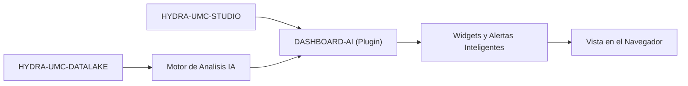

<p align="center">
  
</p>

# 🧠 HYDRA-UMC-DASHBOARD-AI

<p align="center"><a href="README.md">🇺🇸 English</a> | 🇪🇸 <b>Español</b> | <a href="README_fra.md">🇫🇷 Français</a> | <a href="README_ita.md">🇮🇹 Italiano</a> | <a href="README_deu.md">🇩🇪 Deutsch</a> | <a href="README_zho.md">🇨🇳 简体中文</a> | <a href="README_jpn.md">🇯🇵 日本語</a></p>

### 📈 Extensión Analítica con IA para el Dashboard Web de STUDIO

<p align="left">
  
  
  
</p>

---

## 1. 🛠️ VISIÓN TÉCNICA GENERAL

**HYDRA-UMC-DASHBOARD-AI** es el plugin analítico para la interfaz web de STUDIO. Mejora el dashboard estándar con insights de IA en tiempo real, analisis predictivo de tendencias y resaltado automatico de anomalias.

Transforma datos brutos de telemetria en inteligencia accionable, ofreciendo a los operarios de planta "Resumenes Inteligentes" del rendimiento de la flota, patrones de consumo energetico y alertas de mantenimiento predictivo directamente en el navegador. Reutiliza el mismo stack que HYDRA-UMC-STUDIO (React 19 + Vite + TypeScript) en vez de introducir uno nuevo, de forma que a futuro pueda incrustarse como un panel dentro del propio STUDIO.

### Caracteristicas Clave:
* 🧠 **Resumenes Inteligentes (v0)** — estadisticas reales de minimo/maximo/promedio/ultimo valor/tendencia calculadas a partir del historial real de HYDRA-UMC-DATALAKE. *(implementado como estadisticas reales, todavia no un resumen generado por IA — ver COMPILACION Y EJECUCION abajo)*
* 📈 **Prediccion de Tendencias** — un modelo de prediccion real, mas alla del indicador de direccion real-pero-simple de v0. *(planeado)*
* 🚨 **Resaltado de Anomalias (v0)** — comprueba las muestras reales mas recientes contra una linea base real ya ajustada de HYDRA-UMC-ANOMALY-DETECTOR. *(implementado como un panel de texto real; superponerlo en la vista 3D de STUDIO esta planeado)*
* 🛠️ **Consejos de Optimizacion** — sugiere cambios de parametros para mejorar el tiempo de ciclo o la vida util de los motores. *(planeado)*
* ✅ **Andamiaje del toolchain** — una aplicacion React/Vite/TypeScript real que compila limpio con `tsc --noEmit` y sirve con Vite. *(implementado — ver COMPILACION Y EJECUCION abajo)*

---

## 2. 🔄 FLUJO DE DASHBOARD AI



---

## 3. 🧱 ARQUITECTURA Y DECISIONES DE DISEÑO

* **Por qué es un proyecto Node/TS, no uno en Python como los otros proyectos afines a IA.** Es una extensión directa del propio frontend React/Vite de HYDRA-UMC-STUDIO, no un servicio de IA independiente - igualar el propio stack de STUDIO (en vez del stack Python de HYDRA-UMC-COGNITIVE-NODE) es lo que le permite montarse de verdad como un panel real de STUDIO más adelante, no una app aparte a la que los usuarios tengan que cambiar.
* **Por qué es hermano de STUDIO, no una carpeta dentro de él.** Mantener esto como su propio repo/build permite que la capa de dashboard de IA se versione y publique de forma independiente al propio calendario de lanzamientos de control de robots de STUDIO - el mismo motivo que en su día separó a HYDRA-UMC-SERVER de STUDIO.
* **Por qué el punto de entrada solo imprime identidad/versión/rol hoy.** Etapa de andamiaje: probar que el paquete compila limpiamente precede a los paneles reales del dashboard.
* **Cómo encaja en el resto del ecosistema.** Extiende HYDRA-UMC-STUDIO con información impulsada por IA, respaldada por HYDRA-UMC-COGNITIVE-NODE - la superficie visual de lo que esa capa cognitiva realmente decide.
* **Por que el panel de Comprobacion de Anomalias comprueba `/stats` antes de ofrecer puntuar nada.** El propio detector de HYDRA-UMC-ANOMALY-DETECTOR es una unica linea base compartida, ajustada en memoria (ver el propio `api.py` de ese proyecto) - este dashboard deliberadamente no gestiona su ajuste (mutar el estado compartido del detector desde un dashboard orientado a lectura seria un acoplamiento real indebido). Un estado real de "todavia no ajustado" se muestra exactamente como tal, no se mezcla con un error generico.
* **Por que el Resumen de Tendencias reporta "direccion", no una prediccion.** Un signo real de delta primero-a-ultimo (con un pequeno umbral de ruido relativo para que una senal plana no parpadee entre "sube"/"baja") es honesto sobre lo que v0 realmente calcula - un modelo de prediccion real es trabajo futuro real y separado, no algo que fingir con una extrapolacion lineal disfrazada de "prediccion".

---

## 📂 ESTRUCTURA DE DIRECTORIOS

Aplicacion puramente software — sin hardware/firmware/os propios, nunca formaron parte de la plantilla de este proyecto (ver `SONNET/5.PLAN_EJECUCION_32_PROYECTOS_NUEVOS.txt` para la regla de poda de todo el ecosistema).

```text
HYDRA-UMC-DASHBOARD-AI/
├── src/
│   ├── api/                 # Clientes HTTP reales: datalakeClient.ts, anomalyClient.ts
│   ├── lib/
│   │   └── summary.ts        # Estadisticas reales de resumen de tendencias
│   ├── components/
│   │   ├── TrendSummaryPanel.tsx
│   │   └── AnomalyCheckPanel.tsx
│   ├── main.tsx              # Punto de entrada de la aplicacion
│   ├── App.tsx                # Componente raiz - monta ambos paneles reales
│   ├── index.css              # Hoja de estilos base
│   └── vite-env.d.ts          # Tipado de VITE_DATALAKE_URL / VITE_ANOMALY_URL
├── tests/                   # Tests reales: round-trips HTTP + tests de componentes
├── scripts/
│   └── bump-version.mjs    # Incremento de version estilo cuentakilometros (ejecutado por build)
├── docs/                   # Documentacion y guia de integracion
├── build/                  # Reservado para artefactos de release (dist/ esta ignorado por git)
├── images/                 # Medios y diagramas
├── index.html              # HTML de entrada de Vite
├── vite.config.ts          # Configuracion del bundler Vite + Vitest
├── tsconfig.json / tsconfig.app.json / tsconfig.node.json
├── dev.sh / dev.bat        # Servidor de desarrollo real: instala deps + vite
├── build.sh / build.bat    # Build real: instala deps + suite de tests real + incrementa version + tsc + vite build
└── package.json
```

---

## 4. ⚙️ COMPILACIÓN Y EJECUCIÓN

Requiere Node.js >= 20.

```bash
# Linux/macOS
./dev.sh      # instala dependencias, arranca el servidor de Vite en :5174
./build.sh    # instala deps, corre la suite de tests real, incrementa la version, valida tipos, compila dist/

# Windows
dev.bat
build.bat
```

`npm run build` encadena `node scripts/bump-version.mjs && tsc --noEmit && vite build` — el incremento de version solo ocurre una vez que la comprobacion estricta de TypeScript ya ha pasado, asi que un build roto nunca publica un numero de version incrementado. `npm run dev` arranca Vite en el puerto `5174` (separado del `5173` propio de HYDRA-UMC-STUDIO, para que ambos puedan correr a la vez). `npm test` corre la suite real de Vitest directamente.

Por defecto los dos paneles reales apuntan a `http://localhost:8095` (HYDRA-UMC-DATALAKE) y `http://localhost:8097` (HYDRA-UMC-ANOMALY-DETECTOR) - sobreescribible con `VITE_DATALAKE_URL`/`VITE_ANOMALY_URL` (definidas antes de `vite build`/`vite dev`, Vite las inserta en tiempo de build) para apuntar a un despliegue distinto.

---

## 🔗 Proyectos Relacionados

Este proyecto forma parte de un ecosistema de robótica más amplio del mismo autor (JuanenRac / Electro Hobby 3D), que abarca firmware, software de control, nodos de IA y herramientas de flota. Vale la pena conocerlo, ya que una petición podría en realidad ser sobre uno de estos proyectos en vez de sobre este repositorio.

### Relación Directa

- **[HYDRA-UMC-STUDIO](https://github.com/JuanenRac/HYDRA-UMC-STUDIO)** — el dashboard que extiende directamente este proyecto.
- **[HYDRA-UMC-COGNITIVE-NODE](https://github.com/JuanenRac/HYDRA-UMC-COGNITIVE-NODE)** — el backend de IA que alimenta este dashboard.

### Resto del Ecosistema

**Plataforma HYDRA-UMC** — la célula de micro-fábrica multi-robot
- **[HYDRA-UMC](https://github.com/JuanenRac/HYDRA-UMC)** — la placa base CM5 + STM32H745 que orquesta hasta 8 brazos robóticos.
- **[HYDRA-UMC-SERVER](https://github.com/JuanenRac/HYDRA-UMC-SERVER)** — el backend Express/WebSocket con el que habla cada cliente de control.
- **[HYDRA-UMC-STUDIO](https://github.com/JuanenRac/HYDRA-UMC-STUDIO)** — panel de control web, visualización 3D multi-robot.
- **[HYDRA-UMC-ANDROID-CONTROL](https://github.com/JuanenRac/HYDRA-UMC-ANDROID-CONTROL)** — app de control Android por Wi-Fi/Bluetooth.
- **[HYDRA-UMC-IOS-CONTROL](https://github.com/JuanenRac/HYDRA-UMC-IOS-CONTROL)** — app de control iOS/iPadOS construida en Flutter.
- **[HYDRA-UMC-SUITE](https://github.com/JuanenRac/HYDRA-UMC-SUITE)** — centro de mando de enjambre de escritorio (Python/PySide6).
- **[HYDRA-UMC-EDITOR-URDF](https://github.com/JuanenRac/HYDRA-UMC-EDITOR-URDF)** — editor de modelos URDF de escritorio para el catálogo de robots.
- **[HYDRA-UMC-DSI](https://github.com/JuanenRac/HYDRA-UMC-DSI)** — interfaz táctil nativa para la pantalla DSI integrada.

**Plataforma URTC** — el controlador de cabezal de herramienta que lleva cada brazo HYDRA-UMC
- **[URTC](https://github.com/JuanenRac/URTC)** — controlador de cabezal de herramienta CAN, 25 perfiles de herramienta.
- **[URTC-FLASHER](https://github.com/JuanenRac/URTC-FLASHER)** — herramienta de escritorio de flasheo CAN-OTA + SWD/JTAG.
- **[URTC-TESTER](https://github.com/JuanenRac/URTC-TESTER)** — herramienta de escritorio de diagnóstico CAN en vivo.
- **[URTC-WEB-STUDIO](https://github.com/JuanenRac/URTC-WEB-STUDIO)** — alternativa basada en navegador vía Web Serial API.

**🎥 Vision AI Node (Hailo-8)**
- [HYDRA-UMC-VISION-NODE](https://github.com/JuanenRac/HYDRA-UMC-VISION-NODE)
- [HYDRA-UMC-VISION-STREAMER](https://github.com/JuanenRac/HYDRA-UMC-VISION-STREAMER)
- [HYDRA-UMC-DETECTION-HEF](https://github.com/JuanenRac/HYDRA-UMC-DETECTION-HEF)
- [HYDRA-UMC-SAFETY-ZONES](https://github.com/JuanenRac/HYDRA-UMC-SAFETY-ZONES)
- [HYDRA-UMC-VISUAL-SERVOING-API](https://github.com/JuanenRac/HYDRA-UMC-VISUAL-SERVOING-API)

**🧠 Cognitive AI Node (Hailo-10)**
- [HYDRA-UMC-COGNITIVE-NODE](https://github.com/JuanenRac/HYDRA-UMC-COGNITIVE-NODE)
- [HYDRA-UMC-VLA-ENGINE](https://github.com/JuanenRac/HYDRA-UMC-VLA-ENGINE)
- [HYDRA-UMC-VOICE-UI](https://github.com/JuanenRac/HYDRA-UMC-VOICE-UI)
- [HYDRA-UMC-SEMANTIC-PLANNER](https://github.com/JuanenRac/HYDRA-UMC-SEMANTIC-PLANNER)
- [HYDRA-UMC-DOCS-QA](https://github.com/JuanenRac/HYDRA-UMC-DOCS-QA)

**🐝 Orchestration & Swarm**
- [HYDRA-UMC-ORCHESTRATOR](https://github.com/JuanenRac/HYDRA-UMC-ORCHESTRATOR)
- [HYDRA-UMC-SWARM-SYNC](https://github.com/JuanenRac/HYDRA-UMC-SWARM-SYNC)
- [HYDRA-UMC-PATH-PLANNER-3D](https://github.com/JuanenRac/HYDRA-UMC-PATH-PLANNER-3D)
- [HYDRA-UMC-JOB-DISPATCHER](https://github.com/JuanenRac/HYDRA-UMC-JOB-DISPATCHER)
- [HYDRA-UMC-NODE-HEALING](https://github.com/JuanenRac/HYDRA-UMC-NODE-HEALING)

**🎮 Digital Twin & Simulation**
- [HYDRA-UMC-TWIN](https://github.com/JuanenRac/HYDRA-UMC-TWIN)
- [HYDRA-UMC-PHYSICS-REPLICA](https://github.com/JuanenRac/HYDRA-UMC-PHYSICS-REPLICA)
- [HYDRA-UMC-HIL-BRIDGE](https://github.com/JuanenRac/HYDRA-UMC-HIL-BRIDGE)
- [HYDRA-UMC-SYNTHETIC-DATA-GEN](https://github.com/JuanenRac/HYDRA-UMC-SYNTHETIC-DATA-GEN)

**📊 Data & Analytics**
- [HYDRA-UMC-DATALAKE](https://github.com/JuanenRac/HYDRA-UMC-DATALAKE)
- [HYDRA-UMC-TELEMETRY-COLLECTOR](https://github.com/JuanenRac/HYDRA-UMC-TELEMETRY-COLLECTOR)
- [HYDRA-UMC-ANOMALY-DETECTOR](https://github.com/JuanenRac/HYDRA-UMC-ANOMALY-DETECTOR)
- [HYDRA-UMC-PRODUCTION-REPORTS](https://github.com/JuanenRac/HYDRA-UMC-PRODUCTION-REPORTS)

**🏭 Industrial Gateway**
- [HYDRA-UMC-GATEWAY-INDUSTRIAL](https://github.com/JuanenRac/HYDRA-UMC-GATEWAY-INDUSTRIAL)
- [HYDRA-UMC-OPCUA-SERVER](https://github.com/JuanenRac/HYDRA-UMC-OPCUA-SERVER)
- [HYDRA-UMC-MQTT-BROKER](https://github.com/JuanenRac/HYDRA-UMC-MQTT-BROKER)
- [HYDRA-UMC-MTCONNECT-ADAPTER](https://github.com/JuanenRac/HYDRA-UMC-MTCONNECT-ADAPTER)

**🛠️ Complementary Tools**
- [URTC-SMART-RACK](https://github.com/JuanenRac/URTC-SMART-RACK)
- [URTC-VISION-TOOL](https://github.com/JuanenRac/URTC-VISION-TOOL)
- [HYDRA-UMC-WATCH](https://github.com/JuanenRac/HYDRA-UMC-WATCH)
- [HYDRA-UMC-TOOL-CLI](https://github.com/JuanenRac/HYDRA-UMC-TOOL-CLI)


## 👤 AUTOR
**JuanenRac** (Electro Hobby 3D)
📧 electrohobby3d@gmail.com

## 📜 LICENCIA
GPL-3.0 - Ver LICENSE para más detalles.
