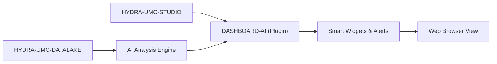

<p align="center">
  
</p>

# 🧠 HYDRA-UMC-DASHBOARD-AI

<p align="center"><a href="README.md">🇺🇸 English</a> | <a href="README_spa.md">🇪🇸 Español</a> | <a href="README_fra.md">🇫🇷 Français</a> | <a href="README_ita.md">🇮🇹 Italiano</a> | <a href="README_deu.md">🇩🇪 Deutsch</a> | 🇨🇳 <b>简体中文</b> | <a href="README_jpn.md">🇯🇵 日本語</a></p>

### 📈 面向 STUDIO Web 仪表盘的 AI 驱动分析扩展

<p align="left">
  
  
  
</p>

---

## 1. 🛠️ 技术概述

**HYDRA-UMC-DASHBOARD-AI** 是 STUDIO Web 界面的分析插件。它通过实时 AI
洞察、预测性趋势分析和自动化异常高亮，增强标准仪表盘的功能。

它将原始遥测数据转化为可操作的洞察，直接在浏览器中为工厂操作员提供集群
性能、能耗模式的"智能摘要"以及预测性维护告警。它复用了 HYDRA-UMC-STUDIO
自身的技术栈（React 19 + Vite + TypeScript），而非另起炉灶，因此日后它
最终可以作为 STUDIO 自身内部的一个面板嵌入其中。

### 关键特性：
* 🧠 **智能摘要（v0）** —— 根据 HYDRA-UMC-DATALAKE 的真实历史数据计算的真实最小值/最大值/平均值/最新值/趋势统计。*（已实现为真实统计数据，尚非 AI 生成的摘要——见下方"构建与运行"）*
* 📈 **趋势预测** —— 一个真实的预测模型，超越 v0 中真实但简单的方向指示器。*（计划中）*
* 🚨 **异常高亮（v0）：** 将最新的真实样本与 HYDRA-UMC-ANOMALY-DETECTOR 已拟合的真实基线进行对比检查。*（已实现为真实的文字面板；在 STUDIO 自身的 3D 视图中叠加显示尚在计划中）*
* 🛠️ **优化建议：** 提出改进周期时间或电机寿命的参数变更建议。*（计划中）*
* ✅ **工具链骨架** —— 一个真实的 React/Vite/TypeScript 应用，能够通过 `tsc --noEmit` 干净地构建，并使用 Vite 进行服务。*（已实现——见下方"构建与运行"）*

---

## 2. 🔄 Dashboard AI 流程



---

## 3. 🧱 架构与设计决策

* **为何本项目是 Node/TS 项目，而非像其他 AI 相邻项目那样使用 Python。** 它是 HYDRA-UMC-STUDIO 自身 React/Vite 前端的直接扩展，而非一个独立的 AI 服务——与 STUDIO 自身的技术栈保持一致（而非采用 HYDRA-UMC-COGNITIVE-NODE 的 Python 技术栈），正是使其日后能够真正作为一个真实的 STUDIO 面板挂载，而非一个用户需要单独切换过去的独立应用的原因。
* **为何它是 STUDIO 的兄弟项目，而非其内部的一个文件夹。** 将其保持为独立的仓库/构建，使 AI 仪表盘层能够独立于 STUDIO 自身的机器人控制发布节奏进行版本管理和交付，这与最初将 HYDRA-UMC-SERVER 从 STUDIO 中拆分出来的理由相同。
* **为何入口点今天只打印身份/版本/角色。** 处于脚手架（scaffolding）阶段：证明该包能够干净地构建，先于真正的仪表盘面板。
* **这如何融入生态系统的其余部分。** 以 HYDRA-UMC-COGNITIVE-NODE 为支撑，为 HYDRA-UMC-STUDIO 扩展了 AI 驱动的洞察——是那个认知层实际决策内容的可视化界面。
* **为何异常检查面板在提供任何评分之前先检查 `/stats`。** HYDRA-UMC-ANOMALY-DETECTOR 自身的检测器是一个共享的、在内存中拟合的单一基线（参见该项目自身的 `api.py`）——本仪表盘刻意不管理其拟合过程（从一个以读取为导向的仪表盘修改共享检测器状态将是一种真实的、不应有的耦合）。真实的"尚未拟合"状态会被准确地显示为该状态本身，而不会被并入一个通用错误中。
* **为何趋势摘要报告的是"方向"，而非预测。** 一个真实的首末增量符号（带有一个小的相对噪声阈值，以避免平坦信号在"上升"/"下降"之间闪烁）如实反映了 v0 实际计算的内容——真实的预测模型是独立的、真正的未来工作，而不是用伪装成"预测"的线性外推来假装实现的东西。

---

## 📂 目录结构

纯软件 Web 应用——没有自己的硬件、固件或操作系统；这些目录按照仓库结构
策略予以省略。

```text
HYDRA-UMC-DASHBOARD-AI/
├── src/
│   ├── api/                 # 真实的 HTTP 客户端：datalakeClient.ts、anomalyClient.ts
│   ├── lib/
│   │   └── summary.ts        # 真实的趋势摘要统计
│   ├── components/
│   │   ├── TrendSummaryPanel.tsx
│   │   └── AnomalyCheckPanel.tsx
│   ├── main.tsx              # 应用程序入口点
│   ├── App.tsx                # 根组件——挂载两个真实面板
│   ├── index.css              # 基础样式表
│   └── vite-env.d.ts          # VITE_DATALAKE_URL / VITE_ANOMALY_URL 的类型定义
├── tests/                   # 真实测试：HTTP 往返 + 组件测试
├── scripts/
│   └── bump-version.mjs    # 里程表式版本递增（由构建运行）
├── docs/                   # 文档与集成指南
├── build/                  # 预留给发布产物（dist/ 本身已被 gitignore）
├── images/                 # 媒体与图表
├── index.html              # Vite 入口 HTML
├── vite.config.ts          # Vite 打包器 + Vitest 配置
├── tsconfig.json / tsconfig.app.json / tsconfig.node.json
├── dev.sh / dev.bat        # 真实开发服务器：安装依赖 + vite
├── build.sh / build.bat    # 真实构建：安装依赖 + 真实测试套件 + 版本递增 + tsc + vite build
└── package.json
```

---

## 4. ⚙️ 构建与运行

需要 Node.js >= 20。

```bash
# Linux/macOS
./dev.sh      # 安装依赖，在 :5174 启动 Vite 开发服务器
./build.sh    # 安装依赖，运行真实测试套件，递增版本号，进行类型检查，构建 dist/

# Windows
dev.bat
build.bat
```

`npm run build` 会依次执行 `node scripts/bump-version.mjs && tsc
--noEmit && vite build`——版本递增只会在严格的 TypeScript 检查已经通过
之后才会发生，因此一次损坏的构建永远不会发布一个已递增的版本号。
`npm run dev` 在端口 `5174` 上启动 Vite（与 HYDRA-UMC-STUDIO 自身的
`5173` 端口区分开，以便两者可以同时并行运行）。`npm test` 直接运行真实的
Vitest 测试套件。

默认情况下，两个真实面板分别指向 `http://localhost:8095`
（HYDRA-UMC-DATALAKE）和 `http://localhost:8097`
（HYDRA-UMC-ANOMALY-DETECTOR）——可通过 `VITE_DATALAKE_URL`/
`VITE_ANOMALY_URL`（在 `vite build`/`vite dev` 之前设置，Vite 会在构建
时内联它们）覆盖，以指向不同的部署环境。

---

## 🔗 相关项目

本项目是同一作者（JuanenRac / Electro Hobby 3D）打造的更大规模机器人生态
系统的一部分，涵盖固件、控制软件、AI 节点和车队工具。值得了解，因为某个
需求实际上可能是关于这些项目之一，而非本仓库。

### 直接相关

- **[HYDRA-UMC-STUDIO](https://github.com/JuanenRac/HYDRA-UMC-STUDIO)** —— 本项目直接扩展的仪表盘。
- **[HYDRA-UMC-COGNITIVE-NODE](https://github.com/JuanenRac/HYDRA-UMC-COGNITIVE-NODE)** —— 为本仪表盘提供数据的 AI 后端。

### 生态系统的其余部分

**HYDRA-UMC 平台** —— 多机器人微工厂单元
- **[HYDRA-UMC](https://github.com/JuanenRac/HYDRA-UMC)** —— 协调最多 8 条机械臂的 CM5 + STM32H745 主板。
- **[HYDRA-UMC-SERVER](https://github.com/JuanenRac/HYDRA-UMC-SERVER)** —— 每个控制客户端所对接的 Express/WebSocket 后端。
- **[HYDRA-UMC-STUDIO](https://github.com/JuanenRac/HYDRA-UMC-STUDIO)** —— 基于 Web 的控制仪表盘，多机器人 3D 可视化。
- **[HYDRA-UMC-ANDROID-CONTROL](https://github.com/JuanenRac/HYDRA-UMC-ANDROID-CONTROL)** —— 通过 Wi-Fi/蓝牙的 Android 控制应用。
- **[HYDRA-UMC-IOS-CONTROL](https://github.com/JuanenRac/HYDRA-UMC-IOS-CONTROL)** —— 基于 Flutter 构建的 iOS/iPadOS 控制应用。
- **[HYDRA-UMC-SUITE](https://github.com/JuanenRac/HYDRA-UMC-SUITE)** —— 桌面端集群指挥中心（Python/PySide6）。
- **[HYDRA-UMC-EDITOR-URDF](https://github.com/JuanenRac/HYDRA-UMC-EDITOR-URDF)** —— 用于机器人目录的桌面端 URDF 模型编辑器。
- **[HYDRA-UMC-DSI](https://github.com/JuanenRac/HYDRA-UMC-DSI)** —— 机载 DSI 触摸屏的原生触控 UI。

**URTC 平台** —— 每台 HYDRA-UMC 机械臂搭载的工具头控制器
- **[URTC](https://github.com/JuanenRac/URTC)** —— CAN 总线工具头控制器，25 种工具配置。
- **[URTC-FLASHER](https://github.com/JuanenRac/URTC-FLASHER)** —— 桌面端 CAN-OTA + SWD/JTAG 刷写工具。
- **[URTC-TESTER](https://github.com/JuanenRac/URTC-TESTER)** —— 桌面端实时 CAN 总线诊断工具。
- **[URTC-WEB-STUDIO](https://github.com/JuanenRac/URTC-WEB-STUDIO)** —— 通过 Web Serial API 的浏览器端替代方案。

**🎥 视觉 AI 节点（Hailo-8）**
- [HYDRA-UMC-VISION-NODE](https://github.com/JuanenRac/HYDRA-UMC-VISION-NODE)
- [HYDRA-UMC-VISION-STREAMER](https://github.com/JuanenRac/HYDRA-UMC-VISION-STREAMER)
- [HYDRA-UMC-DETECTION-HEF](https://github.com/JuanenRac/HYDRA-UMC-DETECTION-HEF)
- [HYDRA-UMC-SAFETY-ZONES](https://github.com/JuanenRac/HYDRA-UMC-SAFETY-ZONES)
- [HYDRA-UMC-VISUAL-SERVOING-API](https://github.com/JuanenRac/HYDRA-UMC-VISUAL-SERVOING-API)

**🧠 认知 AI 节点（Hailo-10）**
- [HYDRA-UMC-COGNITIVE-NODE](https://github.com/JuanenRac/HYDRA-UMC-COGNITIVE-NODE)
- [HYDRA-UMC-VLA-ENGINE](https://github.com/JuanenRac/HYDRA-UMC-VLA-ENGINE)
- [HYDRA-UMC-VOICE-UI](https://github.com/JuanenRac/HYDRA-UMC-VOICE-UI)
- [HYDRA-UMC-SEMANTIC-PLANNER](https://github.com/JuanenRac/HYDRA-UMC-SEMANTIC-PLANNER)
- [HYDRA-UMC-DOCS-QA](https://github.com/JuanenRac/HYDRA-UMC-DOCS-QA)

**🐝 编排与集群**
- [HYDRA-UMC-ORCHESTRATOR](https://github.com/JuanenRac/HYDRA-UMC-ORCHESTRATOR)
- [HYDRA-UMC-SWARM-SYNC](https://github.com/JuanenRac/HYDRA-UMC-SWARM-SYNC)
- [HYDRA-UMC-PATH-PLANNER-3D](https://github.com/JuanenRac/HYDRA-UMC-PATH-PLANNER-3D)
- [HYDRA-UMC-JOB-DISPATCHER](https://github.com/JuanenRac/HYDRA-UMC-JOB-DISPATCHER)
- [HYDRA-UMC-NODE-HEALING](https://github.com/JuanenRac/HYDRA-UMC-NODE-HEALING)

**🎮 数字孪生与仿真**
- [HYDRA-UMC-TWIN](https://github.com/JuanenRac/HYDRA-UMC-TWIN)
- [HYDRA-UMC-PHYSICS-REPLICA](https://github.com/JuanenRac/HYDRA-UMC-PHYSICS-REPLICA)
- [HYDRA-UMC-HIL-BRIDGE](https://github.com/JuanenRac/HYDRA-UMC-HIL-BRIDGE)
- [HYDRA-UMC-SYNTHETIC-DATA-GEN](https://github.com/JuanenRac/HYDRA-UMC-SYNTHETIC-DATA-GEN)

**📊 数据与分析**
- [HYDRA-UMC-DATALAKE](https://github.com/JuanenRac/HYDRA-UMC-DATALAKE)
- [HYDRA-UMC-TELEMETRY-COLLECTOR](https://github.com/JuanenRac/HYDRA-UMC-TELEMETRY-COLLECTOR)
- [HYDRA-UMC-ANOMALY-DETECTOR](https://github.com/JuanenRac/HYDRA-UMC-ANOMALY-DETECTOR)
- [HYDRA-UMC-PRODUCTION-REPORTS](https://github.com/JuanenRac/HYDRA-UMC-PRODUCTION-REPORTS)

**🏭 工业网关**
- [HYDRA-UMC-GATEWAY-INDUSTRIAL](https://github.com/JuanenRac/HYDRA-UMC-GATEWAY-INDUSTRIAL)
- [HYDRA-UMC-OPCUA-SERVER](https://github.com/JuanenRac/HYDRA-UMC-OPCUA-SERVER)
- [HYDRA-UMC-MQTT-BROKER](https://github.com/JuanenRac/HYDRA-UMC-MQTT-BROKER)
- [HYDRA-UMC-MTCONNECT-ADAPTER](https://github.com/JuanenRac/HYDRA-UMC-MTCONNECT-ADAPTER)

**🛠️ 配套工具**
- [URTC-SMART-RACK](https://github.com/JuanenRac/URTC-SMART-RACK)
- [URTC-VISION-TOOL](https://github.com/JuanenRac/URTC-VISION-TOOL)
- [HYDRA-UMC-WATCH](https://github.com/JuanenRac/HYDRA-UMC-WATCH)
- [HYDRA-UMC-TOOL-CLI](https://github.com/JuanenRac/HYDRA-UMC-TOOL-CLI)


## 👤 作者
**JuanenRac**（Electro Hobby 3D）
📧 electrohobby3d@gmail.com

## 📜 许可证
GPL-3.0 —— 详见 LICENSE。

## 🛠️ BUILD & RUN

请在发布构建前使用不改动版本的构建检查：

| 操作 | Windows | Linux / macOS |
|---|---|---|
| 构建检查（不修改版本或 CHANGELOG） | `build-test.bat` | `./build-test.sh` |
| 运行 / 开发（如提供） | `run*.bat` 或 `dev*.bat` | `./run*.sh` 或 `./dev*.sh` |

`build-test.bat` 和 `build-test.sh` 会编译或验证项目技术栈，但不会递增 `hydra-umc.project.json`，也不会修改 `CHANGELOG.md`。它们仅可能生成正常的编译器输出。现有的 `build*.bat`、`build*.sh`、`run*` 和 `dev*` 脚本保留各自的版本化或运行时行为；需要该行为时请使用它们。