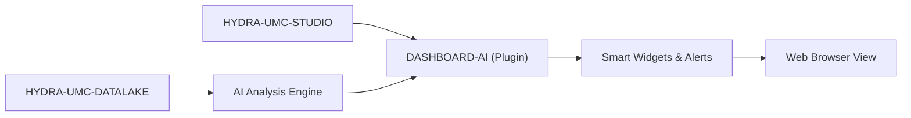

<p align="center">
  
</p>

# 🧠 HYDRA-UMC-DASHBOARD-AI

<p align="center"><a href="README.md">🇺🇸 English</a> | <a href="README_spa.md">🇪🇸 Español</a> | <a href="README_fra.md">🇫🇷 Français</a> | <a href="README_ita.md">🇮🇹 Italiano</a> | <a href="README_deu.md">🇩🇪 Deutsch</a> | 🇨🇳 <b>简体中文</b> | <a href="README_jpn.md">🇯🇵 日本語</a></p>

### 📈 面向 STUDIO Web 仪表盘的 AI 驱动分析扩展

<p align="left">
  
  
  
</p>

---

## 1. 🛠️ 技术概述

**HYDRA-UMC-DASHBOARD-AI** 是 STUDIO Web 界面的分析插件。它通过实时 AI
洞察、预测性趋势分析和自动化异常高亮，增强标准仪表盘的功能。

它将原始遥测数据转化为可操作的洞察，直接在浏览器中为工厂操作员提供集群
性能、能耗模式的"智能摘要"以及预测性维护告警。它复用了 HYDRA-UMC-STUDIO
自身的技术栈（React 19 + Vite + TypeScript），而非另起炉灶，因此日后它
最终可以作为 STUDIO 自身内部的一个面板嵌入其中。

### 关键特性：
* 🧠 **智能摘要（v0）** —— 根据 HYDRA-UMC-DATALAKE 的真实历史数据计算的真实最小值/最大值/平均值/最新值/趋势统计。*（已实现为真实统计数据，尚非 AI 生成的摘要——见下方"构建与运行"）*
* 🔒 **AI 提供方关卡（v0）** —— 为未来基于 LLM 的叙述真实校验输入/输出模式，加上一个真实的、诚实标注的统计回退方案，在没有配置 AI 提供方，或提供方失败/返回非结构化输出时始终使用。*（今天已实现并接入了趋势摘要面板；真正基于 LLM 的提供方本身仍在计划中）*
* 🛡️ **外部契约防护（v0）** —— 在面板计算或显示之前校验每个 Datalake 和异常服务响应；格式错误的数值、标志、过长标识符和不安全控制字符都会被拒绝。*（已实现；参见 [`docs/SECURITY.md`](docs/SECURITY.md)）*
* 📈 **趋势预测** —— 一个真实的预测模型，超越 v0 中真实但简单的方向指示器。*（计划中）*
* 🚨 **异常高亮（v0）：** 将最新的真实样本与 HYDRA-UMC-ANOMALY-DETECTOR 已拟合的真实基线进行对比检查。*（已实现为真实的文字面板；在 STUDIO 自身的 3D 视图中叠加显示尚在计划中）*
* 🛠️ **优化建议：** 提出改进周期时间或电机寿命的参数变更建议。*（计划中）*
* ✅ **工具链骨架** —— 一个真实的 React/Vite/TypeScript 应用，能够通过 `tsc --noEmit` 干净地构建，并使用 Vite 进行服务。*（已实现——见下方"构建与运行"）*

---

## 2. 🔄 Dashboard AI 流程



---

## 3. 🧱 架构与设计决策

* **为何本项目是 Node/TS 项目，而非像其他 AI 相邻项目那样使用 Python。** 它是 HYDRA-UMC-STUDIO 自身 React/Vite 前端的直接扩展，而非一个独立的 AI 服务——与 STUDIO 自身的技术栈保持一致（而非采用 HYDRA-UMC-COGNITIVE-NODE 的 Python 技术栈），正是使其日后能够真正作为一个真实的 STUDIO 面板挂载，而非一个用户需要单独切换过去的独立应用的原因。
* **为何它是 STUDIO 的兄弟项目，而非其内部的一个文件夹。** 将其保持为独立的仓库/构建，使 AI 仪表盘层能够独立于 STUDIO 自身的机器人控制发布节奏进行版本管理和交付，这与最初将 HYDRA-UMC-SERVER 从 STUDIO 中拆分出来的理由相同。
* **为何入口点今天只打印身份/版本/角色。** 处于脚手架（scaffolding）阶段：证明该包能够干净地构建，先于真正的仪表盘面板。
* **这如何融入生态系统的其余部分。** 以 HYDRA-UMC-COGNITIVE-NODE 为支撑，为 HYDRA-UMC-STUDIO 扩展了 AI 驱动的洞察——是那个认知层实际决策内容的可视化界面。
* **为何异常检查面板在提供任何评分之前先检查 `/stats`。** HYDRA-UMC-ANOMALY-DETECTOR 自身的检测器是一个共享的、在内存中拟合的单一基线（参见该项目自身的 `api.py`）——本仪表盘刻意不管理其拟合过程（从一个以读取为导向的仪表盘修改共享检测器状态将是一种真实的、不应有的耦合）。真实的"尚未拟合"状态会被准确地显示为该状态本身，而不会被并入一个通用错误中。
* **为何趋势摘要报告的是"方向"，而非预测。** 一个真实的首末增量符号（带有一个小的相对噪声阈值，以避免平坦信号在"上升"/"下降"之间闪烁）如实反映了 v0 实际计算的内容——真实的预测模型是独立的、真正的未来工作，而不是用伪装成"预测"的线性外推来假装实现的东西。
* **为何 `safeGenerateNarrative()` 会校验请求，但从不因一个糟糕的响应而抛出异常。** 一个格式错误的请求是这份代码里真实的接线错误——没有摘要可以诚实地回退到，因此允许它抛出异常。而提供方返回*格式错误/非结构化*的响应，对任何真实的外部 API 来说都是常态——那条路径总会降级到真实的统计回退，而不是让面板崩溃，因为调用方已经拥有说出真话所需的一切（真实的摘要）。
* **为何 `NO_PROVIDER_CONFIGURED` 复用 `summary.ts`，而不是一个独立的回退实现。** 第二份独立的"回退叙述"公式会与面板已经信任、并已经以数字形式展示的真实统计数据产生偏差——复用相同的 `TrendSummary` 数值，能让回退叙述与旁边的数字保持可证明的一致。

---

## 📂 目录结构

纯软件 Web 应用——没有自己的硬件、固件或操作系统；这些目录按照仓库结构
策略予以省略。

```text
HYDRA-UMC-DASHBOARD-AI/
├── src/
│   ├── api/                 # 真实的 HTTP 客户端：datalakeClient.ts、anomalyClient.ts
│   ├── lib/
│   │   ├── summary.ts        # 真实的趋势摘要统计
│   │   └── aiProvider.ts     # 真实的 AI 提供方关卡：模式校验 + 诚实的回退
│   ├── components/
│   │   ├── TrendSummaryPanel.tsx
│   │   └── AnomalyCheckPanel.tsx
│   ├── main.tsx              # 应用程序入口点
│   ├── App.tsx                # 根组件——挂载两个真实面板
│   ├── index.css              # 基础样式表
│   └── vite-env.d.ts          # VITE_DATALAKE_URL / VITE_ANOMALY_URL 的类型定义
├── tests/                   # 真实测试：HTTP 往返 + 组件测试
├── scripts/
│   ├── bump-version.mjs    # 里程表式版本递增（由构建运行）
│   ├── serve_static.py     # 面向已构建 dist/ SPA 的真实静态文件服务器（实测发现的 CM5 部署缺口）
│   └── test_serve_static.py # serve_static.py 的真实测试
├── systemd/
│   └── hydra-umc-dashboard-ai.service # 本地 CM5 静态服务的 systemd 单元
├── tools/
│   ├── build_test.py       # 不递增版本号的构建检查
│   └── ci_validate.py      # CI 使用的清单/CHANGELOG/文档校验
├── docs/
│   └── SECURITY.md          # 外部内容与部署的公开安全契约
├── build/                  # 预留给发布产物（dist/ 本身已被 gitignore）
├── images/                 # 媒体与图表
├── index.html              # Vite 入口 HTML
├── vite.config.ts          # Vite 打包器 + Vitest 配置
├── tsconfig.json / tsconfig.app.json / tsconfig.node.json
├── bump_manifest_version.py # 将 hydra-umc.project.json 的版本与 package.json 同步(--sync)
├── dev.sh / dev.bat        # 真实开发服务器：安装依赖 + vite
├── build.sh / build.bat    # 真实构建：安装依赖 + 真实测试套件 + 版本递增 + tsc + vite build
└── package.json
```

---

## 4. ⚙️ 构建与运行

需要 Node.js >= 20。

```bash
# Linux/macOS
./dev.sh      # 安装依赖，在 :5174 启动 Vite 开发服务器
./build.sh    # 安装依赖，运行真实测试套件，递增版本号，进行类型检查，构建 dist/

# Windows
dev.bat
build.bat
```

`npm run build` 会依次执行 `node scripts/bump-version.mjs && tsc
--noEmit && vite build`——版本递增只会在严格的 TypeScript 检查已经通过
之后才会发生，因此一次损坏的构建永远不会发布一个已递增的版本号。
`npm run dev` 在端口 `5174` 上启动 Vite（与 HYDRA-UMC-STUDIO 自身的
`5173` 端口区分开，以便两者可以同时并行运行）。`npm test` 直接运行真实的
Vitest 测试套件。

默认情况下，两个真实面板分别指向 `http://localhost:8095`
（HYDRA-UMC-DATALAKE）和 `http://localhost:8097`
（HYDRA-UMC-ANOMALY-DETECTOR）——可通过 `VITE_DATALAKE_URL`/
`VITE_ANOMALY_URL`（在 `vite build`/`vite dev` 之前设置，Vite 会在构建
时内联它们）覆盖，以指向不同的部署环境。

在配置这些浏览器可见的 URL 或连接真实 AI 提供方之前，请阅读
[`docs/SECURITY.md`](docs/SECURITY.md)。其中定义了响应校验、内容安全、失败行为以及不含秘密信息的规则。

每一次真实的趋势摘要请求也都会运行真实的 AI 提供方关卡。在没有配置真实
提供方的情况下（v0 诚实的默认状态），面板会显示真实的、清楚标注的统计
回退：

```ts
import { safeGenerateNarrative, NO_PROVIDER_CONFIGURED } from './lib/aiProvider'

const narrative = await safeGenerateNarrative(NO_PROVIDER_CONFIGURED, { sourceId, kind, field, summary })
// { narrative: "robot-1/motor_temp/value: 4 sample(s), ranging 10.00 to 50.00,
//    averaging 29.00, latest 36.00 (rising).", generatedBy: 'statistical-fallback' }
```

一个抛出异常、或返回缺失/格式错误 `narrative` 字段的响应的提供方，会降级
到这个真实的回退方案，而不是让面板崩溃或什么都不显示。

---

## 🔗 相关项目

本项目是同一作者(JuanenRac / Electro Hobby 3D)打造的 HYDRA-UMC 机器人生态系统的一部分。值得了解,因为某个请求实际上可能是关于这些项目之一,而非本仓库本身。

**直接相关**
- **[HYDRA-UMC-STUDIO](https://github.com/JuanenRac/HYDRA-UMC-STUDIO)** — 具有实时多机器人 3D 可视化的网页控制面板 —— 本项目直接扩展的仪表板。
- **[HYDRA-UMC-COGNITIVE-NODE](https://github.com/JuanenRac/HYDRA-UMC-COGNITIVE-NODE)** — 面向 Hailo-10 认知流水线(LLM/VLA/语音编排)的集成中枢 —— 为本仪表板提供数据的 AI 后端。
- **[HYDRA-UMC-DATALAKE](https://github.com/JuanenRac/HYDRA-UMC-DATALAKE)** — 具备真实数据摄入/查询 HTTP API 的真实 sqlite3 时序数据存储 —— 智能摘要面板据以计算统计数据的真实历史记录。
- **[HYDRA-UMC-ANOMALY-DETECTOR](https://github.com/JuanenRac/HYDRA-UMC-ANOMALY-DETECTOR)** — 具备漂移监测能力的真实 FFT + 统计基线异常检测器 —— 异常高亮面板据以为近期样本评分的拟合基线。

**生态系统中的其他项目**

*核心硬件与平台*
- **[HYDRA-UMC](https://github.com/JuanenRac/HYDRA-UMC)** — 机器人手臂的真实主板——CM5 主机 + 双核 STM32H745，通过 CAN-OTA/SPI-OTA 协调最多 8 条工具臂。
- **[HYDRA-UMC-OS](https://github.com/JuanenRac/HYDRA-UMC-OS)** — 面向 CM5 的可复现 Raspberry Pi OS 产品层——只读代理、经过验证的配置/配置文件、WiFi 首次配网。
- **[HYDRA-UMC-SDK](https://github.com/JuanenRac/HYDRA-UMC-SDK)** — 每个桥接都据此校验自身指令的共享 JSON-Schema 契约与安全门限边界。

*核心后端与客户端*
- **[HYDRA-UMC-SERVER](https://github.com/JuanenRac/HYDRA-UMC-SERVER)** — 每个控制客户端真正通信的真实无头后端(REST/WebSocket)。
- **[HYDRA-UMC-SUITE](https://github.com/JuanenRac/HYDRA-UMC-SUITE)** — 面向多台服务器的桌面(PySide6)集群指挥中心，打包为独立可执行文件。
- **[HYDRA-UMC-ANDROID-CONTROL](https://github.com/JuanenRac/HYDRA-UMC-ANDROID-CONTROL)** — 具有生物识别登录和配对 Wear OS 伴侣应用的原生 Android 控制应用。
- **[HYDRA-UMC-IOS-CONTROL](https://github.com/JuanenRac/HYDRA-UMC-IOS-CONTROL)** — 具有实时 WebSocket 同步的 iOS/iPadOS 控制应用(Flutter)。
- **[HYDRA-UMC-DSI](https://github.com/JuanenRac/HYDRA-UMC-DSI)** — 面向机载 7 英寸 DSI 触摸屏的原生触控界面，直接嵌入 CM5 本体。
- **[HYDRA-UMC-EDITOR-URDF](https://github.com/JuanenRac/HYDRA-UMC-EDITOR-URDF)** — 将完成的模型推送到 STUDIO 自身目录的桌面版图形化 URDF 创建/编辑工具。
- **[HYDRA-UMC-BRIDGE-AMR](https://github.com/JuanenRac/HYDRA-UMC-BRIDGE-AMR)** — 通过真实的 VDA 5050 MQTT 发布者为 AGV/AMR 车队提供的协调边界。
- **[HYDRA-UMC-BRIDGE-CNC](https://github.com/JuanenRac/HYDRA-UMC-BRIDGE-CNC)** — 具备真实 GRBL 状态/控制字节访问能力的高层 CNC 单元协调器。
- **[HYDRA-UMC-BRIDGE-DROIDS](https://github.com/JuanenRac/HYDRA-UMC-BRIDGE-DROIDS)** — 面向足式/人形机器人的协调边界，具备真实的 Boston Dynamics Spot 指令发送器。
- **[HYDRA-UMC-BRIDGE-LASER](https://github.com/JuanenRac/HYDRA-UMC-BRIDGE-LASER)** — 读取 3 项真实钥匙/外壳/联锁 GPIO 安全信号的激光单元安全协调器。
- **[HYDRA-UMC-BRIDGE-OPENPNP](https://github.com/JuanenRac/HYDRA-UMC-BRIDGE-OPENPNP)** — 面向 OpenPnP 贴片机板级流程的安全高层协调器。
- **[HYDRA-UMC-BRIDGE-PRINTER3D](https://github.com/JuanenRac/HYDRA-UMC-BRIDGE-PRINTER3D)** — 面向 Moonraker/Klipper 3D 打印机的安全协调边界，具备真实的受控作业指令。
- **[HYDRA-UMC-BRIDGE-ROS2](https://github.com/JuanenRac/HYDRA-UMC-BRIDGE-ROS2)** — 具备真实的惰性导入 rclpy ROS 2 传输层的安全协调器。
- **[HYDRA-UMC-BRIDGE-UAV](https://github.com/JuanenRac/HYDRA-UMC-BRIDGE-UAV)** — 面向搭载摄像头的无人机的协调边界，具备真实的 MAVLink 指令发送器。

*URTC 工具平台*
- **[URTC](https://github.com/JuanenRac/URTC)** — 面向实体 Universal Robot Tool Controller 板卡的固件，通过 CAN 总线支持 25 种以上工具配置。
- **[URTC-FLASHER](https://github.com/JuanenRac/URTC-FLASHER)** — 面向 URTC 板卡的桌面图形烧录工具，支持 CAN-OTA 以及全芯片 SWD/JTAG。
- **[URTC-TESTER](https://github.com/JuanenRac/URTC-TESTER)** — 面向 URTC 板卡的桌面实时 CAN 总线诊断工具，每种工具配置对应一个面板。
- **[URTC-WEB-STUDIO](https://github.com/JuanenRac/URTC-WEB-STUDIO)** — 通过 Web Serial API 实现的浏览器版 URTC-TESTER 替代方案，无需本地安装。

*视觉 AI 节点(Hailo-8)*
- **[HYDRA-UMC-VISION-NODE](https://github.com/JuanenRac/HYDRA-UMC-VISION-NODE)** — 面向 Hailo-8 视觉流水线的集成中枢，具备逐阶段的真实硬件就绪检测。
- **[HYDRA-UMC-DETECTION-HEF](https://github.com/JuanenRac/HYDRA-UMC-DETECTION-HEF)** — 具备 Hailo 架构/校验和安全加载验证的真实编译模型注册表。
- **[HYDRA-UMC-VISION-STREAMER](https://github.com/JuanenRac/HYDRA-UMC-VISION-STREAMER)** — 具备真实 HailoRT 集成边界的真实 GStreamer 流水线 + MediaMTX 配置生成器。
- **[HYDRA-UMC-VISUAL-SERVOING-API](https://github.com/JuanenRac/HYDRA-UMC-VISUAL-SERVOING-API)** — 具备真实 Position-Based Visual Servoing 修正律，并依据上游区域状态进行安全门控。
- **[HYDRA-UMC-SAFETY-ZONES](https://github.com/JuanenRac/HYDRA-UMC-SAFETY-ZONES)** — 具备校准新鲜度强制检查的真实区域入侵检测与 E-STOP 请求。

*认知 AI 节点(Hailo-10)*
- **[HYDRA-UMC-VLA-ENGINE](https://github.com/JuanenRac/HYDRA-UMC-VLA-ENGINE)** — 面向 Vision-Language-Action 模型的真实动作 token 编解码与轨迹生成。
- **[HYDRA-UMC-VOICE-UI](https://github.com/JuanenRac/HYDRA-UMC-VOICE-UI)** — 具备受限、需确认的 Watch 中继的真实语音前端(VAD + 意图解析)。
- **[HYDRA-UMC-SEMANTIC-PLANNER](https://github.com/JuanenRac/HYDRA-UMC-SEMANTIC-PLANNER)** — 基于真实规则的任务分解，以及针对 MCU 错误码的语义化错误恢复。
- **[HYDRA-UMC-DOCS-QA](https://github.com/JuanenRac/HYDRA-UMC-DOCS-QA)** — 面向本生态系统自身 Markdown 文档的真实纯标准库 TF-IDF 文档检索。

*编排与集群*
- **[HYDRA-UMC-ORCHESTRATOR](https://github.com/JuanenRac/HYDRA-UMC-ORCHESTRATOR)** — 具备真实 gRPC/Protobuf 健康报告契约与任务状态机的集成中枢。
- **[HYDRA-UMC-JOB-DISPATCHER](https://github.com/JuanenRac/HYDRA-UMC-JOB-DISPATCHER)** — 基于真实 HTTP API 的真实优先级任务队列，支持去重。
- **[HYDRA-UMC-NODE-HEALING](https://github.com/JuanenRac/HYDRA-UMC-NODE-HEALING)** — 具备重试/退避与身份不匹配检测的真实基于 gRPC 的车队健康看门狗。
- **[HYDRA-UMC-PATH-PLANNER-3D](https://github.com/JuanenRac/HYDRA-UMC-PATH-PLANNER-3D)** — 具备真实障碍物/工作空间碰撞校验的真实基于 RRT 的三维路径规划器。
- **[HYDRA-UMC-SWARM-SYNC](https://github.com/JuanenRac/HYDRA-UMC-SWARM-SYNC)** — 经过多单元收敛属性测试的真实 CRDT LWW-Element-Map 状态同步。

*数字孪生与仿真*
- **[HYDRA-UMC-TWIN](https://github.com/JuanenRac/HYDRA-UMC-TWIN)** — 面向数字孪生引擎的集成中枢，具备真实的版本兼容性同步契约。
- **[HYDRA-UMC-HIL-BRIDGE](https://github.com/JuanenRac/HYDRA-UMC-HIL-BRIDGE)** — 在仿真与真实硬件之间路由指令的真实硬件在环安全联锁。
- **[HYDRA-UMC-PHYSICS-REPLICA](https://github.com/JuanenRac/HYDRA-UMC-PHYSICS-REPLICA)** — 面向真实 URDF 子集的真实正向运动学与关节限位校验。
- **[HYDRA-UMC-SYNTHETIC-DATA-GEN](https://github.com/JuanenRac/HYDRA-UMC-SYNTHETIC-DATA-GEN)** — 具备 YOLO/COCO 标注导出功能的真实程序化 2D 场景生成器。

*数据与分析*
- **[HYDRA-UMC-PRODUCTION-REPORTS](https://github.com/JuanenRac/HYDRA-UMC-PRODUCTION-REPORTS)** — 基于 DATALAKE 历史数据的真实 OEE/可用率计算，支持可复现的 CSV 导出。
- **[HYDRA-UMC-TELEMETRY-COLLECTOR](https://github.com/JuanenRac/HYDRA-UMC-TELEMETRY-COLLECTOR)** — 面向 DATALAKE 的真实 CAN/WebSocket 数据摄入管道，支持序列去重。

*工业网关*
- **[HYDRA-UMC-GATEWAY-INDUSTRIAL](https://github.com/JuanenRac/HYDRA-UMC-GATEWAY-INDUSTRIAL)** — 中继至工业协议的集成中枢，具备真实的指令白名单/背压控制层。
- **[HYDRA-UMC-OPCUA-SERVER](https://github.com/JuanenRac/HYDRA-UMC-OPCUA-SERVER)** — 经真实二进制协议客户端会话验证的真实 OPC-UA 地址空间。
- **[HYDRA-UMC-MQTT-BROKER](https://github.com/JuanenRac/HYDRA-UMC-MQTT-BROKER)** — 具备可选按客户端认证与主题 ACL 的真实 MQTT 代理。
- **[HYDRA-UMC-MTCONNECT-ADAPTER](https://github.com/JuanenRac/HYDRA-UMC-MTCONNECT-ADAPTER)** — 具备降级模式输出的真实 MTConnect `/probe` 与 `/current` XML 端点。

*辅助工具与生态系统运维*
- **[HYDRA-UMC-TOOL-CLI](https://github.com/JuanenRac/HYDRA-UMC-TOOL-CLI)** — 具备真实、稳定退出码契约的车队 CLI，是 HYDRA-UMC-SERVER 自身 API 的真实在线客户端。
- **[HYDRA-UMC-WATCH](https://github.com/JuanenRac/HYDRA-UMC-WATCH)** — 具备真实触觉提醒与配对手机语音中继功能的 WearOS 伴侣应用。
- **[URTC-SMART-RACK](https://github.com/JuanenRac/URTC-SMART-RACK)** — 面向板卡安装机架的固件，具备真实的工具 ID 解码与 Smart Idle 预热逻辑。
- **[URTC-VISION-TOOL](https://github.com/JuanenRac/URTC-VISION-TOOL)** — 面向热成像/RGB 检测工具头的固件及真实 Python 视觉伴侣程序。
- **[HYDRA-UMC-UPDATER](https://github.com/JuanenRac/HYDRA-UMC-UPDATER)** — 发现、克隆并更新本生态系统中每个仓库的管理类桌面工具。


## 👤 作者
**JuanenRac** (Electro Hobby 3D)
📧 electrohobby3d@gmail.com
📺 [youtube.com/@electrohobby3d](https://youtube.com/@electrohobby3d)

## 📜 许可证
GPL-3.0 —— 详见 LICENSE。
